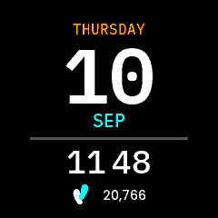

# ClockfaceConsole - Console Clockface

An oversized day of month between the weekday and the month, over a monospaced
clock and the day's step count. The leanest of the five.



*Console in the app simulator. The step count is the design's sample value, fed in by hand: the simulator serves STEP_COUNTER rather than STEP_COUNTER_DAILY, so it reads zero when you run it yourself.*

> New to faces? Start with **[Writing a Watch Face](../writing-a-clockface.md)**,
> which covers the structure, the platform constraints and the techniques all
> five faces share. This page is only what is particular to Console.

| | |
|---|---|
| Directory | `Examples/Apps/ClockfaceConsole` |
| `APP_NAME` / `APP_USER_NAME` | `Console` |
| `APP_ID` | `A1923FF0C81519B0` |
| `.uapp` size | ~79 KB |
| Design | Figma `1317:1104` (24-hour), `1317:1359` (12-hour) |
| Fonts | `IBMPlexMono-SemiBold.ttf` 85, `-Medium.ttf` 36/20/16, `Poppins-Medium.ttf` 14 |

## What it demonstrates

### A face trimmed to one sensor

It draws no charge level, no active minutes and no heart rate, so the service
subscribes to none of them and the messages, the model and the listener carry
only what is shown. `Commands.hpp` has `Time`, `Steps`, `ClockFormat` and
`Refresh`; the model holds a single `uint32_t` where the other faces hold a
triple; the simulator config disables the battery and heart-rate sensors to
match.

That is not tidiness. **A `HEART_RATE` subscription keeps the optical sensor
powered**, and a face is on screen for hours -- see the guide. This is the
example to copy when your design drops a row.

### A date order that swaps rows instead of reversing a line

Console follows Settings -> Clock -> Date Format like the other three, but it
cannot do it the way they do. Its date is not a line -- it is a stack, and the
day of the month is 112 px of it. There is no day-month sequence to reverse.

So the two labels either side of that number exchange rows and the number stays
where it is. Day-first reads WEDNESDAY / 03 / AUG, month-first AUG / 03 /
WEDNESDAY. `layoutDate()` is the whole of it, and each field keeps its own
height when it moves, because the month is set 4 px larger than the weekday and
the other's box would clip it.

The general rule is worth taking from this: a face follows the setting, but
what "month first" means is the design's to decide. A layout that is not a line
will not answer that on its own -- "a stack has no order to reverse" is an
argument for asking, not for opting out.

### A group centred as a whole, meridiem included

The clock group carries the meridiem, and the meridiem counts towards the width
the group is centred on:

```cpp
int16_t total = hourWidth + sepWidth + minuteWidth;
if (mStyle.is12h) {
    total += kMeridiemGap + meridiemText.getTextWidth();
}
```

So the clock is balanced on the face rather than having the label hang off the
right of centred digits. Measured in the simulator, the 12-hour row's ink spans
x=56..184, a centre of 120.0 against the face's 119.5; the half pixel is the
group being an odd 129 wide on an even face. Centring the digits alone and
letting the label overhang puts that centre on 131.0, which is the arrangement
the design does not want.

`kSeparator12 = 22`, `kSeparator24 = 6`. IBM Plex Mono is monospaced -- every
glyph 600/1000 em, so 21.6 px at 36 -- which is why the 12-hour form needs no
extra padding around the colon the way Poppins does.

### Three stacked parts that need no layout at all

The weekday, day of month and month are each centred across the full width, so
writing them is the whole job. The weekday is spelled out in full (`WEDNESDAY`)
and the month abbreviated (`AUG`), which is why they use two typographies and
two sets of Text IDs -- both read back with `TypedText::getText()` into
wildcards, so both typographies need the letters in `WildcardCharacters`.

The meridiem is the exception: two static labels swapped with `setTypedText()`,
because it is the one part of the group whose text never varies beyond two
values.

## Assets

`StepsIcon_17x23.png` from the content pack, and two of IBM Plex Mono's
fourteen shipped weights -- only the two that are used are committed. Poppins is
here for the one row the design sets in it, the step count.

## Known gaps

- The steps row cannot be fed by the simulator (see the guide).
- The launcher icons are placeholders.
