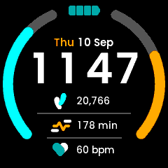

# ClockfacePeak - Peak Clockface

Two daily-goal rings on the rim, round a stacked clock, a two-colour date line
and three metric rows.



*Peak in the app simulator. The step count, active minutes and goals are the design's sample values, fed in by hand: the simulator cannot serve the daily sensors, so they read zero and the rings sit empty when you run it yourself.*

> New to faces? Start with **[Writing a Watch Face](../writing-a-clockface.md)**,
> which covers the structure, the platform constraints and the techniques all
> five faces share. This page is only what is particular to Peak.

| | |
|---|---|
| Directory | `Examples/Apps/ClockfacePeak` |
| `APP_NAME` / `APP_USER_NAME` | `Peak` |
| `APP_ID` | `A152BAC1184FBE9E` |
| `.uapp` size | ~94 KB |
| Design | Figma `1317:821` (24-hour), `1317:956` (12-hour) |
| Fonts | `Poppins-SemiBold.ttf` 60/15, `Poppins-Medium.ttf` 14 (tabular builds) |

## What it demonstrates

### Two goal rings, and why they are two containers

Both arcs sit on one circle -- **centre (120, 120), radius 108.66, stroke
15.16**, round caps -- derived from the design's SVG paths. All of it, including
both angle ranges and all four colours, lives in the generated bases, so
retuning a ring is a Designer edit with no matching code edit.

| | track | fill | design angles |
|---|---|---|---|
| Steps (left) | `64,64,64` | `0,192,192` | -24.75 deg to -131.15 deg |
| Active minutes (right) | `64,64,64` | `192,128,0` | +24.75 deg to +131.15 deg |

Both fills grow from six o'clock towards twelve. Because `Circle` sweeps
clockwise from twelve, that is **not the same operation on the two sides**: on
the left the track's start is its visual bottom, on the right its end is.

```cpp
// GoalArcSteps
progress.setArc(from, from + filled);
// GoalArcActivity
progress.setArc(to - filled, to);
```

The same split the kernel's own face makes between `ActivityBarTop` and
`ActivityBarBottom`. Both containers also read their range off the never-mutated
`background`, clamp past the goal to full, and hide `progress` when there is
nothing to show -- see the guide on arcs for why each of those matters.

The screen declares `CanvasBufferSize: 3600`, matching what the kernel's home
screen uses for two rings of much the same size.

### Targets travel with the clock format

`RequestSystemSettings` carries `steps` and `activityMin` alongside
`timeFormat`, and they change on the same terms, so one request fetches all
three. A target of zero draws an empty ring: an unknown goal is not a met one.

Both `setHealth()` and `setGoals()` drive the rings, each reading the other half
from the presenter -- a ring is a reading over a target, and either can move
alone.

### A two-colour date line

The day name is amber, the rest silver, so the line is two widgets measured and
centred as a pair (`layoutDate()`). `Wed 22 May`, gaining ` | AM` in the
12-hour form.

## Layout

Clock and date are both centred at runtime; `kSeparator12 = 24`,
`kSeparator24 = 5`. The two rules are different widths -- the design tapers them
-- and are one-pixel `Box`es, so the rings are the only thing costing an
outline. Positions were checked band by band against the design render.

## Known gaps

- **The design asks for `UNA_Poppins Bold` at 60 px and no such font exists in
  the repo.** "UNA_Poppins" is the tabular-figures Poppins -- confirmed by digit
  advances, all 661 against the stock build's 646/362/574/... -- and only Light,
  Regular, Medium and SemiBold exist in that form. SemiBold is used. A true Bold
  means producing a tabular `Poppins-Bold.ttf`; dropping in the stock font would
  let the clock digits jitter.
- The rings cannot be exercised in the simulator (see the guide). Fill and
  direction were checked against the design's own drawn percentages by driving
  `setProgress` directly.
- The launcher icons are placeholders.
