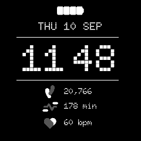

# ClockfaceRetro - Retro Clockface

A dot-matrix clock over the day's steps, active minutes and heart rate, with a
battery indicator at the top. Whole face in one font.

*Retro in the app simulator. The step count and active minutes are the design's sample values, fed in by hand: the simulator cannot serve the daily sensors, so both read zero when you run it yourself.*

> New to faces? Start with **[Writing a Watch Face](../writing-a-clockface.md)**,
> which covers the structure, the platform constraints and the techniques all
> five faces share. This page is only what is particular to Retro.

| | |
|---|---|
| Directory | `Examples/Apps/ClockfaceRetro` |
| `APP_NAME` / `APP_USER_NAME` | `Retro` |
| `APP_ID` | `A1D4E12E57637F8C` |
| `.uapp` size | ~78 KB |
| Design | Figma `1317:1176` (24-hour), `1317:1502` (12-hour) |
| Font | `Doto-Black.ttf` at 63 / 18 / 14 px |

## What it demonstrates

- **Four sensor subscriptions** in one service -- charge, steps, active minutes
  and heart rate -- with the three health readings published as one message,
  since they change on the same timescale and the face redraws the block as one.
- **A battery drawn as an image swap** rather than a container: four supplied
  46x15 bitmaps, one per 25 % band. Below the first band the indicator is taken
  down rather than drawn empty, because there is no artwork for an unlit
  battery.
- **A whole face in a single typeface**, which keeps it to ~78 KB despite three
  point sizes.
- **A date line assembled into one wildcard** -- `WED 22 MAY`, or `WED SEP 11`
  where the watch is set month-first, gaining `|AM` in the 12-hour form -- from
  day and month names read back out of the text database. This is the case that needs those glyphs declared in
  `WildcardCharacters` as well; see the guide.

## Layout

The clock is centred at runtime (`kSeparator12 = 38`, `kSeparator24 = 11`);
everything else is fixed in the Designer. Positions were checked band by band
against the supplied 240x240 render.

Doto is monospaced -- every glyph 600/1000 em -- which is what makes the
measured centring exact and why the 12-hour form needs no extra padding around
the colon.

## Assets

All from the content pack: `Battery1..4_46x15.png` (renamed low-to-full),
`StepsIcon_17x23.png`, `ActivityIcon_28x17.png`, `HrIcon_22x19.png`, and the
static `Doto-Black.ttf` -- static rather than the variable build because the
design pins the `ROND` axis to 0 and TouchGFX rasterises a fixed instance
anyway.

> **The content pack's folder names are right and its file names are not:**
> `Clock Face 3 Icons/` holds files named "Watch Face 4", `Clock Face 4 Icons/`
> is named "Watch Face 3", and `Clock Face 5 Icons/` says "Watch Face 6".
> Established by matching every icon's pixel size against the Figma group it
> fills. Trust the folders.

## Known gaps

- **A change of clock is not seen until the minute turns**, since the service is
  asleep until its next boundary. Leaving the face and returning corrects it at
  once, because resuming asks.
- The launcher icons are placeholders in the Analogue icon's style; the content
  pack carried none.
- What the simulator cannot feed is listed in the guide, and applies here to
  the step and active-minute rows.
