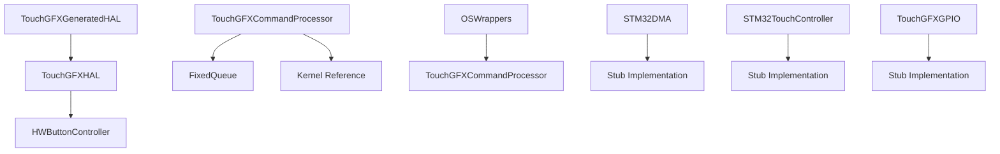
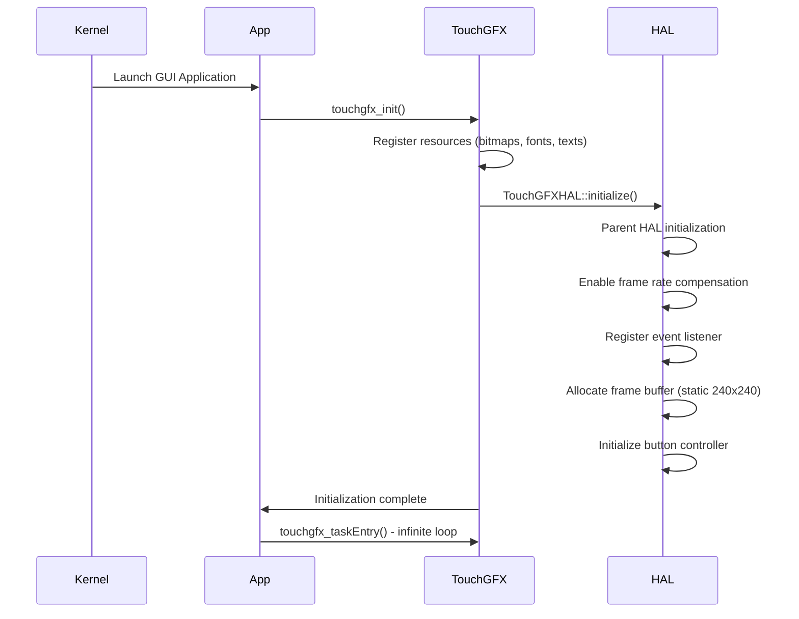
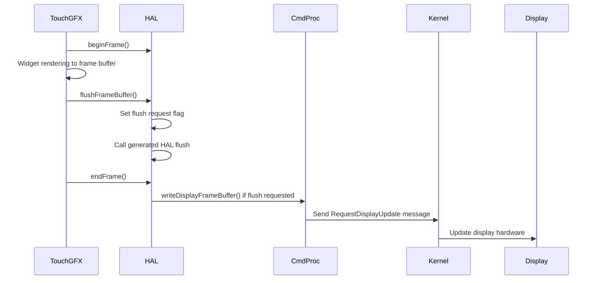
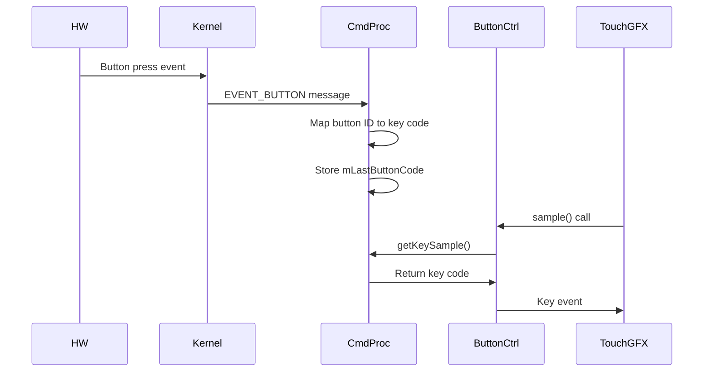
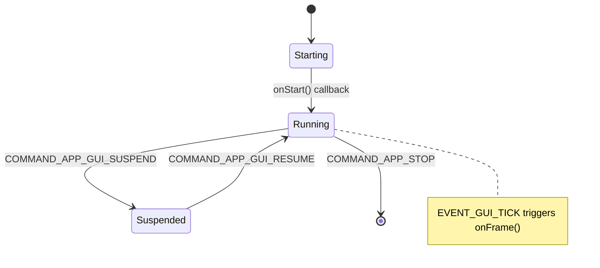

# TouchGFX Port Architecture

## Table of Contents

1. [Overview](#overview)
2. [Definitions and Terminology](#definitions-and-terminology)
3. [Prerequisites and Dependencies](#prerequisites-and-dependencies)
4. [Structural Architecture](#structural-architecture)
5. [API Structure](#api-structure)
6. [Behavioral Architecture](#behavioral-architecture)
   - [Initialization Flow](#initialization-flow)
   - [Rendering Flow](#rendering-flow)
   - [Input Handling](#input-handling)
   - [Lifecycle Management](#lifecycle-management)
   - [Data Flows](#data-flows)
7. [Configuration and Setup](#configuration-and-setup)
8. [Design Patterns](#design-patterns)
9. [Error Handling and Debugging](#error-handling-and-debugging)
10. [Extensibility and Customization Guide](#extensibility-and-customization-guide)
11. [Best Practices and Performance Tips](#best-practices-and-performance-tips)
12. [Overall Architecture Characteristics](#overall-architecture-characteristics)
13. [UNA-Specific System Integration Points](#una-specific-system-integration-points)
14. [References and Further Reading](#references-and-further-reading)
15. [FAQ](#faq)

## Overview

The TouchGFX port implementation for the UNA SDK provides a comprehensive hardware abstraction layer (HAL) that seamlessly integrates the TouchGFX GUI framework into the UNA platform. This port empowers developers to create sophisticated graphical user interfaces for UNA-based applications, leveraging TouchGFX's extensive widget library and rendering capabilities.

The implementation comprises custom HAL classes that extend TouchGFX-generated code, a robust command processor for kernel integration, and stub implementations for hardware interfaces not currently utilized in the UNA platform configuration. The port supports a 240x240 pixel display with 8-bit color depth using ABGR2222 format, software-based rendering, and button-based input handling through the UNA kernel messaging system.

Key architectural principles include:
- **Modular Design**: Separation between TouchGFX framework and UNA platform specifics
- **Message-Based Communication**: Asynchronous integration with the UNA kernel
- **Extensibility**: UNA support for future HW/SW customizations, includes using other GUI libraries like LVGL, etc
- **Performance Optimization**: Efficient resource usage within platform constraints

## Definitions and Terminology

- **ABGR2222**: A 8-bit color format where each pixel uses 2 bits per channel (Alpha, Blue, Green, Red) for compact color representation
- **UNA Kernel**: The core operating system component of the UNA platform, responsible for task scheduling, messaging, and hardware abstraction
- **Stub Implementation**: A minimal, non-functional implementation of an interface, used when the corresponding hardware or feature is not available
- **Frame Buffer**: A memory region storing pixel data for display rendering
- **VSync (Vertical Synchronization)**: Synchronization signal ensuring display updates occur at the correct refresh rate
- **HAL (Hardware Abstraction Layer)**: Software layer that provides a consistent interface to hardware components
- **Frontend Heap**: Memory allocation system used by TouchGFX for dynamic GUI elements
- **Message Queue**: A fixed-size buffer (capacity: 10 messages) for storing kernel messages in the TouchGFX command processor

## Structural Architecture

### Class Hierarchy



### Key Classes and Interfaces

#### TouchGFXHAL
- **Location**: `Libs/Source/Port/TouchGFX/TouchGFXHAL.cpp`, `Libs/Header/SDK/Port/TouchGFX/TouchGFXHAL.hpp`
- **Purpose**: Main hardware abstraction layer extending TouchGFXGeneratedHAL
- **Key Responsibilities**:
  - Frame buffer management and allocation
  - Button controller integration
  - Display initialization and configuration
  - Interrupt handling (delegated to generated HAL)
  - Frame synchronization and flushing

#### TouchGFXCommandProcessor
- **Location**: `Libs/Source/Port/TouchGFX/TouchGFXCommandProcessor.cpp`, `Libs/Header/SDK/Port/TouchGFX/TouchGFXCommandProcessor.hpp`
- **Purpose**: Central command processor and lifecycle manager (singleton pattern)
- **Key Responsibilities**:
  - Kernel message processing and routing
  - GUI lifecycle management (start/stop/resume/suspend)
  - Button event handling and translation
  - Custom message routing
  - Frame synchronization via VSync
  - Display update message sending

#### HWButtonController
- **Location**: `Libs/Source/Port/TouchGFX/TouchGFXHAL.cpp` (nested class)
- **Purpose**: Button input controller for TouchGFX
- **Key Responsibilities**:
  - Sampling button states from command processor
  - Translating UNA button events to TouchGFX key codes
  - Polled input handling

#### Generated and Stub Classes
- **TouchGFXGeneratedHAL**: Base HAL implementation generated by TouchGFX tools
- **OSWrappers**: Operating system abstraction layer bridging TouchGFX to UNA kernel
- **STM32DMA**: DMA interface (stub implementation - not supported)
- **STM32TouchController**: Touch input controller (stub implementation - not implemented)
- **TouchGFXGPIO**: GPIO interface (stub implementation - not utilized)

### Data Structures
- **Frame Buffer**: Static `uint8_t sFrameBuffer[57600]` (240×240×1 byte/pixel)
- **Active Buffer Pointer**: `uint8_t* spActiveBuffer`
- **Flush Request Flag**: `bool sFlushBufferReq`
- **Button State**: `uint8_t mLastButtonCode`
- **Message Queue**: `FixedQueue<MessageBase*, 10> mUserQueue` for custom messages
- **Kernel Reference**: Direct access to UNA kernel for messaging

## API Structure

### Public Interfaces

#### TouchGFXHAL
```cpp
class TouchGFXHAL : public TouchGFXGeneratedHAL {
public:
    TouchGFXHAL(DMA_Interface& dma, LCD& display, TouchController& tc, uint16_t width, uint16_t height);
    virtual void initialize();
    virtual void disableInterrupts();
    virtual void enableInterrupts();
    virtual void configureInterrupts();
    virtual void enableLCDControllerInterrupt();
    virtual bool beginFrame();
    virtual void endFrame();
    virtual void flushFrameBuffer();
    virtual void flushFrameBuffer(const Rect& rect);
    virtual bool blockCopy(void* dest, const void* src, uint32_t numBytes);

protected:
    virtual uint16_t* getTFTFrameBuffer() const;
    virtual void setTFTFrameBuffer(uint16_t* adr);
};
```

#### TouchGFXCommandProcessor
```cpp
class TouchGFXCommandProcessor {
public:
    static TouchGFXCommandProcessor& GetInstance();
    void setAppLifeCycleCallback(IGuiLifeCycleCallback* cb);
    void setCustomMessageHandler(ICustomMessageHandler* h);
    bool waitForFrameTick();
    bool getKeySample(uint8_t& key);
    void writeDisplayFrameBuffer(const uint8_t* data);
    void callCustomMessageHandler();
};
```

### Configuration Functions
- `touchgfx_init()`: Initializes TouchGFX framework, registers resources
- `touchgfx_taskEntry()`: Main GUI task entry point (infinite loop)
- `touchgfx_components_init()`: Component initialization (currently empty)

### Key Relationships
- **TouchGFXHAL** extends **TouchGFXGeneratedHAL** for UNA-specific customizations
- **TouchGFXCommandProcessor** acts as a singleton managing global GUI state
- **HWButtonController** polls **TouchGFXCommandProcessor** for input
- **OSWrappers** delegates VSync waiting to **TouchGFXCommandProcessor**
- Generated classes provide minimal base implementations with stub functionality

## Behavioral Architecture

### Initialization Flow



1. **Application Startup**: UNA kernel launches the GUI application process
2. **TouchGFX Initialization**:
   - `touchgfx_init()` configures the framework
   - Bitmap database, text resources, and font providers are registered
   - Frontend heap is initialized for dynamic allocations
   - HAL is initialized via `TouchGFXHAL::initialize()`
3. **HAL Setup**:
   - Parent generated HAL initialization
   - Frame rate compensation enabled for smooth rendering
   - Event listener registered with TouchGFX Application
   - Static frame buffer allocated (240×240×1 byte)
   - Button controller initialized and configured

### Rendering Flow



1. **Frame Start**: `HAL::beginFrame()` prepares for rendering
2. **Drawing Operations**: TouchGFX widgets render directly to the frame buffer
3. **Frame Flush**: `TouchGFXHAL::flushFrameBuffer()` is called
   - Sets internal flush request flag
   - Delegates to generated HAL for framework notification
4. **Display Update**: Command processor sends display update message to kernel
5. **Frame End**: `HAL::endFrame()` completes the frame cycle

### Input Handling



1. **Button Events**: Hardware button presses generate kernel `EVENT_BUTTON` messages
2. **Event Processing**: Command processor receives and processes button events
3. **Key Mapping**: Button IDs are translated to TouchGFX key codes:
   - SW1 → '1'
   - SW2 → '3'
   - SW3 → '2'
   - SW4 → '4'
4. **Sampling**: `HWButtonController::sample()` retrieves the last button code via `getKeySample()`

### Lifecycle Management



1. **Start**: `onStart()` callback invoked on first frame tick
2. **Resume/Suspend**: Handled via kernel commands with corresponding callbacks
3. **Stop**: `onStop()` callback executed, application terminates
4. **Frame Ticks**: `EVENT_GUI_TICK` messages trigger `onFrame()` callbacks for rendering

### Data Flows

#### Rendering Data Flow
```
TouchGFX Widgets → Frame Buffer (uint8_t[57600]) → flushFrameBuffer() → Display Update Message → Kernel → Display Hardware
```

#### Input Data Flow
```
Hardware Buttons → Kernel → EVENT_BUTTON Message → TouchGFXCommandProcessor.mLastButtonCode → HWButtonController → TouchGFX Key Events
```

#### Lifecycle Data Flow
```
Kernel Commands (START/STOP/RESUME/SUSPEND) → TouchGFXCommandProcessor → Lifecycle Callbacks → TouchGFX Application
```

#### VSync Synchronization
```
Kernel → EVENT_GUI_TICK Message → TouchGFXCommandProcessor.waitForFrameTick() → OSWrappers.waitForVSync() → TouchGFX Frame Processing
```

## Configuration and Setup

### Basic Setup
1. Include TouchGFX port headers in your application
2. Initialize the command processor singleton
3. Set lifecycle callbacks if needed
4. Call TouchGFX initialization functions
5. Start the GUI task

### Code Example: Basic Application Setup
```cpp
#include "SDK/Port/TouchGFX/TouchGFXCommandProcessor.hpp"

// In your application initialization
void setupGUI() {
    auto& cmdProc = SDK::TouchGFXCommandProcessor::GetInstance();

    // Set lifecycle callbacks (optional)
    cmdProc.setAppLifeCycleCallback(&myLifeCycleCallback);

    // Initialize TouchGFX
    touchgfx_init();

    // Start GUI task (never returns)
    touchgfx_taskEntry();
}
```

### Advanced Configuration
- **Custom Message Handling**: Implement `ICustomMessageHandler` for application-specific messages
- **Button Mapping**: Modify `TouchGFXCommandProcessor::handleEvent()` for custom key mappings
- **Display Parameters**: Adjust frame buffer size in `TouchGFXHAL.cpp` if display resolution changes

## Design Patterns

### Singleton Pattern
- **TouchGFXCommandProcessor**: Ensures single instance managing global GUI state
- Provides centralized access to command processing and lifecycle management

### Adapter Pattern
- **TouchGFXHAL**: Adapts TouchGFX HAL interface to UNA platform specifics
- **HWButtonController**: Translates UNA button events to TouchGFX input system

### Template Method Pattern
- **TouchGFXHAL** overrides specific methods while delegating others to generated base class
- Enables customization of key behaviors while maintaining framework compatibility

### Observer Pattern
- **Event Listeners**: HAL registers with TouchGFX Application for framework events
- **Lifecycle Callbacks**: Command processor notifies registered callbacks of state changes

### Bridge Pattern
- **OSWrappers**: Bridges TouchGFX OS requirements to UNA kernel primitives
- Separates platform-specific OS operations from framework logic

## Error Handling and Debugging

### Common Issues and Troubleshooting

| Issue | Symptoms | Solution |
|-------|----------|----------|
| GUI not starting | Application hangs on startup | Check kernel messaging setup, verify TouchGFX resources |
| Display not updating | Screen remains blank | Verify frame buffer allocation, check display update messages |
| Button input not working | Buttons don't respond | Check button mapping in `handleEvent()`, verify kernel button events |
| Memory allocation failures | Application crashes | Ensure sufficient heap space for TouchGFX allocations |
| Frame rate issues | Jerky animation | Check VSync timing, verify `EVENT_GUI_TICK` frequency |

### Debugging Techniques
- **Logging**: Enable debug logging in `TouchGFXCommandProcessor` for message flow tracing
- **Frame Buffer Inspection**: Add debug output to inspect frame buffer contents
- **Message Queue Monitoring**: Track queue usage to detect overflow conditions
- **Performance Profiling**: Use GPIO signals for frame timing analysis (when implemented)

### Error Codes and Messages
- **Queue Full**: Custom message queue reaches capacity (10 messages) - oldest message discarded
- **Invalid Message Type**: Unknown kernel message received - logged and ignored
- **Display Update Failure**: Frame buffer write fails - check kernel communication

## Extensibility and Customization Guide

### Adding Custom Hardware Support
1. **Extend HAL**: Create custom HAL class inheriting from `TouchGFXHAL`
2. **Implement Interfaces**: Override methods for new hardware (e.g., DMA, touch)
3. **Update Stubs**: Replace stub implementations with functional code

### Custom Message Handling
```cpp
class MyCustomHandler : public ICustomMessageHandler {
public:
    bool customMessageHandler(MessageBase* msg) override {
        switch (msg->getType()) {
            case MY_CUSTOM_MESSAGE_TYPE:
                // Handle custom message
                return true;
            default:
                return false;
        }
    }
};

// Register handler
cmdProc.setCustomMessageHandler(new MyCustomHandler());
```

### Button Customization
Modify `TouchGFXCommandProcessor::handleEvent()` to change key mappings or add new buttons.

### Display Configuration
Adjust `skWidth`, `skHeight`, and `skBufferSize` in `TouchGFXHAL.cpp` for different display sizes.

## Best Practices and Performance Tips

### Memory Management
- **Static Allocation**: Use static frame buffer to avoid heap fragmentation
- **Frontend Heap**: Monitor usage for dynamic GUI elements
- **Message Queue**: Keep queue size optimized (currently 10) for your use case

### Performance Optimization
- **Frame Rate**: Balance between smooth animation and CPU usage
- **Rendering**: Minimize overdraw by using efficient widget layouts
- **Input Polling**: Button sampling is polled as GUI is single-thread.

### Code Organization
- **Separation of Concerns**: Keep TouchGFX logic separate from UNA platform code
- **Modular Design**: Use callbacks for lifecycle events rather than tight coupling
- **Error Handling**: Implement robust error handling for kernel communication failures

### Development Tips
- **Testing**: Use simulator builds for rapid development and testing
- **Version Control**: Keep generated and custom code in separate files
- **Documentation**: Document any custom extensions or modifications

## Overall Architecture Characteristics

### Hardware Configuration
- **Display**: 240×240 pixels, 8-bit color (ABGR2222 format)
- **Frame Buffer**: Single static buffer, software rendering only
- **DMA**: Not supported (stub implementation)
- **Touch Input**: Not implemented (stub controller)
- **GPIO**: Not utilized (stub implementation)

### Performance Characteristics
- **Rendering**: Software-based, no hardware acceleration available yet.
- **Memory Usage**: ~57.6 KB static frame buffer + dynamic allocations
- **Synchronization**: Kernel-driven VSync via messaging system
- **Input Handling**: Polled button sampling, no interrupt-driven input
- **Threading Model**: Single-threaded GUI execution

### Integration Approach
- **Kernel Integration**: Asynchronous message-based communication
- **Lifecycle Management**: Command processor handles complete application lifecycle
- **Threading**: Single-threaded execution within GUI task
- **Resource Management**: Frontend heap for TouchGFX dynamic allocations

### Extensibility Features
- **Custom Messages**: Support for application-specific kernel messages via queue
- **Lifecycle Callbacks**: Configurable start/stop/resume/suspend event handlers
- **Hardware Abstraction**: Modular HAL design enables platform customization
- **Stub Architecture**: Easy replacement of non-implemented features

### Limitations and Constraints
- **No Hardware Acceleration**: Software rendering limits performance for complex UIs
- **No Touch Support**: Button-only input, no gesture recognition
- **No DMA**: Memory copies use CPU, potential bottleneck for large transfers
- **Single Buffer**: No double buffering, may cause tearing if not synchronized properly
- **Fixed Resolution**: Currently optimized for 240×240 displays only

## UNA-Specific System Integration Points

The UNA SDK extends standard TouchGFX with comprehensive system integration capabilities that enable seamless operation within the UNA platform ecosystem. These integration points provide the foundation for building sophisticated embedded applications with proper lifecycle management, inter-process communication, and resource coordination.

### Core Integration Components

#### TouchGFXCommandProcessor
- **Location**: [`Libs/Source/Port/TouchGFX/TouchGFXCommandProcessor.cpp:25-77`](Libs/Source/Port/TouchGFX/TouchGFXCommandProcessor.cpp:25), [`Libs/Header/SDK/Port/TouchGFX/TouchGFXCommandProcessor.hpp:35-76`](Libs/Header/SDK/Port/TouchGFX/TouchGFXCommandProcessor.hpp:35)
- **Purpose**: Singleton command processor that serves as the central hub for UNA kernel integration
- **Key Features**:
  - Asynchronous message-based communication with UNA kernel
  - Fixed-size message queue (capacity: 10 messages, configurable) for custom application messages
  - Lifecycle event handling (start/stop/resume/suspend)
  - Button event processing and sampling
  - Frame buffer update coordination

**Technical Implementation Details:**
```cpp
// Singleton instance management
TouchGFXCommandProcessor& TouchGFXCommandProcessor::GetInstance() {
    static TouchGFXCommandProcessor sInstance;
    return sInstance;
}

// Message processing loop (simplified)
bool TouchGFXCommandProcessor::waitForFrameTick() {
    while (true) {
        SDK::MessageBase* msg = nullptr;
        if (!mKernel.comm.getMessage(msg)) {
            continue; // Block until message available
        }

        switch (msg->getType()) {
            case SDK::MessageType::EVENT_GUI_TICK:
                // Process frame tick
                if (mAppLifeCycleCallback) {
                    mAppLifeCycleCallback->onFrame();
                }
                return false; // Allow TouchGFX to render
            // ... other message types
        }
    }
}
```

#### Kernel Message Processing
**Message Structure Details:**

**EventButton Message Structure:**
```cpp
// From Libs/Header/SDK/Messages/CommandMessages.hpp:462-501
struct EventButton : public MessageBase {
    enum class Id : uint8_t {
        SW1 = 0, SW2, SW3, SW4  // Physical button identifiers
    };

    enum class Event : uint8_t {
        PRESS = 0, RELEASE, CLICK, LONG_PRESS, HOLD_1S, HOLD_5S, HOLD_10S
    };

    uint32_t timestamp;  // Event timestamp
    Id id;              // Which button (SW1-SW4)
    Event event;        // Event type (CLICK used for TouchGFX)
};
```

**Button Mapping Implementation:**
```cpp
// From Libs/Source/Port/TouchGFX/TouchGFXCommandProcessor.cpp:189-205
void TouchGFXCommandProcessor::handleEvent(SDK::Message::EventButton* msg) {
    if (!mIsGuiResumed) {
        mLastButtonCode = '\0';
        return;
    }

    if (msg->event == SDK::Message::EventButton::Event::CLICK) {
        switch (msg->id) {
            case SDK::Message::EventButton::Id::SW1: mLastButtonCode = '1'; break;
            case SDK::Message::EventButton::Id::SW2: mLastButtonCode = '3'; break;
            case SDK::Message::EventButton::Id::SW3: mLastButtonCode = '2'; break;
            case SDK::Message::EventButton::Id::SW4: mLastButtonCode = '4'; break;
        }
    }
}
```

**RequestDisplayUpdate Message Structure:**
```cpp
// From Libs/Header/SDK/Messages/CommandMessages.hpp:293-306
struct RequestDisplayUpdate : public MessageBase {
    const uint8_t* pBuffer;  // Pointer to 240x240x1 byte frame buffer
    int16_t x, y;            // Update region (unused, always full screen)
    int16_t width, height;   // Region size (unused, always 0 for full update)

    RequestDisplayUpdate()
        : MessageBase(MessageType::REQUEST_DISPLAY_UPDATE)
        , pBuffer(nullptr), x(0), y(0), width(0), height(0) {}
};
```

**Frame Buffer Update Implementation:**
```cpp
// From Libs/Source/Port/TouchGFX/TouchGFXCommandProcessor.cpp:157-169
void TouchGFXCommandProcessor::writeDisplayFrameBuffer(const uint8_t* data) {
    if (!data || !mIsGuiResumed) {
        return;  // Don't update if suspended or invalid data
    }

    auto* msg = mKernel.comm.allocateMessage<SDK::Message::RequestDisplayUpdate>();
    if (msg) {
        msg->pBuffer = data;  // Pass frame buffer pointer
        mKernel.comm.sendMessage(msg, 1000);  // Send with 1s timeout
        mKernel.comm.releaseMessage(msg);
    }
}
```

- **Message Types Handled**:
  - `COMMAND_APP_STOP`: Graceful application termination with cleanup
  - `EVENT_GUI_TICK`: Frame synchronization and rendering triggers
  - `EVENT_BUTTON`: Physical button input processing (SW1-SW4 mapping)
  - `COMMAND_APP_GUI_RESUME/SUSPEND`: GUI state management
  - Custom application-specific messages via extensible queue system
- **Integration**: Direct kernel communication through `SDK::Kernel` interface

#### Hardware Abstraction Layer Extensions
- **Custom HAL Implementation**: [`Libs/Source/Port/TouchGFX/TouchGFXHAL.cpp:67-87`](Libs/Source/Port/TouchGFX/TouchGFXHAL.cpp:67)
  - Kernel-driven frame buffer flushing via `writeDisplayFrameBuffer()`
  - Button controller integration with kernel message sampling
  - Static frame buffer allocation (57.6 KB for 240×240×8-bit)
  - VSync synchronization through kernel messaging

**HAL Frame Buffer Management:**
```cpp
// From Libs/Source/Port/TouchGFX/TouchGFXHAL.cpp:53-64
static const int16_t skWidth = 240;
static const int16_t skHeight = 240;
static const uint32_t skBufferSize = skWidth * skHeight;  // 57,600 bytes

static uint8_t sFrameBuffer[skBufferSize];  // Static allocation
static uint8_t* spActiveBuffer;
static bool sFlushBufferReq;

// Frame buffer initialization
void TouchGFXHAL::initialize() {
    HAL::initialize();
    spActiveBuffer = sFrameBuffer;
    setFrameBufferStartAddresses((void*)spActiveBuffer, nullptr, nullptr);
}
```

**Flush Mechanism:**
```cpp
// From Libs/Source/Port/TouchGFX/TouchGFXHAL.cpp:128-142
void TouchGFXHAL::flushFrameBuffer(const touchgfx::Rect& rect) {
    sFlushBufferReq = true;  // Set flag for endFrame()
    TouchGFXGeneratedHAL::flushFrameBuffer(rect);
}

// From Libs/Source/Port/TouchGFX/TouchGFXHAL.cpp:203-216
void TouchGFXHAL::endFrame() {
    if (sFlushBufferReq) {
        // Send frame buffer to kernel for display
        SDK::TouchGFXCommandProcessor::GetInstance()
            .writeDisplayFrameBuffer(spActiveBuffer);
        sFlushBufferReq = false;
    }
    TouchGFXGeneratedHAL::endFrame();
}
```

#### Operating System Wrappers
- **Location**: [`Libs/Source/Port/TouchGFX/generated/OSWrappers.cpp:105-108`](Libs/Source/Port/TouchGFX/generated/OSWrappers.cpp:105)
- **UNA-Specific Functions**:
  - `waitForVSync()`: Blocks until kernel sends GUI tick message
  - `taskDelay()`: Uses kernel delay functionality
  - `taskYield()`: Kernel-based task scheduling

**VSync Implementation:**
```cpp
// From Libs/Source/Port/TouchGFX/generated/OSWrappers.cpp:105-108
void OSWrappers::waitForVSync() {
    // Delegate to command processor message loop
    SDK::TouchGFXCommandProcessor::GetInstance().waitForFrameTick();
}
```

### Application Lifecycle Management

#### Lifecycle Callbacks
- **Interface**: `SDK::Interface::IGuiLifeCycleCallback`
- **Events**:
  - `onStart()`: Called once when GUI application begins
  - `onStop()`: Called during application termination for cleanup
  - `onResume()`: GUI reactivation after suspension
  - `onSuspend()`: GUI deactivation
  - `onFrame()`: Called each frame for application logic

**Lifecycle State Machine:**
```cpp
// From Libs/Source/Port/TouchGFX/TouchGFXCommandProcessor.cpp:25-32
TouchGFXCommandProcessor::TouchGFXCommandProcessor()
    : mKernel(SDK::KernelProviderGUI::GetInstance().getKernel())
    , mStartCallbackCalled(false)
    , mIsGuiResumed(false)
    , mLastButtonCode(0)
    , mAppLifeCycleCallback(nullptr)
    , mCustomMessageHandler(nullptr) {}
```

#### Custom Message Handling
- **Interface**: `SDK::Interface::ICustomMessageHandler`
- **Purpose**: Enables application-specific kernel message processing
- **Implementation**: `customMessageHandler()` method for processing queued messages

**Message Queue Implementation:**
```cpp
// From Libs/Header/SDK/Port/TouchGFX/TouchGFXCommandProcessor.hpp:73
SDK::Tools::FixedQueue<SDK::MessageBase*, 10> mUserQueue {};

// Queue processing in message loop
void TouchGFXCommandProcessor::callCustomMessageHandler() {
    while (!mUserQueue.empty()) {
        auto v = mUserQueue.pop();
        if (v) {
            auto msg = *v;
            bool result = false;
            if (mCustomMessageHandler) {
                result = mCustomMessageHandler->customMessageHandler(msg);
            }
            // Send response back to kernel
            msg->setResult(result ? SUCCESS : FAIL);
            mKernel.comm.sendResponse(msg);
            mKernel.comm.releaseMessage(msg);
        }
    }
}
```

### Performance Implications and Optimizations

#### Memory Management
- **Static Frame Buffer**: 57.6 KB pre-allocated to avoid heap fragmentation
- **Fixed Message Queue**: 10-message capacity prevents unbounded growth
- **Frontend Heap**: TouchGFX dynamic allocations monitored for leaks

**Performance Characteristics:**
- **Frame Rate**: Limited by kernel tick frequency (typically 30-60 FPS)
- **CPU Usage**: Software rendering + message processing overhead
- **Memory Footprint**: ~64 KB total (frame buffer + TouchGFX overhead)
- **Latency**: Button input delayed by message processing (~1-2ms)

#### Synchronization Optimizations
- **Kernel-Driven VSync**: Eliminates polling, reduces power consumption
- **Asynchronous Display Updates**: Non-blocking frame buffer submission
- **Message Prioritization**: Critical messages (ticks, buttons) processed first

#### Error Handling and Recovery
- **Queue Overflow Protection**: Oldest messages discarded with logging
- **Timeout Handling**: Display update messages have 1-second timeout
- **Graceful Degradation**: GUI suspends on communication failures

### Additional Integration Points

#### Memory Management Integration
- **Frontend Heap Monitoring**: Integration with UNA memory tracking
- **Resource Cleanup**: Automatic cleanup on application termination
- **Leak Prevention**: Static allocations avoid dynamic memory issues

#### Error Handling and Diagnostics
- **Message Logging**: All kernel communications logged for debugging
- **State Validation**: GUI state checked before processing messages
- **Recovery Mechanisms**: Automatic resume after transient failures

#### Power Management Integration
- **Suspend/Resume Handling**: Proper power state transitions
- **Display Control**: Backlight and display power managed by kernel
- **Idle Detection**: TouchGFX animations paused during suspend

### Key Integration Points Summary

| Integration Point | Standard TouchGFX | UNA Extension | Purpose |
|-------------------|-------------------|---------------|---------|
| Frame Synchronization | Hardware VSync | Kernel message-based | Ensures proper timing without hardware interrupts |
| Input Handling | Touch/DMA controllers | Kernel button messages | Physical button integration via messaging |
| Lifecycle Management | Application init/exit | Full lifecycle callbacks | Proper resource management and state transitions |
| Inter-Process Communication | N/A | Message queue system | Custom application messaging with kernel |
| Task Scheduling | OS task switching | Kernel yield/delay | Cooperative multitasking within UNA ecosystem |
| Frame Buffer Updates | DMA/hardware transfer | Kernel message dispatch | Display updates through UNA communication system |
| Memory Management | Dynamic allocation | Static buffers + heap monitoring | Prevents fragmentation in constrained environment |
| Error Handling | Framework exceptions | Kernel-level supervision | Robust operation with failure recovery |
| Power Management | N/A | Suspend/resume integration | Proper power state handling |

### Benefits of UNA Integration

- **Seamless Platform Integration**: TouchGFX applications operate as first-class citizens within the UNA ecosystem
- **Resource Coordination**: Proper lifecycle management prevents resource conflicts
- **Extensible Communication**: Message-based architecture supports custom application features
- **Robust Error Handling**: Kernel-level supervision and graceful failure recovery
- **Performance Optimization**: Kernel-driven synchronization minimizes unnecessary processing
- **Memory Safety**: Static allocations and monitoring prevent leaks and fragmentation
- **Power Efficiency**: Proper suspend/resume handling extends battery life

## References and Further Reading

### TouchGFX Documentation
- [TouchGFX Designer Guide](https://support.touchgfx.com/docs/introduction/welcome)
- [TouchGFX HAL Documentation](https://support.touchgfx.com/docs/development/ui-development/touchgfx-engine-features/hal)
- [TouchGFX Framework Overview](https://support.touchgfx.com/docs/introduction/touchgfx-framework)

### UNA SDK Documentation
- UNA Kernel Messaging System
- UNA Hardware Abstraction Layer
- UNA Application Lifecycle Management

### Related Projects
- STM32 TouchGFX Examples
- Embedded GUI Development Best Practices
- Real-time Operating System Integration Patterns

## FAQ

### Q: Why is the frame buffer static and not dynamically allocated?
**A:** Static allocation ensures predictable memory usage and avoids heap fragmentation in resource-constrained embedded systems. The fixed 240×240 resolution allows for compile-time size calculation.

### Q: Can I add touch support to this port?
**A:** Yes, implement the `STM32TouchController` stub with actual touch hardware interfacing. Update the HAL initialization to use the functional controller instead of the stub.

### Q: How do I handle custom kernel messages in my TouchGFX application?
**A:** Implement the `ICustomMessageHandler` interface and register it with the command processor. Messages will be queued and processed during the GUI task loop.

### Q: What happens if the message queue overflows?
**A:** The oldest message is discarded with a warning logged. Monitor queue usage in production to ensure adequate capacity.

### Q: Can I use hardware acceleration for rendering?
**A:** Currently not supported. The DMA stub can be implemented if hardware acceleration becomes available on the UNA platform.

### Q: How do I debug display update issues?
**A:** Enable logging in the command processor to trace display update messages. Verify kernel-side display handling and check for message delivery failures.

### Q: Is double buffering supported?
**A:** Not currently implemented. The single buffer design simplifies memory management but may require careful synchronization to avoid visual artifacts.

### Q: Can I change the display resolution?
**A:** Yes, but requires modifying `skWidth`, `skHeight`, and `skBufferSize` in `TouchGFXHAL.cpp`, and regenerating TouchGFX assets for the new resolution.
