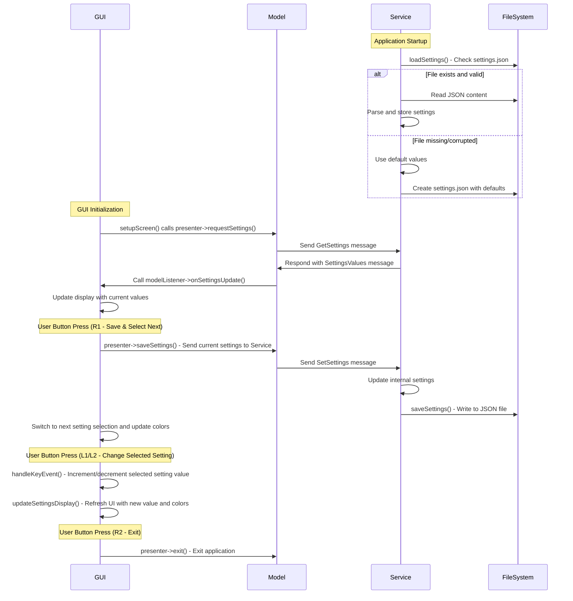

# Files Tutorial - Selectable Settings Management Implementation

This comprehensive tutorial demonstrates a complete settings management system for the UNA SDK, featuring persistent file-based storage, JSON serialization, and seamless GUI-Service communication. The tutorial implements three configurable settings with full CRUD operations, error handling, and an intuitive selectable settings interface using physical buttons for navigation and value cycling.

[Project Folder](https://github.com/UNAWatch/una-sdk/tree/main/Docs/Tutorials/Files)
 
## Overview

The Files tutorial showcases advanced UNA SDK concepts including:
- **Persistent Settings Storage**: JSON file operations with automatic save/load
- **Inter-Process Communication**: Custom message passing between GUI and Service layers
- **TouchGFX MVP Architecture**: Model-View-Presenter pattern implementation
- **File System Integration**: Using SDK's IFileSystem interface
- **Error Recovery**: Graceful handling of corrupted files and I/O errors

## Settings System Architecture

### Settings Data Model

The system manages three distinct setting types:

#### 1. Decimal Counter (Float-based Setting)
- **Purpose**: Configurable numeric value for counting/display purposes
- **Type**: `float` (GUI) / `int32_t` (Service - implementation detail)
- **Valid Values**: 0.5, 1.0, 1.5, 2.0 (cycling through predefined values)
- **Default**: 1.0
- **Storage**: Multiplied by 10 for integer transmission (1.5 → 15)

#### 2. Activity Type (Enumeration Setting)
- **Purpose**: Activity category selection
- **Type**: `CustomMessage::ActivityType` enum
- **Values**:
  - `RUNNING = 0` - Running activities
  - `CYCLING = 1` - Cycling activities
  - `SWIMMING = 2` - Swimming activities
  - `WALKING = 3` - Walking activities
- **Default**: `RUNNING`

#### 3. Display Mode (Enumeration Setting)
- **Purpose**: UI display preference configuration
- **Type**: `CustomMessage::DisplayMode` enum
- **Values**:
  - `SIMPLE = 0` - Basic display mode
  - `DETAILED = 1` - Detailed display mode
  - `COMPACT = 2` - Compact display mode
- **Default**: `SIMPLE`

### JSON File Format

Settings persist in `settings.json` with this structure:

```json
{
  "decimalCounter": 10,
  "activityType": 0,
  "displayMode": 0
}
```

**Note**: Values stored as integers for simplicity; GUI converts decimal counter to/from float representation.

## Message Passing System

### Custom Message Types

The tutorial defines custom messages in the application-specific range (0x00000000-0x0000FFFF):

#### GET_SETTINGS (0x00000002)
- **Direction**: GUI → Service
- **Purpose**: Request current settings from Service
- **Structure**: `CustomMessage::GetSettings` (empty payload)
- **Response**: `SETTINGS_VALUES` message with current values

#### SET_SETTINGS (0x00000003)
- **Direction**: GUI → Service
- **Purpose**: Update settings and persist to file
- **Structure**: `CustomMessage::SetSettings`
  - `int decimalCounter` - Counter value (multiplied by 10)
  - `int activityType` - Activity type enum value
  - `int displayMode` - Display mode enum value
- **Response**: Automatic save to file

#### SETTINGS_VALUES (0x00000004)
- **Direction**: Service → GUI
- **Purpose**: Deliver current settings to GUI
- **Structure**: `CustomMessage::SettingsValues`
  - `int decimalCounter` - Counter value (multiplied by 10)
  - `int activityType` - Activity type enum value
  - `int displayMode` - Display mode enum value

### Message Flow Architecture



## Service Layer Implementation

### Service Class Structure

The Service class (`Service.hpp/cpp`) manages settings persistence and handles GUI communication:

```cpp
class Service {
public:
    Service(SDK::Kernel& kernel);
    void run();

private:
    // Settings storage
    int32_t mDecimalCounter;
    CustomMessage::ActivityType mActivityType;
    CustomMessage::DisplayMode mDisplayMode;

    // Communication
    CustomMessage::GUISender mSender;

    // Methods
    void loadSettings();
    void saveSettings();
    void onStartGUI();
    void onStopGUI();
};
```

### Settings File Operations

#### Loading Settings (`loadSettings()`)

```cpp
void Service::loadSettings() {
    auto file = mKernel.fs.file("settings.json");
    if (file && file->open(SDK::Interface::IFile::Mode::READ)) {
        char buffer[1024];
        size_t bytesRead = file->read(buffer, sizeof(buffer) - 1);
        if (bytesRead > 0) {
            buffer[bytesRead] = '\0';
            SDK::JsonStreamReader reader(buffer, bytesRead);
            if (reader.isValid()) {
                // Read integer values from JSON
                int32_t decimalCounter = mDecimalCounter;
                int32_t activityType = static_cast<int32_t>(mActivityType);
                int32_t displayMode = static_cast<int32_t>(mDisplayMode);

                reader.getInt("decimalCounter", decimalCounter);
                reader.getInt("activityType", activityType);
                reader.getInt("displayMode", displayMode);

                // Validate and convert back to types
                mDecimalCounter = decimalCounter;
                mActivityType = static_cast<CustomMessage::ActivityType>(activityType);
                mDisplayMode = static_cast<CustomMessage::DisplayMode>(displayMode);

                LOG_INFO("Settings loaded from file\n");
            }
        }
        file->close();
    } else {
        LOG_INFO("Settings file not found, using defaults\n");
    }
}
```

**Key Points**:
- Uses `SDK::JsonStreamReader` for parsing
- Falls back to defaults if file missing or invalid
- Stores values as integers in JSON for simplicity

#### Saving Settings (`saveSettings()`)

```cpp
void Service::saveSettings() {
    auto file = mKernel.fs.file("settings.json");
    if (file && file->open(SDK::Interface::IFile::Mode::WRITE)) {
        SDK::JsonStreamWriter writer(file.get());
        writer.startObject();
        writer.add("decimalCounter", mDecimalCounter);
        writer.add("activityType", static_cast<int>(mActivityType));
        writer.add("displayMode", static_cast<int>(mDisplayMode));
        writer.endObject();
        file->close();
        LOG_INFO("Settings saved to file\n");
    } else {
        LOG_ERROR("Failed to save settings\n");
    }
}
```

**Key Points**:
- Uses `SDK::JsonStreamWriter` for serialization
- Overwrites entire file on each save
- Logs success/failure for debugging

### Message Handling in Service

The Service's main loop processes custom messages:

```cpp
case CustomMessage::GET_SETTINGS: {
    LOG_INFO("Received GET_SETTINGS request\n");
    mSender.updateSettings(mDecimalCounter,
                          static_cast<int>(mActivityType),
                          static_cast<int>(mDisplayMode));
} break;

case CustomMessage::SET_SETTINGS: {
    auto setMsg = static_cast<CustomMessage::SetSettings*>(msg);
    LOG_INFO("Received SET_SETTINGS: dc=%d, at=%d, dm=%d\n",
             setMsg->decimalCounter, setMsg->activityType, setMsg->displayMode);

    // Update internal settings
    mDecimalCounter = setMsg->decimalCounter;
    mActivityType = static_cast<CustomMessage::ActivityType>(setMsg->activityType);
    mDisplayMode = static_cast<CustomMessage::DisplayMode>(setMsg->displayMode);

    // Persist to file
    saveSettings();
} break;
```

## GUI Layer Implementation

### Model-View-Presenter Architecture

The GUI follows TouchGFX's MVP pattern:

- **Model** (`Model.hpp/cpp`): Handles business logic and Service communication
- **View** (`MainView.hpp/cpp`): Manages UI rendering and user input
- **Presenter** (`MainPresenter.hpp/cpp`): Bridges Model and View

### Model Implementation

#### Message Sending

```cpp
void Model::requestSettings() {
    if (auto req = SDK::make_msg<CustomMessage::GetSettings>(mKernel)) {
        req.send();
    }
}

void Model::updateSettings(float decimalCounter, CustomMessage::ActivityType activityType, CustomMessage::DisplayMode displayMode) {
    if (auto req = SDK::make_msg<CustomMessage::SetSettings>(mKernel)) {
        req->decimalCounter = static_cast<int>(decimalCounter * 10);  // Convert to int
        req->activityType = static_cast<int>(activityType);
        req->displayMode = static_cast<int>(displayMode);
        req.send();
    }
}
```

#### Message Receiving

```cpp
bool Model::customMessageHandler(SDK::MessageBase *msg) {
    switch (msg->getType()) {
        case CustomMessage::SETTINGS_VALUES: {
            LOG_DEBUG("Update SETTINGS_VALUES\n");
            auto* m = static_cast<CustomMessage::SettingsValues*>(msg);

            LOG_DEBUG("decimalCounter %.1f, activityType %d, displayMode %d\n",
                     m->decimalCounter / 10.0f, m->activityType, m->displayMode);

            // Notify presenter/view of settings update
            modelListener->onSettingsUpdate(m->decimalCounter / 10.0f,
                                          static_cast<CustomMessage::ActivityType>(m->activityType),
                                          static_cast<CustomMessage::DisplayMode>(m->displayMode));
        } break;
    }
    return true;
}
```

### Presenter Implementation

The Presenter acts as an intermediary:

```cpp
void MainPresenter::requestSettings() {
    model->requestSettings();
}

void MainPresenter::saveSettings(float decimalCounter, CustomMessage::ActivityType activityType, CustomMessage::DisplayMode displayMode) {
    model->updateSettings(decimalCounter, activityType, displayMode);
}

void MainPresenter::onSettingsUpdate(float decimalCounter, CustomMessage::ActivityType activityType, CustomMessage::DisplayMode displayMode) {
    view.updateSettingsDisplay(decimalCounter, activityType, displayMode);
}
```

### View Implementation

#### Initialization

```cpp
void MainView::setupScreen() {
    MainViewBase::setupScreen();

    buttons.setL1(ButtonsSet::WHITE);
    buttons.setL2(ButtonsSet::WHITE);
    buttons.setR1(ButtonsSet::AMBER);
    buttons.setR2(ButtonsSet::WHITE);

    // Request initial settings
    presenter->requestSettings();

    // Initial display
    updateSettingsDisplay(mDecimalCounter, mActivityType, mDisplayMode);
}
```

#### Settings Display Update

```cpp
void MainView::updateSettingsDisplay(float decimalCounter, CustomMessage::ActivityType activityType, CustomMessage::DisplayMode displayMode) {
    mDecimalCounter = decimalCounter;
    mActivityType = activityType;
    mDisplayMode = displayMode;

    // Update setting1: decimal counter
    Unicode::snprintf(setting1Buffer, SETTING1_SIZE, "%.1f", decimalCounter);
    setting1.setColor(touchgfx::Color::getColorFromRGB(stgSel == StgType::STG1 ? 255 : 255, stgSel == StgType::STG1 ? 0 : 255, stgSel == StgType::STG1 ? 0 : 255));
    setting1.resizeToCurrentText();
    setting1.invalidate();

    // Update setting2: activity type
    const char* activityStr = "*";
    switch (activityType) {
        case CustomMessage::ActivityType::RUNNING: activityStr = "RUNNING"; break;
        case CustomMessage::ActivityType::CYCLING: activityStr = "CYCLING"; break;
        case CustomMessage::ActivityType::SWIMMING: activityStr = "SWIMMING"; break;
        case CustomMessage::ActivityType::WALKING: activityStr = "WALKING"; break;
    }
    Unicode::strncpy(setting2Buffer, activityStr, SETTING2_SIZE - 1);
    setting2.setColor(touchgfx::Color::getColorFromRGB(stgSel == StgType::STG2 ? 255 : 255, stgSel == StgType::STG2 ? 0 : 255, stgSel == StgType::STG2 ? 0 : 255));
    setting2.resizeToCurrentText();
    setting2.invalidate();

    // Update setting3: display mode
    const char* displayStr = "-";
    switch (displayMode) {
        case CustomMessage::DisplayMode::SIMPLE: displayStr = "SIMPLE"; break;
        case CustomMessage::DisplayMode::DETAILED: displayStr = "DETAILED"; break;
        case CustomMessage::DisplayMode::COMPACT: displayStr = "COMPACT"; break;
    }
    Unicode::strncpy(setting3Buffer, displayStr, SETTING3_SIZE - 1);
    setting3.setColor(touchgfx::Color::getColorFromRGB(stgSel == StgType::STG3 ? 255 : 255, stgSel == StgType::STG3 ? 0 : 255, stgSel == StgType::STG3 ? 0 : 255));
    setting3.resizeToCurrentText();
    setting3.invalidate();
}
```

#### Button Event Handling

```cpp
void MainView::handleKeyEvent(uint8_t key) {
    if (key == Gui::Config::Button::L1) {
        // Change value of selected setting
        switch (stgSel) {
            case StgType::STG1: {
                // Cycle decimal counter: 0.5, 1.0, 1.5, 2.0
                const float values[] = {0.5f, 1.0f, 1.5f, 2.0f};
                int currentIndex = -1;
                for (int i = 0; i < 4; ++i) {
                    if (mDecimalCounter == values[i]) {
                        currentIndex = i;
                        break;
                    }
                }
                if (currentIndex == -1) currentIndex = 0; // default
                currentIndex = (currentIndex + 1) % 4;
                mDecimalCounter = values[currentIndex];
                break;
            }
            case StgType::STG2: {
                // Cycle activity type
                int current = static_cast<int>(mActivityType);
                current = (current + 1) % 4;
                mActivityType = static_cast<CustomMessage::ActivityType>(current);
                break;
            }
            case StgType::STG3: {
                // Cycle display mode
                int current = static_cast<int>(mDisplayMode);
                current = (current + 1) % 3;
                mDisplayMode = static_cast<CustomMessage::DisplayMode>(current);
                break;
            }
        }
        updateSettingsDisplay(mDecimalCounter, mActivityType, mDisplayMode);
    }

    if (key == Gui::Config::Button::L2) {
        // Change value of selected setting (decrement)
        switch (stgSel) {
            case StgType::STG1: {
                // Cycle decimal counter: 0.5, 1.0, 1.5, 2.0
                const float values[] = {0.5f, 1.0f, 1.5f, 2.0f};
                int currentIndex = -1;
                for (int i = 0; i < 4; ++i) {
                    if (mDecimalCounter == values[i]) {
                        currentIndex = i;
                        break;
                    }
                }
                if (currentIndex == -1) currentIndex = 0; // default
                currentIndex = (currentIndex - 1 + 4) % 4; // decrement
                mDecimalCounter = values[currentIndex];
                break;
            }
            case StgType::STG2: {
                // Cycle activity type
                int current = static_cast<int>(mActivityType);
                current = (current - 1 + 4) % 4; // decrement
                mActivityType = static_cast<CustomMessage::ActivityType>(current);
                break;
            }
            case StgType::STG3: {
                // Cycle display mode
                int current = static_cast<int>(mDisplayMode);
                current = (current - 1 + 3) % 3; // decrement
                mDisplayMode = static_cast<CustomMessage::DisplayMode>(current);
                break;
            }
        }
        updateSettingsDisplay(mDecimalCounter, mActivityType, mDisplayMode);
    }

    if (key == Gui::Config::Button::R1) {
        // Save current settings
        presenter->saveSettings(mDecimalCounter, mActivityType, mDisplayMode);

        // Switch selection
        int current = static_cast<int>(stgSel);
        current = (current + 1) % 3;
        stgSel = static_cast<StgType>(current);
        updateSettingsDisplay(mDecimalCounter, mActivityType, mDisplayMode); // to update colors
    }

    if (key == Gui::Config::Button::R2) {
        presenter->saveSettings(mDecimalCounter, mActivityType, mDisplayMode);
        presenter->exit();
    }
}
```

## Button Control Scheme

The tutorial uses physical buttons for user interaction with a selectable settings system:

- **L1 Button**: Increment the currently selected setting value
- **L2 Button**: Decrement the currently selected setting value
- **R1 Button**: Save current settings to file and switch to next setting selection
- **R2 Button**: Exit the application

### Setting Selection Flow

The system cycles through three selectable settings:

1. **Decimal Counter** (STG1): Cycles through 0.5, 1.0, 1.5, 2.0
2. **Activity Type** (STG2): Cycles through RUNNING, CYCLING, SWIMMING, WALKING
3. **Display Mode** (STG3): Cycles through SIMPLE, DETAILED, COMPACT

The currently selected setting is highlighted with red text color, while unselected settings appear in green. After saving with R1, the selection automatically advances to the next setting.

## Build System Integration

### CMake Configuration

The tutorial uses the standard UNA SDK build system:

```cmake
# App configuration
set(APP_NAME "Files")
set(APP_TYPE "Activity")
set(DEV_ID "UNA")
set(APP_ID "F1E2D3C448669786")

# Include SDK build tools
include($ENV{UNA_SDK}/cmake/una-app.cmake)
include($ENV{UNA_SDK}/cmake/una-sdk.cmake)

# Build service and GUI executables
una_app_build_service(${APP_NAME}Service.elf)
una_app_build_gui(${APP_NAME}GUI.elf)
una_app_build_app()
```

## Error Handling and Recovery

### File System Errors
- **Missing File**: Automatically creates with default values
- **Corrupted JSON**: Falls back to defaults, logs warning
- **I/O Failures**: Logs error, continues with current values
- **Permission Issues**: Uses SDK's file system abstraction

### Message Communication Errors
- **Failed Message Send**: Logged, operation continues
- **Invalid Message Data**: Uses default values, logs warning
- **Type Mismatches**: Static casts with bounds checking

### Data Validation
- **Enum Ranges**: Clamped to valid values during conversion
- **Float Precision**: Multiplied by 10 for integer transmission
- **Buffer Overflows**: Fixed-size buffers with length limits

## Key Learning Concepts

### 1. Persistent Storage
- JSON serialization with SDK's stream writers/readers
- File system abstraction for cross-platform compatibility
- Automatic save/load during app lifecycle

### 2. Inter-Process Communication
- Custom message type definition
- Asynchronous message passing
- Request-response patterns

### 3. MVP Architecture
- Separation of concerns (Model/View/Presenter)
- Event-driven UI updates
- Clean interface design

### 4. Error Recovery
- Graceful degradation with defaults
- Comprehensive logging
- User-transparent error handling

### 5. User Experience
- Immediate UI feedback for local changes
- Persistent storage for settings survival
- Intuitive button-based navigation

## Extension Points

The tutorial provides a foundation for adding:
- Additional setting types (strings, arrays, nested objects)
- Settings validation and constraints
- Multiple settings files
- Settings import/export
- Cloud synchronization
- Settings profiles/presets

This implementation demonstrates production-ready patterns for settings management in embedded applications using the UNA SDK.