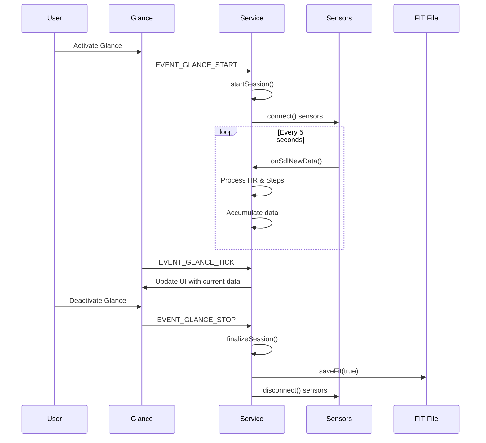

# FitFiles - FIT File Creation and Sensor Logging Tutorial

## Overview

The FitFiles app is a focused tutorial demonstrating FIT (Flexible and Interoperable Data Transfer) file creation and sensor data logging on wearable devices. This app showcases how to collect heart rate and step counter data during glance sessions and store it in the industry-standard FIT format using the UNA SDK's native `SDK::Fit` encoder.

The application implements a glance-triggered recording service that monitors heart rate and steps data during active glance sessions, accumulates step counts, and writes them to FIT files with custom developer fields. It demonstrates core concepts of session-based recording, event-driven data collection, and FIT file structure creation with a simplified, tutorial-friendly approach.

Key features include:
- Real-time heart rate and step counting during glance sessions
- FIT file creation with proper headers, definitions, and CRC validation
- Custom developer fields for extended data types
- Activity session management triggered by glance start/stop events
- Session-based data persistence
- Glance UI displaying both current heart rate and step count
- Automatic data persistence on session completion

## Architecture

The FitFiles app follows a service-only architecture pattern typical of glance applications, where all functionality resides in the service component with a minimal UI for data display. The service handles sensor integration, data processing, FIT file management, and communication with the glance interface. Unlike continuous monitoring apps, this application is event-driven, activating recording only during active glance sessions.

### High-Level Components

1. **Service Layer**: Core business logic, sensor integration, FIT file creation, data persistence
2. **Glance UI**: Simple display interface showing current heart rate and step count
3. **SDK Integration**: Kernel, sensor layer, file system, native `SDK::Fit` encoder
4. **Data Persistence**: FIT file format with custom developer fields

### Component Interaction

```
[Hardware Sensors] <-> [Sensor Layer] <-> [Service]
                                      ^
                                      |
                            [Glance Interface]
```

The service runs as a separate process/thread, processing sensor data only during active glance sessions and maintaining session-based activity data. The glance UI provides a simple display for the current heart rate and accumulated step data during the session.

### App Workflow



## Service Backend

The service backend is implemented in `Service.hpp` and `Service.cpp`, providing the core functionality for heart rate and step tracking during glance sessions and FIT file management.

### Core Classes and Structures

#### Service Class

The main service class handles all backend logic for heart rate and step counting during glance sessions and FIT file creation. It manages sensor connections, processes heart rate and step data, maintains activity state, and handles file I/O operations through the UNA SDK's kernel interface.

```cpp
class Service : public SDK::Interface::ISensorDataListener
{
public:
    Service(SDK::Kernel &kernel);
    virtual ~Service();
    void run();

private:
    // ===== SENSOR MANAGEMENT =====
    void connect();
    void disconnect();

    // ISensorDataListener implementation
    void onSdlNewData(uint16_t handle, const SDK::Sensor::Data* data, uint16_t count, uint16_t stride) override;

    // ===== GLANCE UI =====
    void onGlanceTick();
    bool configGui();
    void createGuiControls();

    // ===== SESSION MANAGEMENT =====
    void startSession();
    void finalizeSession();

    // ===== FIT FILE MANAGEMENT =====
    void saveFit(bool finalize);
    void appendPendingRecords();
    void writeFitDefinitions(std::time_t timestamp);
    void writeFitSessionSummary(std::time_t timestamp);
    void writeStepsFieldDescription();

    // ===== FIT ENCODER =====
    // Native SDK::Fit streaming encoder, constructed in saveFit() over the open
    // file and reset after finish().
    std::unique_ptr<SDK::Fit::FitWriter> mFit;

    // ... member variables
};
```

#### Key Data Structures

**FitRecord Structure:**
```cpp
struct FitRecord {
    std::time_t timestamp;
    uint8_t     heartRate;
    uint32_t    steps;
};
```

This structure represents individual data points containing timestamp, heart rate, and accumulated step count for FIT file recording during glance sessions.

### Sensor Integration

The service integrates with heart rate and step counter sensors to collect biometric data during glance sessions:

- **Heart Rate Sensor** (`SDK::Sensor::Type::HEART_RATE`): Provides real-time heart rate measurements in BPM
- **Step Counter Sensor** (`SDK::Sensor::Type::STEP_COUNTER`): Provides incremental step count measurements
- **Sampling Rate**: 5-second intervals for efficient power management
- **Data Processing**: Accumulates step deltas, captures heart rate values, and maintains session-based totals

### Data Processing Pipeline

#### 1. Sensor Data Reception

Heart rate and step data arrive through the kernel's message system. The `onSdlNewData()` method processes both sensor types during active glance sessions:

```cpp
void Service::onSdlNewData(uint16_t handle, const SDK::Sensor::Data* data, uint16_t count, uint16_t stride) {
    if (!mSessionOpen) return;  // Only process data during active sessions

    std::time_t now = std::time(nullptr);
    SDK::Sensor::DataBatch batch(data, count, stride);
    bool hasNewData = false;

    // Process step counter data
    if (mSensorSteps.matchesDriver(handle)) {
        for (uint16_t i = 0; i < count; ++i) {
            SDK::SensorDataParser::StepCounter p(batch[i]);
            if (!p.isDataValid()) continue;
            uint32_t steps = p.getStepCount();
            if (steps > mLastSteps) {
                uint32_t delta = steps - mLastSteps;
                mTotalSteps += delta;
                mLastSteps = steps;
                mSampleCount++;
                hasNewData = true;
            }
        }
    }
    // Process heart rate data
    else if (mSensorHR.matchesDriver(handle)) {
        for (uint16_t i = 0; i < count; ++i) {
            SDK::SensorDataParser::HeartRate p(batch[i]);
            if (!p.isDataValid()) continue;
            uint8_t newHR = static_cast<uint8_t>(p.getBpm());
            if (newHR > 0) {  // Only consider valid HR readings
                mCurrentHR = newHR;
                hasNewData = true;
            }
        }
    }

    // Accumulate records for FIT file if we have new valid data
    if (hasNewData) {
        mPendingRecords.push_back({now, mCurrentHR, mTotalSteps});
        LOG_DEBUG("Recorded data point: HR=%u, steps=%u\n", mCurrentHR, mTotalSteps);
    }
}
```

#### 2. Session Management

The app manages glance sessions with simple start/stop logic:

```cpp
void Service::startSession() {
    std::time_t now = std::time(nullptr);
    mSessionStart = now;
    mSessionOpen = true;
    mTotalSteps = 0;
    mLastSteps = 0;
    mSampleCount = 0;
    mCurrentHR = 0;
    mPendingRecords.clear();
    LOG_INFO("FIT session started at %ld\n", now);
}

void Service::finalizeSession() {
    if (mSessionOpen) {
        saveFit(true);
        mSessionOpen = false;
        LOG_INFO("FIT session finalized\n");
    }
}
```

#### 3. FIT File Creation and Management

The app creates properly formatted FIT files with headers, definitions, and data records:

**FIT File Structure:**
- File Header (protocol version, data size, CRC)
- File ID Message (manufacturer, product, timestamp)
- Developer Data ID Message (developer/app identification)
- Field Descriptions (custom developer fields)
- Data Records (timestamped heart rate and step counts)
- Session Messages (activity summaries)
- Activity Messages (overall activity data)
- File CRC

**Native FIT Encoder (`SDK::Fit::FitWriter`):**

The app uses the SDK's native streaming encoder. A single `FitWriter` is constructed over the open file; each FIT message type is registered with `defineMessage()` against a *local message type* (a small 0-15 handle), then data records are emitted with the fluent `data(localType)...write()` builder. Global message numbers, field-definition numbers and base types come from `SDK/Fit/FitProfile.hpp`.

```cpp
namespace fit = SDK::Fit;

// Local message types (0-15) bound to each FIT message definition.
enum Local : uint8_t {
    L_FILE_ID    = 0,
    L_DEV_ID     = 1,
    L_FIELD_DESC = 2,
    L_EVENT      = 3,
    L_RECORD     = 4,
    L_SESSION    = 5,
    L_ACTIVITY   = 6,
};

// One streaming encoder owns the whole file; constructed in saveFit().
std::unique_ptr<fit::FitWriter> mFit;
```

`saveFit()` ties the lifecycle together: open (truncate) the file, construct the encoder over it, `begin()` the header placeholder, write definitions + records + the summary, then `finish()` to back-patch the header and append the file CRC:

```cpp
void Service::saveFit(bool finalize) {
    if (!mSessionOpen) return;

    auto file = mKernel.fs.file(skFitFileName);
    if (!file || !file->open(/*write=*/true, /*truncate=*/true)) {
        LOG_ERROR("Cannot open FIT file\n");
        return;
    }

    std::time_t now = std::time(nullptr);

    mFit = std::make_unique<fit::FitWriter>(*file);
    mFit->begin(/*profileVersion=*/0);

    writeFitDefinitions(mSessionStart);   // definitions + start event
    appendPendingRecords();               // record messages
    if (finalize) {
        writeFitSessionSummary(now);      // stop event + session + activity
    }

    mFit->finish();   // back-patch header data size + CRC, append file CRC
    mFit.reset();

    file->flush();
    file->close();
}
```

`defineMessage()` takes a local type, the global message number from `fit::mesgNum(fit::MesgNum::X)`, an ordered list of `fit::field::<Msg>::<Field>` entries, and (optionally) a list of developer fields. For example, the File ID and Record definitions:

```cpp
mFit->defineMessage(L_FILE_ID, fit::mesgNum(fit::MesgNum::FileId),
    {fit::field::FileId::Type, fit::field::FileId::Manufacturer,
     fit::field::FileId::Product, fit::field::FileId::SerialNumber,
     fit::field::FileId::TimeCreated});

// Record carries timestamp + heart_rate, plus the "steps" developer field
// (dev field number, size in bytes, developer-data index 0).
mFit->defineMessage(L_RECORD, fit::mesgNum(fit::MesgNum::Record),
    {fit::field::Record::Timestamp, fit::field::Record::HeartRate},
    {{skStepsDevFieldNum, fit::baseTypeSize(fit::BaseType::UInt32), 0}});
```

Each definition record is written to the file as it is emitted; the encoder remembers the expected payload size per local type and validates it on `write()` ([Message Encoding](../../FitFiles-Structure.md#message-encoding)).

#### 4. Custom Developer Fields

The "steps" value is recorded as a FIT *developer field*. This needs two pieces: a `field_description` message that names and types the field, and a developer-field entry on the `record` definition (added above). The encoder declares the field description with a few fixed columns plus the variable-length `field_name`/`units` strings, sized exactly at encode time:

```cpp
void Service::writeStepsFieldDescription() {
    const char* name  = "steps";
    const char* units = "count";
    const uint8_t nameLen  = static_cast<uint8_t>(std::strlen(name) + 1);
    const uint8_t unitsLen = static_cast<uint8_t>(std::strlen(units) + 1);

    mFit->defineMessage(L_FIELD_DESC, fit::mesgNum(fit::MesgNum::FieldDescription),
        {fit::field::FieldDescription::DeveloperDataIndex,
         fit::field::FieldDescription::FieldDefinitionNumber,
         fit::field::FieldDescription::FitBaseTypeId,
         {fit::field::FieldDescription::kFieldNameNum, fit::BaseType::String, nameLen},
         {fit::field::FieldDescription::kUnitsNum, fit::BaseType::String, unitsLen}});
    mFit->data(L_FIELD_DESC)
        .u8(0)                  // developer_data_index
        .u8(skStepsDevFieldNum) // field_definition_number
        .u8(fit::baseTypeId(fit::BaseType::UInt32))
        .str(name, nameLen)
        .str(units, unitsLen)
        .write();
}
```

#### 4. Session and Activity Management

The app manages activity sessions with proper start/stop events and summaries:

**Session Creation:**
```cpp
void Service::startSession() {
    std::time_t now = std::time(nullptr);
    mSessionStart = now;
    mSessionOpen = true;
    mTotalSteps = 0;
    mLastSteps = 0;
    mSampleCount = 0;
    mCurrentHR = 0;
    mPendingRecords.clear();
    LOG_INFO("FIT session started at %ld\n", now);
}
```

**Session Summary:**

The `Session` and `Activity` definitions are emitted earlier in `writeFitDefinitions()`; here the summary just appends data records via the builder. Values are written in the same order the fields were declared, with multi-byte values stored little-endian. Time fields use the FIT scale-1000 convention (milliseconds).

```cpp
void Service::writeFitSessionSummary(std::time_t timestamp) {
    // Stop session event.
    mFit->data(L_EVENT)
        .u32(unixToFitTimestamp(timestamp))
        .u8(static_cast<uint8_t>(fit::Event::Timer))
        .u8(static_cast<uint8_t>(fit::EventType::Stop))
        .write();

    const uint32_t elapsedMs = static_cast<uint32_t>((timestamp - mSessionStart) * 1000);

    // Session summary.
    mFit->data(L_SESSION)
        .u32(unixToFitTimestamp(timestamp))
        .u32(unixToFitTimestamp(mSessionStart))
        .u32(elapsedMs)  // total_elapsed_time, scale 1000
        .u32(elapsedMs)  // total_timer_time, scale 1000
        .u16(0)          // message_index
        .u8(static_cast<uint8_t>(fit::Sport::Generic))
        .u8(static_cast<uint8_t>(fit::SubSport::Generic))
        .write();

    // Activity summary.
    mFit->data(L_ACTIVITY)
        .u32(unixToFitTimestamp(timestamp))
        .u32(elapsedMs)  // total_timer_time, scale 1000
        .u32(unixToFitTimestamp(timestamp))  // local_timestamp (simplified)
        .u16(1)          // num_sessions
        .write();
}
```

### Data Persistence Strategy

#### FIT File Writing Process

`saveFit()` writes the whole activity in a single pass each time it runs - the native encoder streams records as they are produced, so there is no read-back-and-append step:

1. **File (Re)creation**: Open the FIT file truncated for writing
2. **Header Placeholder**: `FitWriter::begin()` writes a 14-byte header placeholder
3. **Definitions + Start Event**: `writeFitDefinitions()` emits every message definition and the timer-start event
4. **Data Records**: `appendPendingRecords()` emits the records accumulated this session
5. **Session Summary**: `writeFitSessionSummary()` emits the stop event, session and activity records (on finalize)
6. **Finish**: `FitWriter::finish()` back-patches the header data size + header CRC and appends the trailing file CRC

#### Data Persistence Strategy

The app saves data on session completion:

- **Session-based**: Automatic save when glance session ends
- **Event-based**: App termination triggers session finalization
- **Simple approach**: One FIT file per session with complete data

#### FIT File Writing Process

1. **File Creation**: (Re)create the FIT file truncated on each save
2. **Header Management**: `begin()` writes a placeholder header (data size + CRC patched at the end)
3. **Definition Writing**: Define each message's local type before its first data record
4. **Data Records**: Emit accumulated records via the `data(local)...write()` builder
5. **Session Finalization**: Write the session summary on completion
6. **CRC Calculation**: `finish()` computes and appends the file CRC

## Glance UI Implementation

The glance UI provides a simple display for the current heart rate and step count during active sessions:

### UI Components

**Glance Controls:**
- Icon display (60x60 pixel icon)
- Title text: "Steps"
- Value text: Current step count
- Heart rate text: Current heart rate in BPM

**Layout:**
```
+-------------------+
|        Icon       |
|                   |
|      Steps        |
|     1,234         |
|   HR: 72          |
+-------------------+
```

### Message Handling

The service updates the glance display on each tick event with current sensor data:

```cpp
void Service::onGlanceTick() {
    mGlanceValue.print("%u", mTotalSteps);
    mGlanceHR.print("HR: %u", mCurrentHR);
    // Send update to glance interface
}
```

## Sensor Integration

The FitFiles app integrates with the UNA SDK's sensor layer for heart rate and step counting during glance sessions:

### Heart Rate and Step Counter Sensors

**Heart Rate Sensor Configuration:**
- Type: `SDK::Sensor::Type::HEART_RATE`
- Sample Period: 5 seconds (300,000 ms)
- Latency: 1,000 ms

**Step Counter Sensor Configuration:**
- Type: `SDK::Sensor::Type::STEP_COUNTER`
- Sample Period: 5 seconds (300,000 ms)
- Latency: 1,000 ms

**Sensor Connection Code:**
```cpp
void Service::connect() {
    const float samplePeriodMs = static_cast<float>(skSamplePeriodSec) * 1000.0f;
    if (!mSensorSteps.isConnected()) {
        LOG_DEBUG("Connecting to Steps sensor\n");
        mSensorSteps.connect(samplePeriodMs);
    }
    if (!mSensorHR.isConnected()) {
        LOG_DEBUG("Connecting to HR sensor\n");
        mSensorHR.connect(samplePeriodMs);
    }
}
```

**Data Processing:**
- Real-time heart rate measurements in BPM
- Incremental step counts from hardware steps
- Delta calculation to track new steps
- Session-based accumulation of biometric data
- Timestamp association for FIT recording

### Sensor Data Flow

```
Hardware Sensors -> Sensor Drivers -> SDK Parsers -> Service Accumulator -> FIT File
    (HR + Steps)      (HR + Steps)     (HR + Steps)       (Session Data)
```

## FIT File Format Implementation

### FIT Protocol Overview

FIT (Flexible and Interoperable Data Transfer) is Garmin's binary file format for fitness data. Key characteristics:

- Binary format for efficient storage ([Introduction to FIT](../../FitFiles-Structure.md#introduction-to-fit))
- Self-describing with message definitions ([Message Encoding](../../FitFiles-Structure.md#message-encoding))
- Extensible through developer fields ([Developer Fields Implementation](../../FitFiles-Structure.md#developer-fields-implementation))
- CRC validation for data integrity ([CRC Calculation and Validation](../../FitFiles-Structure.md#crc-calculation-and-validation))
- Timestamp-based (seconds since FIT epoch: 1989-12-31 00:00:00 UTC) ([FIT Timestamp Handling](../../FitFiles-Structure.md#fit-timestamp-handling))

### Message Types Used

All message numbers come from `SDK::Fit::MesgNum`, passed to `defineMessage()` via `fit::mesgNum(...)`:

1. **File ID** (`MesgNum::FileId`): File metadata ([File ID Message](../../FitFiles-Structure.md#file-id-message))
2. **Developer Data ID** (`MesgNum::DeveloperDataId`): Developer identification ([Developer Data ID Message](../../FitFiles-Structure.md#developer-data-id-message))
3. **Field Description** (`MesgNum::FieldDescription`): Custom field definitions ([Field Description Messages](../../FitFiles-Structure.md#field-description-messages))
4. **Record** (`MesgNum::Record`): Data points with timestamps ([Record Messages](../../FitFiles-Structure.md#record-messages))
5. **Event** (`MesgNum::Event`): Session start/stop markers ([Event Messages](../../FitFiles-Structure.md#event-messages))
6. **Session** (`MesgNum::Session`): Activity segment summaries ([Session Messages](../../FitFiles-Structure.md#session-messages))
7. **Activity** (`MesgNum::Activity`): Overall activity summary ([Activity Messages](../../FitFiles-Structure.md#activity-messages))

### Custom Developer Fields

The app demonstrates developer fields for heart rate and step data ([Developer Fields Implementation](../../FitFiles-Structure.md#developer-fields-implementation)):

**Heart Rate Field (Standard FIT):**
- Built-in FIT field: `fit::field::Record::HeartRate` (field number 3)
- Units: BPM
- Base Type: `BaseType::UInt8`

**Steps Field (Developer Field):**
- Field Name: "steps"
- Units: "count"
- Base Type: `BaseType::UInt32`
- Developer Index: 0
- Field Number: `skStepsDevFieldNum` (0)

**Data Recording:**

Because the steps developer field was declared on the `L_RECORD` definition, its value is appended to the same data record after the standard fields - in definition order, with the developer field last. There is no separate field-message call:

```cpp
// In appendPendingRecords()
for (const auto& rec : mPendingRecords) {
    mFit->data(L_RECORD)
        .u32(unixToFitTimestamp(rec.timestamp))  // timestamp
        .u8(rec.heartRate)                        // heart_rate
        .u32(rec.steps)                           // "steps" developer field
        .write();
}
```

## Build and Setup

The FitFiles app uses CMake for cross-platform builds:

### Build Configuration

**Primary Build File**: `CMakeLists.txt` in `FitFiles/Software/App/FitFiles-CMake/`

```cmake
set(APP_NAME "FitFiles")
set(APP_TYPE "Glance")
set(DEV_ID "UNA")
set(APP_ID "A1B2C3D4-E5F6-7890-ABCD-EF1234567890")
```

### Build Targets

**Service Build**:
```cmake
set(SERVICE_SOURCES
    ${LIBS_SOURCES}
    ${UNA_SDK_SOURCES_COMMON}
    ${UNA_SDK_SOURCES_SERVICE}
    ${UNA_SDK_SOURCES_SENSOR}
    ${UNA_SDK_SOURCES_FIT}
)
una_app_build_service(${APP_NAME}Service.elf)
```

### Dependencies

**SDK Components**:
- UNA SDK common, service, and sensor sources
- Native FIT encoder (`SDK::Fit`, `${UNA_SDK_SOURCES_FIT}`)
- File system interfaces
- Kernel messaging system

## Key Concepts Demonstrated

### FIT File Creation

1. **File Structure**: Proper FIT file format with headers, definitions, and data ([Visual Representations and Diagrams](../../FitFiles-Structure.md#visual-representations-and-diagrams))
2. **Message Definitions**: Dynamic definition writing for message types ([Message Definition Structure](../../FitFiles-Structure.md#message-definition-structure))
3. **Developer Fields**: Custom field creation for extended data types ([Developer Fields Implementation](../../FitFiles-Structure.md#developer-fields-implementation))
4. **CRC Validation**: File integrity through cyclic redundancy checks ([Advanced Topics and Best Practices](../../FitFiles-Structure.md#advanced-topics-and-best-practices))

### Sensor Data Logging

1. **Event-Driven Processing**: Sensor data collection triggered by glance events
2. **Multi-Sensor Integration**: Simultaneous heart rate and step counter handling
3. **Session-Based Accumulation**: Data collection limited to active glance sessions
4. **Timestamp Management**: Proper time handling for session-based activity data
5. **Power Efficiency**: Optimized sampling rates and processing

### Session Management

1. **Glance Sessions**: Start/stop event handling based on user interaction
2. **Session Boundaries**: Automatic session management with FIT file creation
3. **Data Persistence**: Reliable storage with session completion
4. **Simplified Approach**: Clean session lifecycle without complex state recovery

### File System Integration

1. **File Operations**: Create, read, write, and truncate operations
2. **Path Management**: Organized file naming and directory structure
3. **Data Integrity**: Header updates and CRC calculations
4. **Resource Management**: Proper file handle lifecycle

## Next Steps

This tutorial provides a foundation for more advanced glance-based fitness applications. The simplified approach focuses on core FIT file creation concepts:

1. **Additional Sensors**: Add GPS, altitude, or other biometric sensors
2. **Advanced FIT Features**: Implement laps, events, and complex activities
3. **Data Synchronization**: Add cloud upload capabilities
4. **Enhanced UI**: Extend to full TouchGFX applications with charts and trends
5. **Performance Optimization**: Implement data compression and efficient storage
6. **Health Metrics**: Calculate calories, distance, and activity intensity
7. **Session Analytics**: Add post-session summary and statistics

The tutorial demonstrates essential FIT file creation using the UNA SDK's native `SDK::Fit` encoder with a clean, tutorial-friendly implementation.

The FitFiles tutorial demonstrates essential concepts for building robust, data-persistent wearable applications using the UNA SDK's FIT file capabilities and sensor integration features.