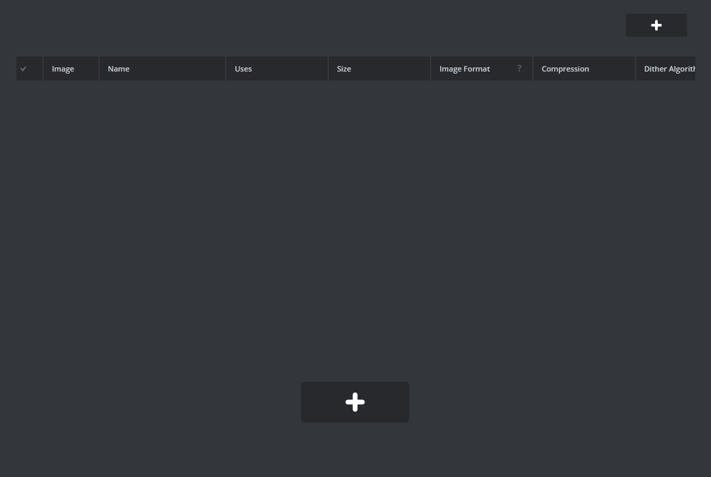
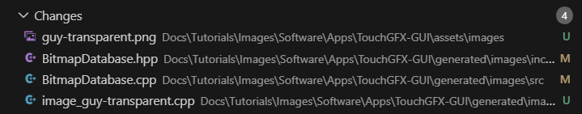

(tutorials/images/architecture)=
# Import Images Tutorial

Welcome to the UNA SDK tutorial series! The Import Images tutorial teaches you how to import and display graphic assets in UNA watch applications. This tutorial focuses on the complete workflow of creating images (such as drawing in Paint), importing them into TouchGFX Designer, and displaying them on screen through the UNA app framework.

## What You'll Learn

- How to create and prepare graphic assets for UNA apps
- The process of importing images into TouchGFX Designer
- How images are converted and stored in the UNA SDK
- Using bitmap IDs to reference and display images in code
- Understanding the TouchGFX image pipeline in UNA applications
- Best practices for image optimization and management

## Getting Started

### Prerequisites
Before starting the Import Images tutorial, you need to set up the UNA SDK environment. Follow the [Windows Setup section of sdk-setup.md](../../sdk-setup.md#windows-setup) for complete installation instructions, including:

- UNA SDK cloned with submodules (`git clone --recursive`)
- ST ARM GCC Toolchain (from STM32CubeIDE/CubeCLT, not system GCC)
- CMake 3.21+ and make
- Python 3 with pip packages installed
- TouchGFX Designer installed (see [Windows Setup section of sdk-setup.md](../../sdk-setup.md#windows-setup))

**Minimum requirements for Import Images:**
- `UNA_SDK` environment variable pointing to SDK root
- ARM GCC toolchain in PATH
- CMake and build tools
- TouchGFX Designer for GUI development
- Image editing software (Paint, GIMP, Photoshop, etc.)

### Building and Running Import Images

1. **Verify your environment setup** (see [Windows Setup section of sdk-setup.md](../../sdk-setup.md#windows-setup) for details):
    ```bash
    echo $UNA_SDK                   # Should point to SDK root.
                                    # Note for backward compatibility with linux path notation it uses '/'

    which arm-none-eabi-gcc         # Should find ST toolchain
    which cmake                     # Should find CMake
    ```

2. **Navigate to the Images tutorial directory:**
    ```bash
    cd $UNA_SDK/Docs/Tutorials/Images
    ```

3. **Build the application:**
    ```bash
    mkdir build && cd build
    cmake -G "Unix Makefiles" ../Software/Apps/Images-CMake
    make
    ```

The app will start and display imported images on screen, demonstrating the complete image import workflow in UNA apps.

## Images App Overview

The Import Images tutorial demonstrates how graphic assets are integrated into UNA watch applications:

### The Asset Pipeline
- **Creation**: Images are created using external tools (Paint, GIMP, etc.)
- **Import**: Images are added to TouchGFX Designer project
- **Conversion**: TouchGFX converts images to optimized bitmap formats
- **Storage**: Converted images are stored in flash memory
- **Display**: Images are referenced by ID and displayed on screen

### The GUI Layer (Frontend)
- Built with TouchGFX framework
- Displays imported images using bitmap IDs
- Handles image positioning and rendering
- Manages image resources efficiently

### Image Management in UNA SDK
- Images are converted to TouchGFX bitmap format during build
- Each image gets a unique ID in `BitmapDatabase.hpp`
- Images are stored in flash memory for efficient access
- TouchGFX handles image decompression and display

## Image Import Process

Follow these steps to import and display images in your UNA app:

### Step 1: Create Your Image Asset

1. **Open your image editor** (Paint, GIMP, Photoshop, etc.)

2. **Create a new image** with appropriate dimensions:
    - Consider the UNA watch display (typically 240x240 pixels)
    - Use power-of-2 dimensions when possible for better compression
    - Choose appropriate color depth (RGB565 for photos, indexed for icons)

3. **Draw or import your graphic**:
    - For this tutorial, create a simple character or icon
    - Save as PNG format with transparency if needed

4. **Save your image** as `my_image.png` in a temporary location

### Step 2: Import into TouchGFX Designer

1. **Open the TouchGFX project**:
    ```
    Images.touchgfx
    ```

2. **Navigate to the Images tab** in TouchGFX Designer

3. **Click "Import Images"** and select your `my_image.png` file\n\n   

4. **Configure image settings**:
    - Choose appropriate color format (RGB565, ARGB8888, etc.)
    - Enable dithering if needed for better quality
    - Set compression options

5. **Generate code** after importing:
    - Click "Generate Code" in TouchGFX Designer\n\n   
    - This creates bitmap IDs and conversion code

### Step 3: Display the Image in Code

After importing, TouchGFX generates a bitmap ID. For example, if you imported `guy-transparent.png`, it creates `BITMAP_GUY_TRANSPARENT_ID = 0`.

In your view code, display the image:

```cpp
// In MainViewBase.cpp or your custom view
#include <images/BitmapDatabase.hpp>

// Create an image widget
touchgfx::Image myImage;
myImage.setBitmap(touchgfx::Bitmap(BITMAP_GUY_TRANSPARENT_ID));
myImage.setPosition(50, 50, 100, 100); // x, y, width, height
add(myImage);
```

### Step 4: Build and Test

1. **Rebuild the application**:
    ```bash
    cmake -G "Unix Makefiles" ../Software/Apps/Images-CMake
    make
    ```

2. **Run on simulator** to see your imported image displayed

3. **Test on hardware** to verify performance and appearance

## Code Details

### Understanding Bitmap IDs

When you import images into TouchGFX, each image gets a unique ID defined in `BitmapDatabase.hpp`:

```cpp
// Generated by imageconverter. Please, do not edit!
#ifndef TOUCHGFX_BITMAPDATABASE_HPP
#define TOUCHGFX_BITMAPDATABASE_HPP

#include <touchgfx/hal/Types.hpp>
#include <touchgfx/Bitmap.hpp>

const uint16_t BITMAP_GUY_TRANSPARENT_ID = 0;

// Additional bitmap IDs for other images...
```

### Using Images in TouchGFX Widgets\n\n**Suggested additional screenshots:**\n- Static scaled image display\n- Image during custom jump animation (triggered by R1 button)\n- Toggle between scaled and animated modes\n\n

TouchGFX provides several ways to display images:

**Basic Image Widget:**
```cpp
touchgfx::Image backgroundImage;
backgroundImage.setBitmap(touchgfx::Bitmap(BITMAP_GUY_TRANSPARENT_ID));
backgroundImage.setPosition(0, 0, 240, 240);
add(backgroundImage);
```

**Scaled Image:**
```cpp
touchgfx::ScaledImage scaledImage;
scaledImage.setBitmap(touchgfx::Bitmap(BITMAP_GUY_TRANSPARENT_ID));
scaledImage.setPosition(50, 50, 100, 100);
scaledImage.setScalingAlgorithm(touchgfx::ScalableImage::NEAREST_NEIGHBOR);
add(scaledImage);
```

**Animated Image (for sequences):**
```cpp
touchgfx::AnimatedImage animatedImage;
animatedImage.setBitmap(touchgfx::Bitmap(BITMAP_FIRST_FRAME_ID));
animatedImage.setPosition(50, 50, 64, 64);
animatedImage.setNumberOfFrames(10); // For animation sequences
add(animatedImage);
```

### Image Memory Management

Images in UNA apps are stored in flash memory and loaded into RAM as needed:

- **Flash Storage**: Images are compressed and stored in internal/external flash
- **RAM Usage**: Only active images are decompressed into RAM
- **Caching**: TouchGFX manages image caching automatically
- **Optimization**: Use appropriate color depths to balance quality and memory usage

## Best Practices

### Image Creation
- Use vector graphics when possible for scalability
- Choose appropriate color depths (RGB565 for most cases)
- Consider transparency needs (ARGB8888 for transparent images)
- Test images on actual device for color accuracy

### Import Optimization
- Enable dithering for better quality on limited color displays
- Use compression options to reduce flash usage
- Group similar images for better compression
- Consider image dimensions vs. display capabilities

### Performance Considerations
- Minimize number of active images on screen
- Use appropriate scaling algorithms
- Avoid frequent image switching in animations
- Profile memory usage on target hardware

### File Organization
- Keep original source images in `assets/images/`
- Use descriptive names for bitmap IDs
- Document image purposes and dimensions
- Version control your image assets

## Next Steps

1. **Import your first image** - Follow the steps above to add a custom image to the tutorial app
2. **Experiment with different formats** - Try various color depths and compression settings
3. **Create image sequences** - Import multiple frames for animations
4. **Optimize for performance** - Test memory usage and display performance
5. **Explore advanced features** - Study TouchGFX documentation for effects and transformations
6. **Continue to other tutorials** - Learn about buttons, text, and complex interactions

## Troubleshooting

### Import Issues
- Ensure image dimensions are reasonable for the display
- Check that TouchGFX Designer is properly installed
- Verify image format is supported (PNG, BMP, etc.)
- Regenerate code after making changes

### Display Problems
- Confirm bitmap ID is correct in `BitmapDatabase.hpp`
- Check image position and dimensions fit the screen
- Verify color format matches display capabilities
- Test on simulator first, then hardware

### Build Errors
- Ensure TouchGFX project is synchronized with CMake build
- Check for missing image files in assets directory
- Verify bitmap database is regenerated after changes
- Clean build directory and rebuild if issues persist

### Performance Issues
- Reduce image resolution if memory constrained
- Use simpler color formats (RGB565 vs ARGB8888)
- Limit number of simultaneous images
- Profile with TouchGFX Performance Analyzer

Remember: Images are a powerful way to make your UNA watch apps visually appealing. Start simple, optimize as needed, and you'll create engaging user interfaces that work great on the small screen!