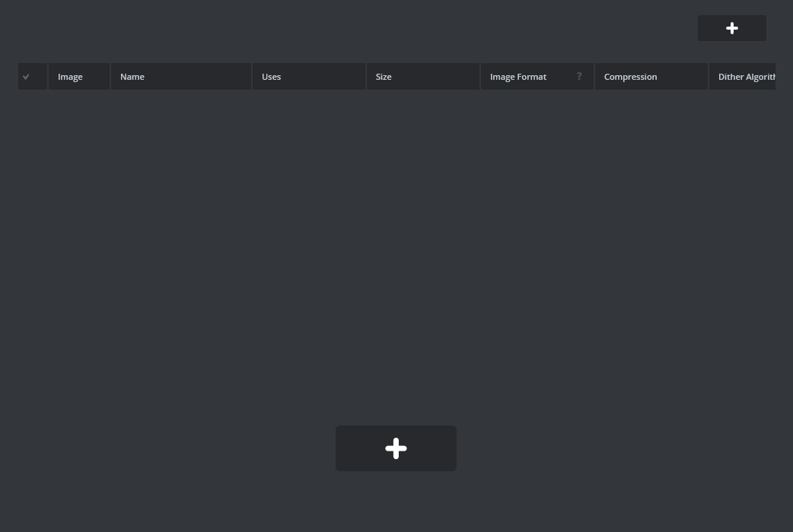
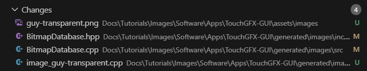

(tutorials/images/architecture)=
# Images - Working with Graphics and Assets

Welcome to the UNA SDK tutorial series! The Import Images tutorial teaches you how to import and display graphic assets in UNA Watch applications. This tutorial focuses on the complete workflow of creating images (such as drawing in Paint), importing them into TouchGFX Designer, and displaying them on screen through the UNA app framework.

[Project Folder](https://github.com/UNAWatch/una-sdk/tree/main/Docs/Tutorials/Images)

As in the earlier tutorials, the app comes with a **TouchGFX** GUI and an **LVGL** GUI over the same service. The image pipelines differ the most: TouchGFX Designer converts images at generate time, LVGL's are converted by a script from a manifest. See [The Same Image in Two Toolkits](#the-same-image-in-two-toolkits).

## What You'll Learn

- How to create and prepare graphic assets for UNA apps
- The process of importing images into TouchGFX Designer, or listing them in the LVGL asset manifest
- How images are converted and stored in the UNA SDK
- Using bitmap IDs (TouchGFX) or image descriptors (LVGL) to reference and display images in code
- Programmatically adding images without using designer-generated backgrounds
- Mode switching between Image and ScalableImage using L1 button
- Tick-based jump animation triggered by R1 button via [`handleTickEvent()`](Software/Apps/TouchGFX-GUI/gui/src/main_screen/MainView.cpp) (TouchGFX) or `onFrame()` (LVGL)
- Understanding the TouchGFX image pipeline in UNA applications. For detailed information about the TouchGFX port implementation, see [TouchGFX Port Architecture](../../TouchGFX-Port-Architecture.md)
- Best practices for image optimization and management

## Getting Started

### Prerequisites
Before starting the Import Images tutorial, you need to set up the UNA SDK environment. Follow the [Windows Setup section of sdk-setup.md](../../sdk-setup.md#windows-setup) for complete installation instructions, including:

- UNA SDK cloned (`git clone https://github.com/UNAWatch/una-sdk.git`)
- ST ARM GCC Toolchain (from STM32CubeIDE/CubeCLT, not system GCC)
- CMake 3.21+ and make
- Python 3 with pip packages installed
- TouchGFX Designer installed (see [Windows Setup section of sdk-setup.md](../../sdk-setup.md#windows-setup))

**Minimum requirements for Import Images:**
- `UNA_SDK` environment variable pointing to SDK root
- ARM GCC toolchain in PATH
- CMake and build tools
- TouchGFX Designer for the TouchGFX GUI; for the LVGL GUI, the LVGL submodule (`git submodule update --init ThirdParty/lvgl`) and, to convert images, Python with the `pypng` and `lz4` packages
- Image editing software (Paint, GIMP, Photoshop, etc.)

### Building and Running Import Images

1. **Verify your environment setup** (see [Windows Setup section of sdk-setup.md](../../sdk-setup.md#windows-setup) for details):
    ```bash
    echo $UNA_SDK                   # Should point to SDK root.
                                    # Note for backward compatibility with linux path notation it uses '/'

    which arm-none-eabi-gcc         # Should find ST toolchain
    which cmake                     # Should find CMake
    ```

2. **Navigate to the Images tutorial directory:**
    ```bash
    cd $UNA_SDK/Docs/Tutorials/Images
    ```

3. **Build the application** with the GUI of your choice:
    ```bash
    # TouchGFX GUI
    mkdir build && cd build
    cmake -G "Unix Makefiles" ../Software/Apps/Images-CMake
    make

    # LVGL GUI (from the tutorial directory again)
    cd .. && mkdir build-lvgl && cd build-lvgl
    cmake -G "Unix Makefiles" ../Software/Apps/ImagesLVGL-CMake
    make
    ```

The app will start and display imported images on screen, demonstrating the complete image import workflow in UNA apps. The two builds appear in the launcher as **Images** and **ImagesLVGL**.

### Running on Simulator

**TouchGFX** (Windows only):

1. Open `Images.touchgfx` in TouchGFX Designer and click **Generate Code (F4)** (do this once).
2. Navigate to `Images\Software\Apps\TouchGFX-GUI\simulator\msvs`
3. Open `Application.vcxproj` in Visual Studio
4. Press **F5** to start debugging and run the simulator

**LVGL** (Windows and Linux): a CMake project in `Software/Apps/LVGL-GUI/simulator`, built the same way as HelloWorld's (see [that tutorial](../HelloWorld/ARCHITECTURE.md#running-on-simulator)); the executable is `ImagesLVGLSimulator`.

In either simulator, use keyboard keys to interact:
- **1** = L1 (Toggle between Image and ScalableImage modes)
- **3** = R1 (Trigger jump animation when in Image mode)
- **4** = R2 (Exit)

The simulator will display the imported character image with scaling and animation capabilities. For detailed simulator setup and button mapping, see [Simulator](../../Simulator.md).

## Images App Overview

The Images tutorial demonstrates programmatic image display and interactivity in UNA Watch apps:

### Key Features Demonstrated
- **No background**: Pure programmatic content - no designer-generated backgrounds or boxes
- **Dual image modes**: L1 toggles between Image (`guyImage`) and ScalableImage (`scaledGuyImage`)
- **Jump animation**: R1 triggers sine-wave Y-offset animation on `guyImage` via tick events

### The Asset Pipeline
- **Creation**: Images are created using external tools (Paint, GIMP, etc.)
- **Import**: Images are added to TouchGFX Designer project
- **Conversion**: TouchGFX converts images to optimized bitmap formats
- **Storage**: Converted images are stored in flash memory
- **Display**: Images are referenced by ID and displayed on screen

### The GUI Layer (Frontend)
- Built with TouchGFX framework. For detailed information about the TouchGFX port implementation, see [TouchGFX Port Architecture](../../TouchGFX-Port-Architecture.md)
- Programmatically adds images in [`setupScreen()`](Software/Apps/TouchGFX-GUI/gui/src/main_screen/MainView.cpp)
- Handles L1/R1 buttons for mode switching and animation triggers in [`handleKeyEvent()`](Software/Apps/TouchGFX-GUI/gui/src/main_screen/MainView.cpp)
- Drives animation in [`handleTickEvent()`](Software/Apps/TouchGFX-GUI/gui/src/main_screen/MainView.cpp)

### Image Management in UNA SDK
- Images are converted to TouchGFX bitmap format during build
- Each image gets a unique ID in [`BitmapDatabase.hpp`](Software/Apps/TouchGFX-GUI/generated/images/include/images/BitmapDatabase.hpp)
- Images are stored in flash memory for efficient access
- TouchGFX handles image decompression and display

## The Same Image in Two Toolkits

| Piece | TouchGFX (`TouchGFX-GUI`) | LVGL (`LVGL-GUI`) |
|---|---|---|
| Import | Designer's Images tab; converted at **Generate Code** into `generated/images/` | one entry in `assets/assets.json`; converted by `lvgl_assets.py` into `assets/images/img_guy_transparent.c` (committed) |
| Reference in code | `BITMAP_GUY_TRANSPARENT_ID` from `BitmapDatabase.hpp` | `img_guy_transparent`, an `lv_image_dsc_t` declared in `gui/Assets.hpp` |
| Pixel format | Designer setting (RGB565 with alpha here) | `"format": "RGB565A8"` in the manifest: RGB565 colour followed by a separate 8-bit alpha plane. A single-colour icon uses `"A8"`, alpha only, and is tinted at draw time |
| Plain image, clipped to 100 x 100 | `touchgfx::Image` with `setPosition(70, y, 100, 100)` | `lv_image` inside a 100 x 100 `Draw::container` |
| Scaled to 120 x 120 | `touchgfx::ScalableImage` with `BILINEAR_INTERPOLATION` | `lv_image_set_scale_x/y()` in 1/256 steps with the pivot at the top-left corner, anti-aliased |
| Show one or the other | `setVisible()` + `invalidate()` on both | `Draw::setHidden()` on both |
| Jump animation | `handleTickEvent()` every frame, 60 ticks of `sin(phase) * 30` | `onFrame()`, the kernel's frame tick forwarded by the model, running the same sum for the same 60 frames |

The LVGL screen's setup, from `LVGL-GUI/gui/src/screens/MainScreen.cpp`:

```cpp
// The plain image at its own size (76 x 115) inside a 100 x 100 clipping box.
mPlainBox = Draw::container(mRoot, kX, kY, kPlainSize, kPlainSize);
mPlain    = Draw::image(mPlainBox, &img_guy_transparent, 0, 0);

// The scaled image: two factors, because 76 x 115 is stretched over 120 x 120.
mScaled = Draw::image(mRoot, &img_guy_transparent, kX, kY);
lv_image_set_scale_x(mScaled, kScaledSize * 256 / img_guy_transparent.header.w);
lv_image_set_scale_y(mScaled, kScaledSize * 256 / img_guy_transparent.header.h);
lv_image_set_pivot(mScaled, 0, 0);
lv_image_set_antialias(mScaled, true);
```

An image's width and height are in its descriptor (`header.w`, `header.h`), so the code never repeats them. LVGL v9 keeps `RGB565A8` and `A8` images as they are in flash; indexed formats are decoded to 32-bit ARGB in RAM at draw time and are not a saving on the watch.

To add an image to the LVGL GUI: drop the PNG anywhere under the tutorial (the manifest path is relative to `assets.json`), add an entry with a name and format, run

```bash
python $UNA_SDK/Utilities/Scripts/lvgl_assets/lvgl_assets.py Software/Apps/LVGL-GUI/assets/assets.json
```

and declare the name in `gui/include/gui/Assets.hpp` with `LV_IMAGE_DECLARE`.

### Size on the watch

| Build | `.uapp` | GUI code (text) | GUI RAM (bss) |
|---|---|---|---|
| Images (TouchGFX) | 234 KB | 220 KB | 71 KB |
| ImagesLVGL | 204 KB | 195 KB | 139 KB |

## Image Import Process

Follow these steps to import and display images in your UNA app:

### Step 1: Create Your Image Asset

1. **Open your image editor** (Paint, GIMP, Photoshop, etc.)

2. **Create a new image** with appropriate dimensions:
    - Consider the UNA Watch display (typically 240x240 pixels)
    - Use power-of-2 dimensions when possible for better compression
    - Choose appropriate color depth (RGB565 for photos, indexed for icons)

3. **Draw or import your graphic**:
    - For this tutorial, create a simple character or icon
    - Save as PNG format with transparency if needed

4. **Save your image** as `my_image.png` in a temporary location

### Step 2: Import into TouchGFX Designer

1. **Open the TouchGFX project**:
    ```
    Images.touchgfx
    ```

2. **Navigate to the Images tab** in TouchGFX Designer

3. **Click "Import Images"** and select your `my_image.png` file   



4. **Configure image settings**:
    - Choose appropriate color format (RGB565, ARGB8888, etc.)
    - Enable dithering if needed for better quality
    - Set compression options

5. **Generate code** after importing:
    - Click "Generate Code" in TouchGFX Designer



    - This creates bitmap IDs and conversion code

### Step 3: Display the Image in Code

After importing `guy-transparent.png`, TouchGFX generates [`BITMAP_GUY_TRANSPARENT_ID`](Software/Apps/TouchGFX-GUI/generated/images/include/images/BitmapDatabase.hpp).

Images are added programmatically in [`MainView::setupScreen()`](Software/Apps/TouchGFX-GUI/gui/src/main_screen/MainView.cpp):

```cpp
// Programmatic image setup - no background
guyImage.setBitmap(touchgfx::Bitmap(BITMAP_GUY_TRANSPARENT_ID));
guyImage.setPosition(70, originalY, 100, 100);
guyImage.setVisible(false);  // Initially hidden (scaled mode active)
add(guyImage);

scaledGuyImage.setBitmap(touchgfx::Bitmap(BITMAP_GUY_TRANSPARENT_ID));
scaledGuyImage.setPosition(70, originalY, 120, 120);
scaledGuyImage.setScalingAlgorithm(touchgfx::ScalableImage::BILINEAR_INTERPOLATION);
scaledGuyImage.setVisible(true);  // Initially shown
add(scaledGuyImage);
```

**Note**: Widgets declared as members in [`MainView.hpp`](Software/Apps/TouchGFX-GUI/gui/include/gui/main_screen/MainView.hpp). Includes placed in header.

### Step 4: Build and Test

1. **Rebuild the application**:
    ```bash
    cmake -G "Unix Makefiles" ../Software/Apps/Images-CMake
    make
    ```

2. **Run on simulator** to see your imported image displayed

3. **Test on hardware** to verify performance and appearance

## Code Details

### Understanding Bitmap IDs

When you import images into TouchGFX, each image gets a unique ID defined in `BitmapDatabase.hpp`:

```cpp
// Generated by imageconverter. Please, do not edit!
#ifndef TOUCHGFX_BITMAPDATABASE_HPP
#define TOUCHGFX_BITMAPDATABASE_HPP

#include <touchgfx/hal/Types.hpp>
#include <touchgfx/Bitmap.hpp>

const uint16_t BITMAP_GUY_TRANSPARENT_ID = 0;

// Additional bitmap IDs for other images...
```

### Using Images in TouchGFX Widgets

TouchGFX provides several ways to display images:

**No Background:**
The demo has no background image or box. All content is added programmatically in [`setupScreen()`](Software/Apps/TouchGFX-GUI/gui/src/main_screen/MainView.cpp).

**ScalableImage (scaledGuyImage):**
```cpp
scaledGuyImage.setBitmap(touchgfx::Bitmap(BITMAP_GUY_TRANSPARENT_ID));
scaledGuyImage.setPosition(70, originalY, 120, 120);
scaledGuyImage.setScalingAlgorithm(touchgfx::ScalableImage::BILINEAR_INTERPOLATION);
scaledGuyImage.setVisible(true);
add(scaledGuyImage);
```

**Custom Tick-Based Animation:**
Demo uses `handleTickEvent()` for sine-wave jump on `guyImage`:
- Triggered by R1 when Image mode active
- 60 ticks (~6s at 10Hz), sin(phase)*30px offset
(See [`MainView.cpp`](Software/Apps/TouchGFX-GUI/gui/src/main_screen/MainView.cpp))

### Image Memory Management

Images in UNA apps are stored in flash memory and loaded into RAM as needed:

- **Flash Storage**: Images are compressed and stored in internal/external flash
- **RAM Usage**: Only active images are decompressed into RAM
- **Caching**: TouchGFX manages image caching automatically
- **Optimization**: Use appropriate color depths to balance quality and memory usage

## Best Practices

### Image Creation
- Use vector graphics when possible for scalability
- Choose appropriate color depths (RGB565 for most cases)
- Consider transparency needs (ARGB8888 for transparent images)
- Test images on actual device for color accuracy

### Import Optimization
- Enable dithering for better quality on limited color displays
- Use compression options to reduce flash usage
- Group similar images for better compression
- Consider image dimensions vs. display capabilities

### Performance Considerations
- Minimize number of active images on screen
- Use appropriate scaling algorithms
- Avoid frequent image switching in animations
- Profile memory usage on target hardware

### File Organization
- Keep original source images in `assets/images/`
- Use descriptive names for bitmap IDs
- Document image purposes and dimensions
- Version control your image assets

## Next Steps

1. **Import your first image** - Follow the steps above to add a custom image to the tutorial app
2. **Experiment with different formats** - Try various color depths and compression settings
3. **Create image sequences** - Import multiple frames for animations
4. **Optimize for performance** - Test memory usage and display performance
5. **Explore advanced features** - Study TouchGFX documentation for effects and transformations
6. **Continue to other tutorials** - Learn about buttons, text, and complex interactions

## Troubleshooting

### Import Issues
- Ensure image dimensions are reasonable for the display
- Check that TouchGFX Designer is properly installed
- Verify image format is supported (PNG, BMP, etc.)
- Regenerate code after making changes

### Display Problems
- Confirm bitmap ID is correct in `BitmapDatabase.hpp`
- Check image position and dimensions fit the screen
- Verify color format matches display capabilities
- Test on simulator first, then hardware

### Build Errors
- Ensure TouchGFX project is synchronized with CMake build
- Check for missing image files in assets directory
- Verify bitmap database is regenerated after changes
- For the LVGL build, check that `ThirdParty/lvgl` is populated and that every name in `Assets.hpp` has a generated file under `assets/images/`
- Clean build directory and rebuild if issues persist

### Performance Issues
- Reduce image resolution if memory constrained
- Use simpler color formats (RGB565 vs ARGB8888)
- Limit number of simultaneous images
- Profile with TouchGFX Performance Analyzer

Remember: Images are a powerful way to make your UNA Watch apps visually appealing. Start simple, optimize as needed, and you'll create engaging user interfaces that work great on the small screen!