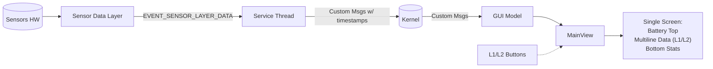

(tutorials/sensors/architecture)=

# Sensors - Integrating Hardware Sensors

In this tutorial, we implement a sensors dashboard app that subscribes to available sensors at **maximum frequency** (period=0, count=0 except Accelerometer), processes new message structures with **timestamps** where available, and displays data on a **single GUI screen**:

- **Top**: Battery level
- **Middle multiline text**: Sensor data with **L1/L2 verbosity levels** (BASIC/DETAILED/FULL and individual sensor views)
- **Bottom**: Stats (Service/GUI CPU%, TX/RX msg rates, bytes/sec)

[Project Folder](https://github.com/UNAWatch/una-sdk/tree/main/Docs/Tutorials/Sensors)

## List of Implemented Sensors

| Sensor | Description | Notes |
|--------|-------------|-------|
| Heart Rate | Live BPM + Trust Level | |
| GPS Location | Lat/Long/Alt (double) | Always on |
| Altimeter | Elevation (m) | Barometric pressure based |
| Accelerometer | X/Y/Z G-forces | connect(0.1f, 0); sender throttled ~100ms |
| Step Counter | Total steps | Cumulative |
| Floor Counter | Floors ascended | Cumulative; parser.getFloorsUp() |
| Magnetometer | X/Y/Z fields (for compass) | Heading computed from X/Y fields |
| RTC | Time (sec since boot) | From kernel sys.getTimeMs()/1000; not sensor |

## Architecture Overview



## Implementation Steps


### Optional step: copy the Sensor tutorial code to edit
1. **Copy sensors tutorial**
2. **Change naming**: Rename project directory, cmake directory and name of the project in CMakeLists.txt; Also change APP_ID to something else, Step 2 in [Creating New Apps](https://www.developers.unawatch.com/latest/sdk-setup.html#creating-new-apps) gives commmands for generating your own app ID programatically from the name. 
3. **Commit initial changes**: it's a good practice to use version control system like git
4. ***Edit TouchGFX if you changed the name**: 
   - Rename `*.touchgfx` to `<MY_APP>.touchgfx`
   - Rename `*.touchgfx:163` `"Name": "MY_APP"`
   - Click **Generate code**


### Step 1: Define Custom Messages

Create [`Commands.hpp`](Software/Libs/Header/Commands.hpp) with message types and structs:

```cpp
namespace CustomMessage {
    constexpr SDK::MessageType::Type HR_VALUES = 0x00000001;
    constexpr SDK::MessageType::Type LOCATION_VALUES = 0x00000002;
    constexpr SDK::MessageType::Type ELEVATION_VALUES = 0x00000003;
    constexpr SDK::MessageType::Type ACCELEROMETER_VALUES = 0x00000004;
    constexpr SDK::MessageType::Type STEP_COUNTER_VALUES = 0x00000005;
    constexpr SDK::MessageType::Type FLOORS_VALUES = 0x00000006;
    constexpr SDK::MessageType::Type COMPASS_VALUES = 0x00000007;
    constexpr SDK::MessageType::Type STATS_VALUES = 0x00000008;
    constexpr SDK::MessageType::Type RTC_VALUES = 0x00000009;
    constexpr SDK::MessageType::Type BATTERY_VALUES = 0x0000000A;
    constexpr SDK::MessageType::Type PRESSURE_VALUES = 0x0000000B;

    // Every message pairs a default constructor, which sets the message type,
    // with one that fills the fields and delegates to it -- the shape every
    // example app uses, which keeps the type tag in a single initializer. That
    // second constructor is what lets a caller send the message in a single call.
    struct HRValues : public SDK::MessageBase {
        float heartRate;
        float trustLevel;

        HRValues()
            : SDK::MessageBase(HR_VALUES)
            , heartRate()
            , trustLevel()
        {}

        explicit HRValues(float heartRate, float trustLevel)
            : HRValues()
        {
            this->heartRate  = heartRate;
            this->trustLevel = trustLevel;
        }
    };

    // The rest follow the same shape, over these fields:
    // LocationValues: uint64_t timestamp; double latitude, longitude, altitude;
    // ElevationValues: uint64_t timestamp; float elevation;
    // AccelerometerValues: uint64_t timestamp; float x,y,z;
    // StepCounterValues: uint64_t timestamp; uint32_t steps;
    // FloorsValues: uint64_t timestamp; uint32_t floors;
    // CompassValues: uint64_t timestamp; float heading;
    // StatsValues: float serviceCpuPct, guiCpuPct, txMsgRate, rxMsgRate, txByteRate, rxByteRate;
    // RtcValues: uint32_t time;
    // BatteryValues: float level;
    // PressureValues: uint64_t timestamp; float pressure;
}
```

`PressureValues` is the one message the service never sends: the sensor is connected and `Model.cpp`
handles `PRESSURE_VALUES`, but the service only hex-dumps the raw frame today. Both ends exist, and
so does `SDK::SensorDataParser::Pressure` — wiring it up means giving that branch the same
parse-then-send shape as the branches below, using `parser.getPressure()`.

Those constructors are what let `SDK::send_msg<T>(kernel, args...)` do the whole send in one call —
allocate from the kernel pool, forward the arguments to the constructor, send, and release. The app
needs no sender class of its own.

`send_msg` is for fire-and-forget sends, and it posts with a zero timeout — it never waits for a
reply, and a message that finds no room in the queue is dropped. That is the right trade for sensor
data: the next sample is moments away. Reach for `SDK::make_msg<T>()` when the reply matters: it
returns an RAII `MessageGuard` that releases on scope exit, so you can send with a timeout and read
the result back (`msg.send(timeout) && msg.ok()`). That timeout bounds the wait for the reply, not for
queue space — no send waits out a full queue.

### Step 2: Service - Subscribe & Process Sensors

In [`Service.hpp`](Software/Libs/Header/Service.hpp):

```cpp
SDK::Sensor::Connection mSensorHR{SDK::Sensor::Type::HEART_RATE, 0, 0};
SDK::Sensor::Connection mSensorGPS{SDK::Sensor::Type::GPS_LOCATION, 0, 0};
SDK::Sensor::Connection mSensorAltimeter{SDK::Sensor::Type::ALTIMETER, 0, 0};
SDK::Sensor::Connection mSensorAccelerometer{SDK::Sensor::Type::ACCELEROMETER, 0, 0};
SDK::Sensor::Connection mSensorStepCounter{SDK::Sensor::Type::STEP_COUNTER, 0, 0};
SDK::Sensor::Connection mSensorFloorCounter{SDK::Sensor::Type::FLOOR_COUNTER, 0, 0};
```

In `run()` [`Service.cpp`](Software/Libs/Sources/Service.cpp): connect all (acc.connect(0.1f, 0)), loop getMessage:

```cpp
case SDK::MessageType::EVENT_SENSOR_LAYER_DATA: {
    auto event = static_cast<SDK::Message::Sensor::EventData*>(msg);
    SDK::Sensor::DataBatch data(event->data, event->count, event->stride);
    onSdlNewData(event->handle, data);
} break;
```

In `onSdlNewData`:

```cpp
if (mSensorHR.matchesDriver(handle)) {
    SDK::SensorDataParser::HeartRate parser(data[0]);
    if (parser.isDataValid()) {
        SDK::send_msg<CustomMessage::HRValues>(mKernel, parser.getBpm(), parser.getTrustLevel());
    }
}
// Similar for GPS:  SDK::send_msg<CustomMessage::LocationValues>(mKernel, ts, lat, lon, alt);
// Altimeter:        SDK::send_msg<CustomMessage::ElevationValues>(mKernel, ts, parser.getAltitude());
// Accel:            if (nowMs - mLastAccTimeMs >= 100) SDK::send_msg<CustomMessage::AccelerometerValues>(mKernel, ts, x, y, z);
// Steps:            SDK::send_msg<CustomMessage::StepCounterValues>(mKernel, ts, parser.getStepCount());
// Floors:           SDK::send_msg<CustomMessage::FloorsValues>(mKernel, ts, parser.getFloorsUp());
// Compass:          compute heading from magnetic X/Y fields, then SDK::send_msg<CustomMessage::CompassValues>(mKernel, ts, heading);
```

Track stats every 1s (simplistic CPU% = ms/10, rates=counts/sec) with
`SDK::send_msg<CustomMessage::StatsValues>(...)`, and
`SDK::send_msg<CustomMessage::RtcValues>(mKernel, timeMs/1000)`.

### Step 3: GUI Model - Receive Messages

In [`Model.cpp`](Software/Apps/TouchGFX-GUI/gui/src/model/Model.cpp), implement `customMessageHandler`:

```cpp
case CustomMessage::HR_VALUES: {
    auto* m = static_cast<CustomMessage::HRValues*>(msg);
    modelListener->updateHR(m->heartRate, m->trustLevel);
} break;
// Similar cases for all types: LOCATION_VALUES -> updateGPS(m->latitude, m->longitude, m->altitude);
// etc. for Elevation, Accelerometer, StepCounter, Floors, Compass, Stats, RTC
```

### Step 4: MainView - Display & Controls

In [`MainView.hpp`](Software/Apps/TouchGFX-GUI/gui/include/gui/main_screen/MainView.hpp), [`MainView.cpp`](Software/Apps/TouchGFX-GUI/gui/src/main_screen/MainView.cpp):

Store data in members, `updateHR(float hr, float tl)` etc. store values.

`handleKeyEvent`: L1: verbosity++ % VERB_LEVEL_MAX, L2: verbosity-- % VERB_LEVEL_MAX (BASIC/DETAILED/FULL/HR/GPS/ALT/ACC/STEP/FLOOR/MAG), R1: TODO GPS toggle, R2: presenter->exit()

`handleTickEvent()` every tick: `refreshDisplay()` `refreshStats()` `refreshBattery()`

`refreshDisplay()`: format multiline in `text_body` based on verbosity level, with group display for BASIC/DETAILED/FULL and per-sensor detailed views for individual sensors.

Unicode::strncpy(text_bodyBuffer, buffer, TEXT_BODY_SIZE); invalidate

Header: `refreshBattery()` "Battery: %.1f%%" `text_header`

Stats: `refreshStats()` "CPU S: %.1f%% G: %.1f%%\nMsg Tx: %.0f Rx: %.0f\nBytes Tx: %.0f Rx: %.0f" `text_stats`

### Additional Notes

- **Battery**: Battery level retrieval implemented using SDK::Sensor::BATTERY_LEVEL
- **Altimeter**: Uses altitude from barometric sensor; pressure not available in parser
- **Max Frequency**: period=0,count=0 except Accel connect(0.1f, 0); sender Accel throttle 100ms.
- **RTC**: Kernel sys.getTimeMs()/1000 (seconds since boot), not SDK::Sensor::RTC.
- Build with [`CMakeLists.txt`](Software/Apps/Sensors-CMake/CMakeLists.txt).

### Running on Simulator

To test the Sensors app on the simulator (Windows only):

1. Build the app following the [SDK setup](../../sdk-setup.md) instructions.
2. Open `Sensors.touchgfx` in TouchGFX Designer and click **Generate Code (F4)** (do this once).
3. Navigate to `Sensors\Software\Apps\TouchGFX-GUI\simulator\msvs`
4. Open `Application.vcxproj` in Visual Studio
5. Press **F5** to start debugging and run the simulator

The simulator provides simulated sensor data for all implemented sensors. Use L1/L2 buttons to cycle through verbosity levels and view different sensor data displays.

For detailed sensor simulation configuration and features, see [Simulator](../../Simulator.md).
