(architecture-deep-dive)=
# Platform Architecture

This document explains the technical magic that enables the Una-Watch platform.

## Core Concepts

### Pure Machine Code Execution
Una-Watch apps are not interpreted or virtualized. They are compiled ARM Cortex-M ELF binaries that execute directly in the MCU memory. This provides:
- **Native Performance**: Zero abstraction overhead.
- **Direct Hardware Access**: Apps can interact with peripherals at MCU speeds.
- **Efficiency**: Minimal memory and CPU footprint.

### Position-Independent Code (PIC)
To allow apps to be loaded at any memory address without re-linking, the SDK uses Position-Independent Code.
- **Kernel Abstraction**: Apps are completely abstracted from the kernel's memory layout.
- **Dynamic Loading**: The kernel can load, run, and unload apps on demand.
- **Process Isolation**: Ensures that apps do not interfere with each other or the kernel.

### Shared libc Integration
Una-Watch implements a shared libc architecture to save memory.
- **Common Base**: All apps share the same standard library implementation provided by the kernel.
- **Reduced Footprint**: Significant reduction in the size of each `.uapp` file.
- **C++ Support**: Full support for modern C++ features (strings, vectors, etc.) via the shared library.

### Dual-Process Model
Every Una-Watch app consists of two distinct components:
1. **Service Process**: Handles background logic, sensors, and BLE.
2. **GUI Process**: Handles user interface and interaction.

### IPC Mechanisms
Communication between processes is handled via a high-performance message-passing system.
- **Kernel Pools**: Messages are allocated from pre-defined kernel memory pools.
- **Type-Safe**: Messages are strongly typed using C++ structures.
- **Asynchronous**: Non-blocking message exchange for smooth UI performance.

### Memory Management
- **Pool Allocation**: Prevents heap fragmentation in long-running applications.
- **RAII Patterns**: Automatic resource cleanup using modern C++ practices.
- **Protected Regions**: Memory regions are protected to prevent unauthorized access.

### Power Management
- **Deep Sleep**: The kernel automatically enters low-power modes when idle.
- **Wake Sources**: Apps can define specific wake sources (timers, sensors, buttons).
- **Battery Optimization**: Adaptive sampling rates and event-driven design.

## Technical Architecture Details

### Detailed Implementation Analysis

#### 1. Backend Core Implementation (Backend.cpp)
The Backend class is a **1,045-line orchestration engine** that implements 10+ callback interfaces:

**Thread Management:**
- Dedicated backend thread with event loop processing GUI events
- Circular buffer message queues (20 slots each) for GUI RX/TX communication
- Periodic timers: minute updates, BLE monitoring, find-phone alerts

**System Initialization Sequence:**
```cpp
Backend thread {
    // Device info broadcast
    sendEventToGui(B2GEvent::DevInfo{deviceInfo});
    sendEventToGui(B2GEvent::Settings{settings});
    sendEventToGui(B2GEvent::BatteryLevel{battery});
    sendEventToGui(B2GEvent::BleBond{ble.isBonded()});

    // Component initialization
    ComponentFactory::scanModules();  // Hardware discovery
    SensorLayer::init();              // Sensor management
    App::Manager::scan();            // App discovery
    GPS.attachCallback(this);         // Location services

    // Main event loop
    for (;;) {
        receiveBackendEvent(data);
        evtHandler(data);  // Dispatch to handlers
    }
}
```

**Event Handler Architecture:**
- **std::visit** pattern for type-safe event dispatch
- 20+ specialized event handlers (shutdown, backlight, buzzer, BLE pairing, etc.)
- GUI event processing with immediate feedback loops

**BLE Integration:**
- Service stack: DeviceInfo, CurrentTime, Battery, FileTransfer, Notification, CustomCommand
- Dynamic service allocation with `new (std::nothrow)` placement
- Firmware update via BLE file transfer with integrity checks

#### Backend Event Processing Flow

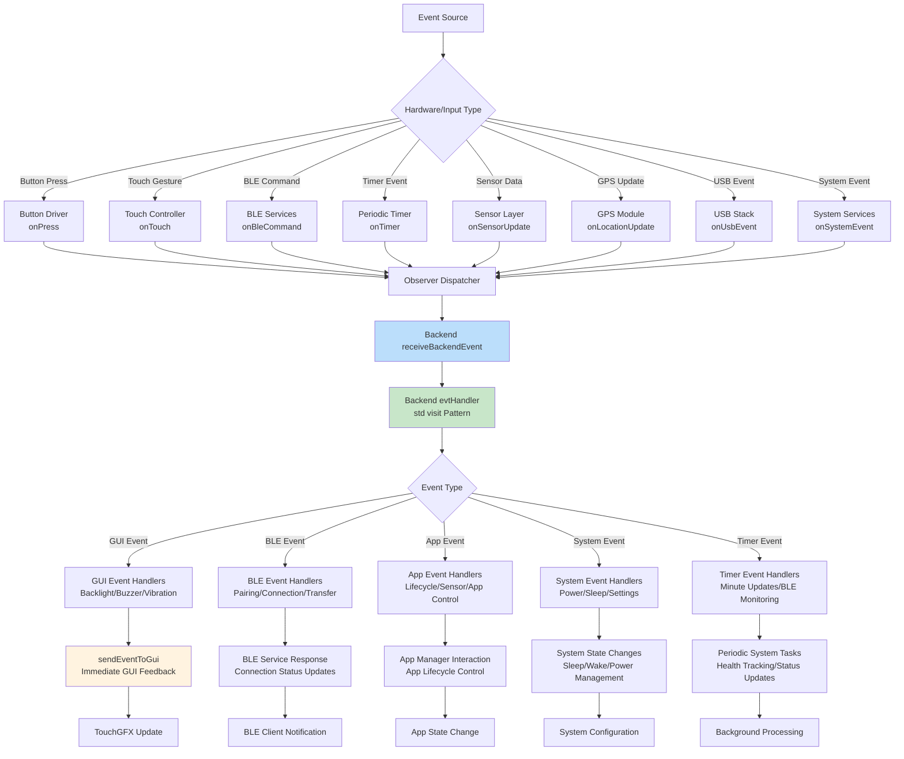
```mermaid
flowchart TD
    A[Event Source] --> B{Hardware/Input Type}

    B -->|Button Press| C[Button Driver<br/>onPress]
    B -->|Touch Gesture| D[Touch Controller<br/>onTouch]
    B -->|BLE Command| E[BLE Services<br/>onBleCommand]
    B -->|Timer Event| F[Periodic Timer<br/>onTimer]
    B -->|Sensor Data| G[Sensor Layer<br/>onSensorUpdate]
    B -->|GPS Update| H[GPS Module<br/>onLocationUpdate]
    B -->|USB Event| I[USB Stack<br/>onUsbEvent]
    B -->|System Event| J[System Services<br/>onSystemEvent]

    C --> K[Observer Dispatcher]
    D --> K
    E --> K
    F --> K
    G --> K
    H --> K
    I --> K
    J --> K

    K --> L[Backend receiveBackendEvent]

    L --> M[Backend evtHandler<br/>std visit Pattern]

    M --> N{Event Type}

    N -->|GUI Event| O[GUI Event Handlers<br/>Backlight/Buzzer/Vibration]
    N -->|BLE Event| P[BLE Event Handlers<br/>Pairing/Connection/Transfer]
    N -->|App Event| Q[App Event Handlers<br/>Lifecycle/Sensor/App Control]
    N -->|System Event| R[System Event Handlers<br/>Power/Sleep/Settings]
    N -->|Timer Event| S[Timer Event Handlers<br/>Minute Updates/BLE Monitoring]

    O --> T[sendEventToGui<br/>Immediate GUI Feedback]
    P --> U[BLE Service Response<br/>Connection Status Updates]
    Q --> V[App Manager Interaction<br/>App Lifecycle Control]
    R --> W[System State Changes<br/>Sleep/Wake/Power Management]
    S --> X[Periodic System Tasks<br/>Health Tracking/Status Updates]

    T --> Y[TouchGFX Update]
    U --> Z[BLE Client Notification]
    V --> AA[App State Change]
    W --> BB[System Configuration]
    X --> CC[Background Processing]

    style L fill:#bbdefb
    style M fill:#c8e6c9
    style T fill:#fff3e0
```

#### Backend Interface Architecture


```mermaid
graph TD
    subgraph "Core Backend Class"
        BACKEND[Backend<br/>Central Orchestrator<br/>1,045 lines]
    end

    subgraph "GUI Communication"
        IGUI_BACKEND[IGuiBackend<br/>Bidirectional TouchGFX Events]
        G2B_EVENTS[G2B Events<br/>Button/Touch/BLE Commands]
        B2G_EVENTS[B2G Events<br/>Status Updates/Notifications]
    end

    subgraph "Power Management"
        IPOWER_MGR[IPowerManager<br/>Battery/Charging/Sleep Control]
        BATTERY_EVENTS[Battery Events<br/>Level/Charging Status]
        POWER_COMMANDS[Power Commands<br/>Sleep/Wake/Screen Control]
    end

    subgraph "User Input"
        IINPUT_HANDLER[IInputHandler<br/>Button/Touch Processing]
        BUTTON_EVENTS[Button Events<br/>Press/Release/Long Press]
        TOUCH_EVENTS[Touch Events<br/>Gestures/Coordinates]
    end

    subgraph "BLE Services"
        IBLE_MANAGER[IBleManager<br/>BLE Stack Coordination]
        BLE_CONNECTION[Connection Events<br/>Pairing/Disconnect]
        BLE_SERVICES[Service Events<br/>DIS/CTS/BAS/FTS/NTS/CCS]
    end

    subgraph "GPS Integration"
        IGPS_HANDLER[IGpsHandler<br/>Location Services]
        GPS_EVENTS[GPS Events<br/>Location Updates/EPO]
        LOCATION_DATA[Location Data<br/>Coordinates/Accuracy]
    end

    subgraph "App Lifecycle"
        IAPP_MANAGER[IAppManager<br/>Application Control]
        APP_EVENTS[App Events<br/>Start/Stop/Suspend/Resume]
        APP_COMMANDS[App Commands<br/>Install/Update/Remove]
    end

    subgraph "System Services"
        ISYSTEM_HANDLER[ISystemHandler<br/>System Integration]
        SYSTEM_EVENTS[System Events<br/>USB/File/Health]
        SYSTEM_COMMANDS[System Commands<br/>Settings/Configuration]
    end

    BACKEND --> IGUI_BACKEND
    BACKEND --> IPOWER_MGR
    BACKEND --> IINPUT_HANDLER
    BACKEND --> IBLE_MANAGER
    BACKEND --> IGPS_HANDLER
    BACKEND --> IAPP_MANAGER
    BACKEND --> ISYSTEM_HANDLER

    IGUI_BACKEND --> G2B_EVENTS
    IGUI_BACKEND --> B2G_EVENTS

    IPOWER_MGR --> BATTERY_EVENTS
    IPOWER_MGR --> POWER_COMMANDS

    IINPUT_HANDLER --> BUTTON_EVENTS
    IINPUT_HANDLER --> TOUCH_EVENTS

    IBLE_MANAGER --> BLE_CONNECTION
    IBLE_MANAGER --> BLE_SERVICES

    IGPS_HANDLER --> GPS_EVENTS
    IGPS_HANDLER --> LOCATION_DATA

    IAPP_MANAGER --> APP_EVENTS
    IAPP_MANAGER --> APP_COMMANDS

    ISYSTEM_HANDLER --> SYSTEM_EVENTS
    ISYSTEM_HANDLER --> SYSTEM_COMMANDS

    style BACKEND fill:#bbdefb
    style IGUI_BACKEND fill:#c8e6c9
    style IPOWER_MGR fill:#c8e6c9
    style IINPUT_HANDLER fill:#c8e6c9
    style IBLE_MANAGER fill:#c8e6c9
```

#### Backend State Management

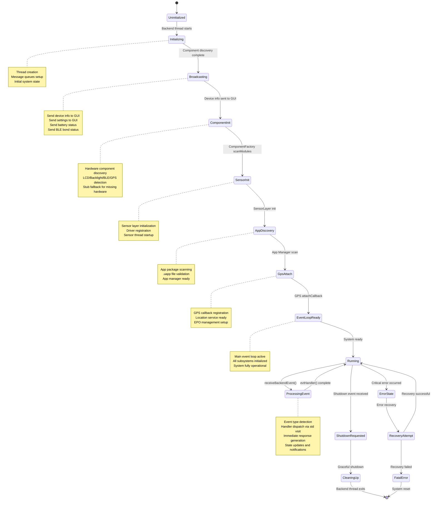
```mermaid
stateDiagram-v2
    [*] --> Uninitialized

    Uninitialized --> Initializing: Backend thread starts

    Initializing --> Broadcasting: Component discovery complete
    Broadcasting --> ComponentInit: Device info sent to GUI

    ComponentInit --> SensorInit: ComponentFactory scanModules
    SensorInit --> AppDiscovery: SensorLayer init
    AppDiscovery --> GpsAttach: App Manager scan
    GpsAttach --> EventLoopReady: GPS attachCallback

    EventLoopReady --> Running: System ready

    Running --> ProcessingEvent: receiveBackendEvent()
    ProcessingEvent --> Running: evtHandler() complete

    Running --> ShutdownRequested: Shutdown event received
    ShutdownRequested --> CleaningUp: Graceful shutdown
    CleaningUp --> [*]: Backend thread exits

    Running --> ErrorState: Critical error occurred
    ErrorState --> RecoveryAttempt: Error recovery
    RecoveryAttempt --> Running: Recovery successful
    RecoveryAttempt --> FatalError: Recovery failed
    FatalError --> [*]: System reset

    note right of Initializing
        Thread creation
        Message queues setup
        Initial system state
    end note

    note right of Broadcasting
        Send device info to GUI
        Send settings to GUI
        Send battery status
        Send BLE bond status
    end note

    note right of ComponentInit
        Hardware component discovery
        LCD/Backlight/BLE/GPS detection
        Stub fallback for missing hardware
    end note

    note right of SensorInit
        Sensor layer initialization
        Driver registration
        Sensor thread startup
    end note

    note right of AppDiscovery
        App package scanning
        .uapp file validation
        App manager ready
    end note

    note right of GpsAttach
        GPS callback registration
        Location service ready
        EPO management setup
    end note

    note right of EventLoopReady
        Main event loop active
        All subsystems initialized
        System fully operational
    end note

    note right of ProcessingEvent
        Event type detection
        Handler dispatch via std visit
        Immediate response generation
        State updates and notifications
    end note
```

#### Backend Communication Patterns

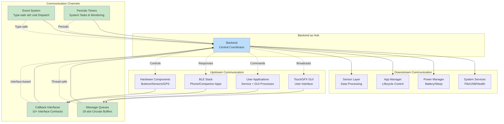
```mermaid
graph TD
    subgraph "Backend as Hub"
        BACKEND[Backend<br/>Central Coordinator]
    end

    subgraph "Upstream Communication"
        GUI[TouchGFX GUI<br/>User Interface]
        APPS[User Applications<br/>Service + GUI Processes]
        BLE_STACK[BLE Stack<br/>Phone/Companion Apps]
        HARDWARE[Hardware Components<br/>Buttons/Sensors/GPS]
    end

    subgraph "Downstream Communication"
        SYSTEM_SERVICES[System Services<br/>File/USB/Health]
        POWER_MGR[Power Manager<br/>Battery/Sleep]
        APP_MGR[App Manager<br/>Lifecycle Control]
        SENSOR_LAYER[Sensor Layer<br/>Data Processing]
    end

    subgraph "Communication Channels"
        MSG_QUEUES[Message Queues<br/>20-slot Circular Buffers]
        CALLBACKS[Callback Interfaces<br/>10+ Interface Contracts]
        EVENTS[Event System<br/>Type-safe std::visit Dispatch]
        TIMERS[Periodic Timers<br/>System Tasks & Monitoring]
    end

    GUI --> MSG_QUEUES
    APPS --> MSG_QUEUES
    BLE_STACK --> CALLBACKS
    HARDWARE --> CALLBACKS

    MSG_QUEUES --> BACKEND
    CALLBACKS --> BACKEND
    EVENTS --> BACKEND
    TIMERS --> BACKEND

    BACKEND --> SYSTEM_SERVICES
    BACKEND --> POWER_MGR
    BACKEND --> APP_MGR
    BACKEND --> SENSOR_LAYER

    BACKEND -.->|Broadcasts| GUI
    BACKEND -.->|Commands| APPS
    BACKEND -.->|Responses| BLE_STACK
    BACKEND -.->|Controls| HARDWARE

    MSG_QUEUES -.->|Thread-safe| BACKEND
    CALLBACKS -.->|Interface-based| BACKEND
    EVENTS -.->|Type-safe| BACKEND
    TIMERS -.->|Periodic| BACKEND

    style BACKEND fill:#bbdefb
    style MSG_QUEUES fill:#c8e6c9
    style CALLBACKS fill:#c8e6c9
    style EVENTS fill:#c8e6c9
    style TIMERS fill:#c8e6c9
```

#### 3. Component Factory Implementation (ComponentFactory.cpp)
**Hardware Auto-Discovery (202 lines):**

**I2C Bus Probing:**
```cpp
void ComponentFactory::scanModules() {
    // LCD/Backlight discovery via EEPROM
    Hardware::N24S64B eeprom{i2cMain};
    if (eeprom.readUniqueId(uniqueId)) {
        mpLcd = new LS012B7DD06A();
        mpBacklight = new Backlight(gpio);
    }

    // BLE on Sensor1 bus
    if (eeprom.readUniqueId(uniqueId)) {
        mpBle = new Ble::PeripheralBlueNRG(core);
    }

    // GPS on Sensor2 bus
    if (eeprom.readUniqueId(uniqueId)) {
        mpGps = new Gps::GpsAiroha(uart, power);
    }
}
```

**Stub Pattern Fallback:**
- `Stub::Backlight`, `Stub::Lcd`, `Stub::BleServer` for missing hardware
- Graceful degradation when components not detected
- Interface-based design enables runtime component replacement

#### Hardware Component Detection Flow

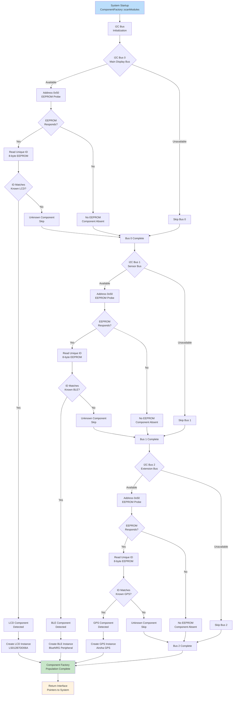
```mermaid
flowchart TD
    A[System Startup<br/>ComponentFactory::scanModules] --> B[I2C Bus<br/>Initialization]

    B --> C{I2C Bus 0<br/>Main Display Bus}
    C -->|Available| D[Address 0x50<br/>EEPROM Probe]
    C -->|Unavailable| E[Skip Bus 0]

    D --> F{EEPROM<br/>Responds?}
    F -->|Yes| G[Read Unique ID<br/>8-byte EEPROM]
    F -->|No| H[No EEPROM<br/>Component Absent]

    G --> I{ID Matches<br/>Known LCD?}
    I -->|Yes| J[LCD Component<br/>Detected]
    I -->|No| K[Unknown Component<br/>Skip]

    J --> L[Create LCD Instance<br/>LS012B7DD06A]
    K --> M[Bus 0 Complete]
    H --> M
    E --> M

    M --> N{I2C Bus 1<br/>Sensor Bus}
    N -->|Available| O[Address 0x50<br/>EEPROM Probe]
    N -->|Unavailable| P[Skip Bus 1]

    O --> Q{EEPROM<br/>Responds?}
    Q -->|Yes| R[Read Unique ID<br/>8-byte EEPROM]
    Q -->|No| S[No EEPROM<br/>Component Absent]

    R --> T{ID Matches<br/>Known BLE?}
    T -->|Yes| U[BLE Component<br/>Detected]
    T -->|No| V[Unknown Component<br/>Skip]

    U --> W[Create BLE Instance<br/>BlueNRG Peripheral]
    V --> X[Bus 1 Complete]
    S --> X
    P --> X

    X --> Y{I2C Bus 2<br/>Extension Bus}
    Y -->|Available| Z[Address 0x50<br/>EEPROM Probe]
    Y -->|Unavailable| AA[Skip Bus 2]

    Z --> BB{EEPROM<br/>Responds?}
    BB -->|Yes| CC[Read Unique ID<br/>8-byte EEPROM]
    BB -->|No| DD[No EEPROM<br/>Component Absent]

    CC --> EE{ID Matches<br/>Known GPS?}
    EE -->|Yes| FF[GPS Component<br/>Detected]
    EE -->|No| GG[Unknown Component<br/>Skip]

    FF --> HH[Create GPS Instance<br/>Airoha GPS]
    GG --> II[Bus 2 Complete]
    DD --> II
    AA --> II

    L --> JJ[Component Factory<br/>Population Complete]
    W --> JJ
    HH --> JJ
    II --> JJ

    JJ --> KK[Return Interface<br/>Pointers to System]

    style A fill:#bbdefb
    style JJ fill:#c8e6c9
    style KK fill:#fff3e0
```

#### Component Factory Interface Architecture

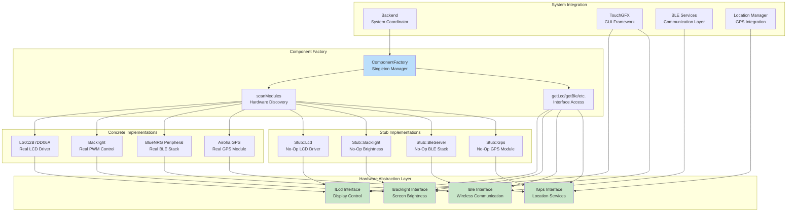
```mermaid
graph TD
    subgraph "Hardware Abstraction Layer"
        ILCD[ILcd Interface<br/>Display Control]
        IBACKLIGHT[IBacklight Interface<br/>Screen Brightness]
        IBLE[IBle Interface<br/>Wireless Communication]
        IGPS[IGps Interface<br/>Location Services]
    end

    subgraph "Concrete Implementations"
        LCD_REAL[LS012B7DD06A<br/>Real LCD Driver]
        BACKLIGHT_REAL[Backlight<br/>Real PWM Control]
        BLE_REAL[BlueNRG Peripheral<br/>Real BLE Stack]
        GPS_REAL[Airoha GPS<br/>Real GPS Module]
    end

    subgraph "Stub Implementations"
        LCD_STUB[Stub::Lcd<br/>No-Op LCD Driver]
        BACKLIGHT_STUB[Stub::Backlight<br/>No-Op Brightness]
        BLE_STUB[Stub::BleServer<br/>No-Op BLE Stack]
        GPS_STUB[Stub::Gps<br/>No-Op GPS Module]
    end

    subgraph "Component Factory"
        FACTORY[ComponentFactory<br/>Singleton Manager]
        SCAN_MODULES[scanModules<br/>Hardware Discovery]
        GET_COMPONENTS[getLcd/getBle/etc.<br/>Interface Access]
    end

    subgraph "System Integration"
        BACKEND[Backend<br/>System Coordinator]
        TOUCHGFX[TouchGFX<br/>GUI Framework]
        BLE_STACK[BLE Services<br/>Communication Layer]
        LOCATION_MGR[Location Manager<br/>GPS Integration]
    end

    FACTORY --> SCAN_MODULES
    SCAN_MODULES --> LCD_REAL
    SCAN_MODULES --> BACKLIGHT_REAL
    SCAN_MODULES --> BLE_REAL
    SCAN_MODULES --> GPS_REAL

    SCAN_MODULES --> LCD_STUB
    SCAN_MODULES --> BACKLIGHT_STUB
    SCAN_MODULES --> BLE_STUB
    SCAN_MODULES --> GPS_STUB

    LCD_REAL --> ILCD
    BACKLIGHT_REAL --> IBACKLIGHT
    BLE_REAL --> IBLE
    GPS_REAL --> IGPS

    LCD_STUB --> ILCD
    BACKLIGHT_STUB --> IBACKLIGHT
    BLE_STUB --> IBLE
    GPS_STUB --> IGPS

    FACTORY --> GET_COMPONENTS
    GET_COMPONENTS --> ILCD
    GET_COMPONENTS --> IBACKLIGHT
    GET_COMPONENTS --> IBLE
    GET_COMPONENTS --> IGPS

    BACKEND --> FACTORY
    TOUCHGFX --> ILCD
    TOUCHGFX --> IBACKLIGHT
    BLE_STACK --> IBLE
    LOCATION_MGR --> IGPS

    style FACTORY fill:#bbdefb
    style ILCD fill:#c8e6c9
    style IBACKLIGHT fill:#c8e6c9
    style IBLE fill:#c8e6c9
    style IGPS fill:#c8e6c9
```

#### Component Lifecycle and Error Recovery

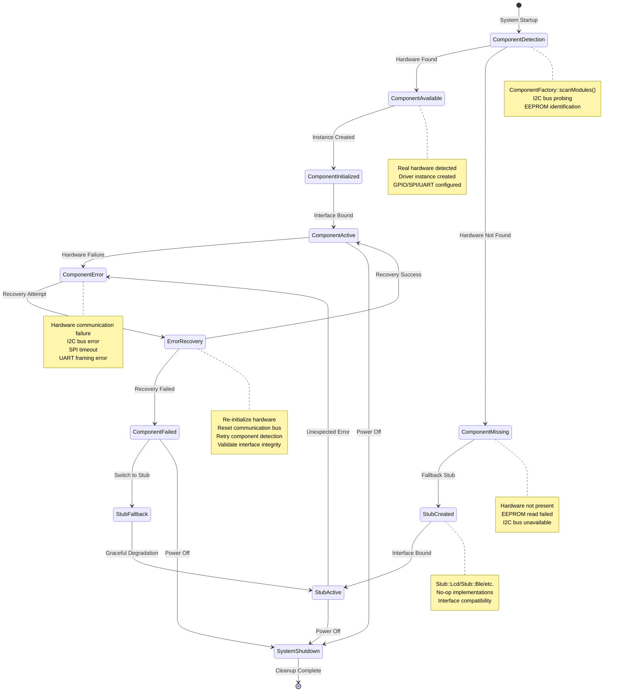
```mermaid
stateDiagram-v2
    [*] --> ComponentDetection: System Startup

    ComponentDetection --> ComponentAvailable: Hardware Found
    ComponentDetection --> ComponentMissing: Hardware Not Found

    ComponentAvailable --> ComponentInitialized: Instance Created
    ComponentMissing --> StubCreated: Fallback Stub

    ComponentInitialized --> ComponentActive: Interface Bound
    StubCreated --> StubActive: Interface Bound

    ComponentActive --> ComponentError: Hardware Failure
    StubActive --> ComponentError: Unexpected Error

    ComponentError --> ErrorRecovery: Recovery Attempt
    ErrorRecovery --> ComponentActive: Recovery Success
    ErrorRecovery --> ComponentFailed: Recovery Failed

    ComponentFailed --> StubFallback: Switch to Stub
    StubFallback --> StubActive: Graceful Degradation

    ComponentActive --> SystemShutdown: Power Off
    StubActive --> SystemShutdown: Power Off

    ComponentFailed --> SystemShutdown: Power Off
    SystemShutdown --> [*]: Cleanup Complete

    note right of ComponentDetection
        ComponentFactory::scanModules()
        I2C bus probing
        EEPROM identification
    end note

    note right of ComponentAvailable
        Real hardware detected
        Driver instance created
        GPIO/SPI/UART configured
    end note

    note right of ComponentMissing
        Hardware not present
        EEPROM read failed
        I2C bus unavailable
    end note

    note right of StubCreated
        Stub::Lcd/Stub::Ble/etc.
        No-op implementations
        Interface compatibility
    end note

    note right of ComponentError
        Hardware communication failure
        I2C bus error
        SPI timeout
        UART framing error
    end note

    note right of ErrorRecovery
        Re-initialize hardware
        Reset communication bus
        Retry component detection
        Validate interface integrity
    end note
```

#### I2C Bus Probing and Component Identification

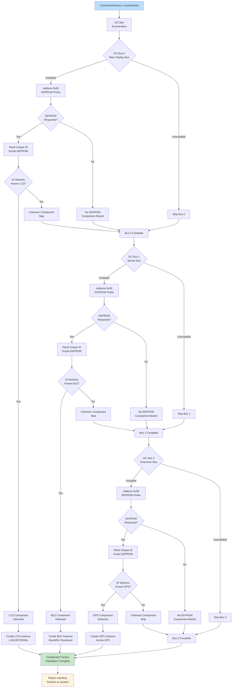
```mermaid
flowchart TD
    A[ComponentFactory::scanModules] --> B[I2C Bus<br/>Enumeration]

    B --> C{I2C Bus 0<br/>Main Display Bus}
    C -->|Available| D[Address 0x50<br/>EEPROM Probe]
    C -->|Unavailable| E[Skip Bus 0]

    D --> F{EEPROM<br/>Responds?}
    F -->|Yes| G[Read Unique ID<br/>8-byte EEPROM]
    F -->|No| H[No EEPROM<br/>Component Absent]

    G --> I{ID Matches<br/>Known LCD?}
    I -->|Yes| J[LCD Component<br/>Detected]
    I -->|No| K[Unknown Component<br/>Skip]

    J --> L[Create LCD Instance<br/>LS012B7DD06A]
    K --> M[Bus 0 Complete]
    H --> M
    E --> M

    M --> N{I2C Bus 1<br/>Sensor Bus}
    N -->|Available| O[Address 0x50<br/>EEPROM Probe]
    N -->|Unavailable| P[Skip Bus 1]

    O --> Q{EEPROM<br/>Responds?}
    Q -->|Yes| R[Read Unique ID<br/>8-byte EEPROM]
    Q -->|No| S[No EEPROM<br/>Component Absent]

    R --> T{ID Matches<br/>Known BLE?}
    T -->|Yes| U[BLE Component<br/>Detected]
    T -->|No| V[Unknown Component<br/>Skip]

    U --> W[Create BLE Instance<br/>BlueNRG Peripheral]
    V --> X[Bus 1 Complete]
    S --> X
    P --> X

    X --> Y{I2C Bus 2<br/>Extension Bus}
    Y -->|Available| Z[Address 0x50<br/>EEPROM Probe]
    Y -->|Unavailable| AA[Skip Bus 2]

    Z --> BB{EEPROM<br/>Responds?}
    BB -->|Yes| CC[Read Unique ID<br/>8-byte EEPROM]
    BB -->|No| DD[No EEPROM<br/>Component Absent]

    CC --> EE{ID Matches<br/>Known GPS?}
    EE -->|Yes| FF[GPS Component<br/>Detected]
    EE -->|No| GG[Unknown Component<br/>Skip]

    FF --> HH[Create GPS Instance<br/>Airoha GPS]
    GG --> II[Bus 2 Complete]
    DD --> II
    AA --> II

    L --> JJ[Component Factory<br/>Population Complete]
    W --> JJ
    HH --> JJ
    II --> JJ

    JJ --> KK[Return Interface<br/>Pointers to System]

    style A fill:#bbdefb
    style JJ fill:#c8e6c9
    style KK fill:#fff3e0
```

#### 4. Sensor Layer Implementation (SensorManager.cpp)
**Multi-Sensor Coordination (251 lines):**

**Driver Registration:**
```cpp
bool Sensor::Manager::regDriver(Driver* driver) {
    OS::MutexCS cs(mMutex);
    if (std::find(mDrivers.begin(), mDrivers.end(), driver) != mDrivers.end()) {
        return false; // Already registered
    }
    mDrivers.push_back(driver);
    driver->setHandle(mDrivers.size());
    updateRefreshPeriodUnsafe();
    return true;
}
```

**Adaptive Refresh Periods:**
- **Dynamic Period Calculation**: Minimum period across all registered sensors
- **Thread-Safe Updates**: Mutex-protected period recalculation
- **Semaphore-Based Threading**: Efficient blocking on sensor availability

**Connection Management:**
- **Handle-Based Access**: 1-based indexing for sensor identification
- **Type-Based Queries**: `getSensorList(SDK::Sensor::Type::HEART_RATE)`
- **Listener Registration**: Separate listeners for service vs GUI processes

#### Sensor Resource Arbitration Architecture

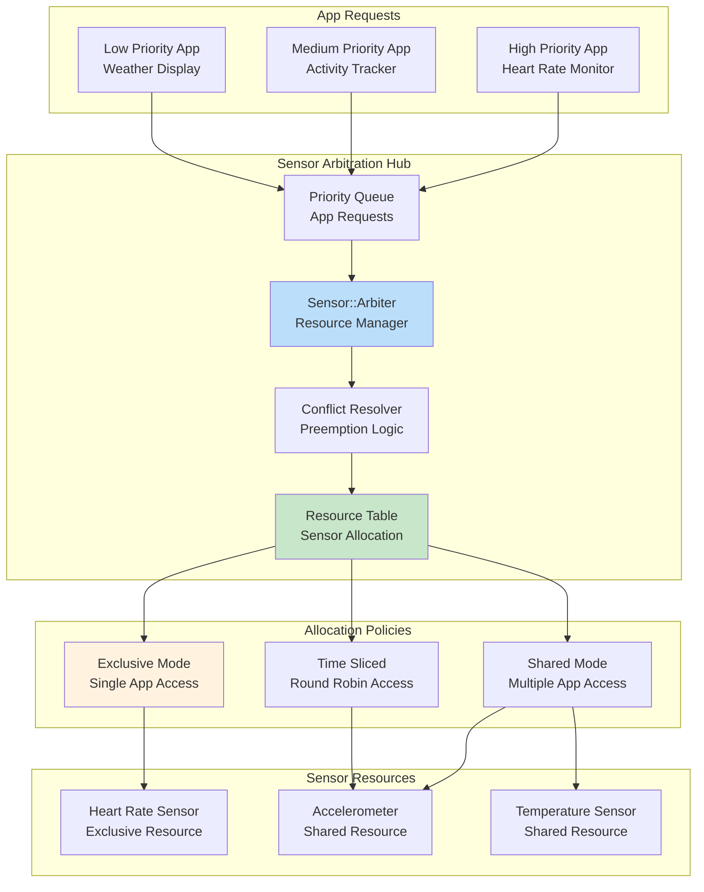
```mermaid
graph TD
    subgraph "Sensor Arbitration Hub"
        ARBITER[Sensor::Arbiter<br/>Resource Manager]
        PRIORITY_QUEUE[Priority Queue<br/>App Requests]
        RESOURCE_TABLE[Resource Table<br/>Sensor Allocation]
        CONFLICT_RESOLVER[Conflict Resolver<br/>Preemption Logic]
    end

    subgraph "App Requests"
        APP_HIGH[High Priority App<br/>Heart Rate Monitor]
        APP_MED[Medium Priority App<br/>Activity Tracker]
        APP_LOW[Low Priority App<br/>Weather Display]
    end

    subgraph "Sensor Resources"
        HR_SENSOR[Heart Rate Sensor<br/>Exclusive Resource]
        ACCEL_SENSOR[Accelerometer<br/>Shared Resource]
        TEMP_SENSOR[Temperature Sensor<br/>Shared Resource]
    end

    subgraph "Allocation Policies"
        EXCLUSIVE[Exclusive Mode<br/>Single App Access]
        SHARED[Shared Mode<br/>Multiple App Access]
        TIME_SLICED[Time Sliced<br/>Round Robin Access]
    end

    APP_HIGH --> PRIORITY_QUEUE
    APP_MED --> PRIORITY_QUEUE
    APP_LOW --> PRIORITY_QUEUE

    PRIORITY_QUEUE --> ARBITER

    ARBITER --> CONFLICT_RESOLVER
    CONFLICT_RESOLVER --> RESOURCE_TABLE

    RESOURCE_TABLE --> EXCLUSIVE
    RESOURCE_TABLE --> SHARED
    RESOURCE_TABLE --> TIME_SLICED

    EXCLUSIVE --> HR_SENSOR
    SHARED --> ACCEL_SENSOR
    SHARED --> TEMP_SENSOR
    TIME_SLICED --> ACCEL_SENSOR

    style ARBITER fill:#bbdefb
    style RESOURCE_TABLE fill:#c8e6c9
    style EXCLUSIVE fill:#fff3e0
```

#### Sensor Data Pipeline and Processing Flow

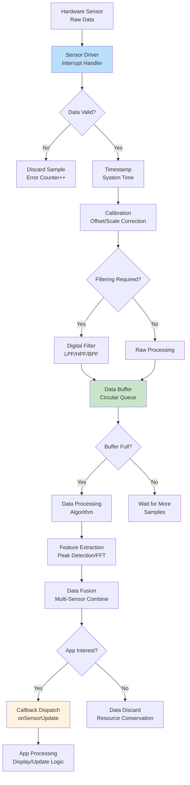
```mermaid
flowchart TD
    A[Hardware Sensor<br/>Raw Data] --> B[Sensor Driver<br/>Interrupt Handler]

    B --> C{Data Valid?}
    C -->|No| D[Discard Sample<br/>Error Counter++]
    C -->|Yes| E[Timestamp<br/>System Time]

    E --> F[Calibration<br/>Offset/Scale Correction]

    F --> G{Filtering Required?}
    G -->|Yes| H[Digital Filter<br/>LPF/HPF/BPF]
    G -->|No| I[Raw Processing]

    H --> J[Data Buffer<br/>Circular Queue]
    I --> J

    J --> K{Buffer Full?}
    K -->|Yes| L[Data Processing<br/>Algorithm]
    K -->|No| M[Wait for More<br/>Samples]

    L --> N[Feature Extraction<br/>Peak Detection/FFT]
    N --> O[Data Fusion<br/>Multi-Sensor Combine]

    O --> P{App Interest?}
    P -->|Yes| Q[Callback Dispatch<br/>onSensorUpdate]
    P -->|No| R[Data Discard<br/>Resource Conservation]

    Q --> S[App Processing<br/>Display/Update Logic]

    style B fill:#bbdefb
    style J fill:#c8e6c9
    style Q fill:#fff3e0
```

#### Sensor Error Handling and Recovery Mechanisms

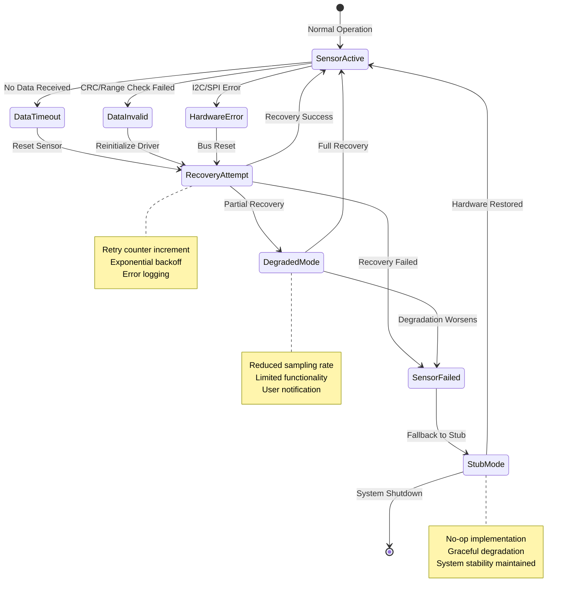
```mermaid
stateDiagram-v2
    [*] --> SensorActive: Normal Operation

    SensorActive --> DataTimeout: No Data Received
    SensorActive --> DataInvalid: CRC/Range Check Failed
    SensorActive --> HardwareError: I2C/SPI Error

    DataTimeout --> RecoveryAttempt: Reset Sensor
    DataInvalid --> RecoveryAttempt: Reinitialize Driver
    HardwareError --> RecoveryAttempt: Bus Reset

    RecoveryAttempt --> SensorActive: Recovery Success
    RecoveryAttempt --> DegradedMode: Partial Recovery
    RecoveryAttempt --> SensorFailed: Recovery Failed

    DegradedMode --> SensorActive: Full Recovery
    DegradedMode --> SensorFailed: Degradation Worsens

    SensorFailed --> StubMode: Fallback to Stub
    StubMode --> SensorActive: Hardware Restored

    StubMode --> [*]: System Shutdown

    note right of RecoveryAttempt
        Retry counter increment
        Exponential backoff
        Error logging
    end note

    note right of DegradedMode
        Reduced sampling rate
        Limited functionality
        User notification
    end note

    note right of StubMode
        No-op implementation
        Graceful degradation
        System stability maintained
    end note
```

#### Sensor Performance Monitoring and Optimization

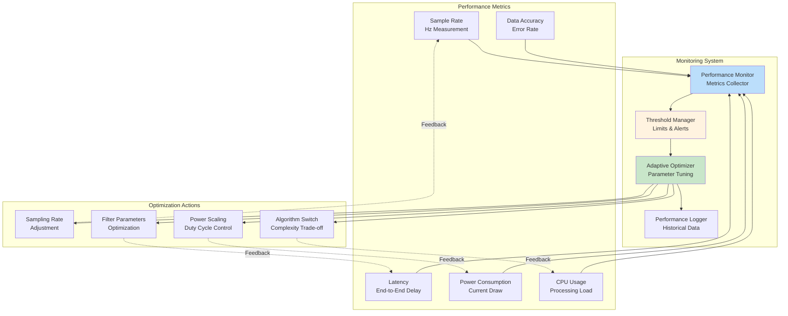
```mermaid
graph TD
    subgraph "Performance Metrics"
        SAMPLE_RATE[Sample Rate<br/>Hz Measurement]
        LATENCY[Latency<br/>End-to-End Delay]
        POWER_CONSUMPTION[Power Consumption<br/>Current Draw]
        DATA_ACCURACY[Data Accuracy<br/>Error Rate]
        CPU_USAGE[CPU Usage<br/>Processing Load]
    end

    subgraph "Monitoring System"
        PERFORMANCE_MONITOR[Performance Monitor<br/>Metrics Collector]
        THRESHOLDS[Threshold Manager<br/>Limits & Alerts]
        OPTIMIZER[Adaptive Optimizer<br/>Parameter Tuning]
        LOGGER[Performance Logger<br/>Historical Data]
    end

    subgraph "Optimization Actions"
        RATE_ADJUSTMENT[Sampling Rate<br/>Adjustment]
        FILTER_TUNING[Filter Parameters<br/>Optimization]
        POWER_SCALING[Power Scaling<br/>Duty Cycle Control]
        ALGORITHM_SWITCH[Algorithm Switch<br/>Complexity Trade-off]
    end

    SAMPLE_RATE --> PERFORMANCE_MONITOR
    LATENCY --> PERFORMANCE_MONITOR
    POWER_CONSUMPTION --> PERFORMANCE_MONITOR
    DATA_ACCURACY --> PERFORMANCE_MONITOR
    CPU_USAGE --> PERFORMANCE_MONITOR

    PERFORMANCE_MONITOR --> THRESHOLDS
    THRESHOLDS --> OPTIMIZER
    OPTIMIZER --> LOGGER

    OPTIMIZER --> RATE_ADJUSTMENT
    OPTIMIZER --> FILTER_TUNING
    OPTIMIZER --> POWER_SCALING
    OPTIMIZER --> ALGORITHM_SWITCH

    RATE_ADJUSTMENT -.->|Feedback| SAMPLE_RATE
    FILTER_TUNING -.->|Feedback| LATENCY
    POWER_SCALING -.->|Feedback| POWER_CONSUMPTION
    ALGORITHM_SWITCH -.->|Feedback| CPU_USAGE

    style PERFORMANCE_MONITOR fill:#bbdefb
    style OPTIMIZER fill:#c8e6c9
    style THRESHOLDS fill:#fff3e0
```

#### 5. Settings Management Implementation (SettingsManager.cpp)
**JSON-Based Persistence (120 lines):**

**Structured Configuration:**
```json
{
  "units": "metric",
  "watchFaceId": 832675,
  "phone": {"notifications": true},
  "heartRateZones": [150, 170, 190, 210],
  "dailyGoals": {
    "activityMinutes": 120,
    "steps": 7000,
    "floors": 100
  }
}
```

**Type-Safe Serialization:**
- **Template-Based ManagerBase**: `ManagerBase<WatchSettings>`
- **JSON Stream Processing**: Custom reader/writer for structured data
- **Validation**: Units enum checking, bounds validation for heart rate zones

#### Settings Persistence and Recovery Flow

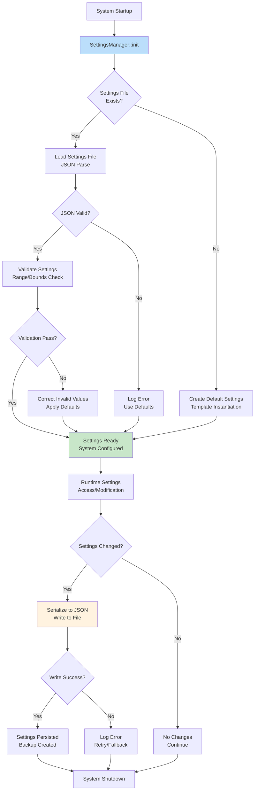
```mermaid
flowchart TD
    A[System Startup] --> B[SettingsManager::init]
    B --> C{Settings File<br/>Exists?}

    C -->|Yes| D[Load Settings File<br/>JSON Parse]
    C -->|No| E[Create Default Settings<br/>Template Instantiation]

    D --> F{JSON Valid?}
    F -->|Yes| G[Validate Settings<br/>Range/Bounds Check]
    F -->|No| H[Log Error<br/>Use Defaults]

    G --> I{Validation Pass?}
    I -->|Yes| J[Settings Ready<br/>System Configured]
    I -->|No| K[Correct Invalid Values<br/>Apply Defaults]

    E --> J
    H --> J
    K --> J

    J --> L[Runtime Settings<br/>Access/Modification]

    L --> M{Settings Changed?}
    M -->|Yes| N[Serialize to JSON<br/>Write to File]
    M -->|No| O[No Changes<br/>Continue]

    N --> P{Write Success?}
    P -->|Yes| Q[Settings Persisted<br/>Backup Created]
    P -->|No| R[Log Error<br/>Retry/Fallback]

    Q --> S[System Shutdown]
    O --> S
    R --> S

    style B fill:#bbdefb
    style J fill:#c8e6c9
    style N fill:#fff3e0
```

#### Settings Configuration State Machine

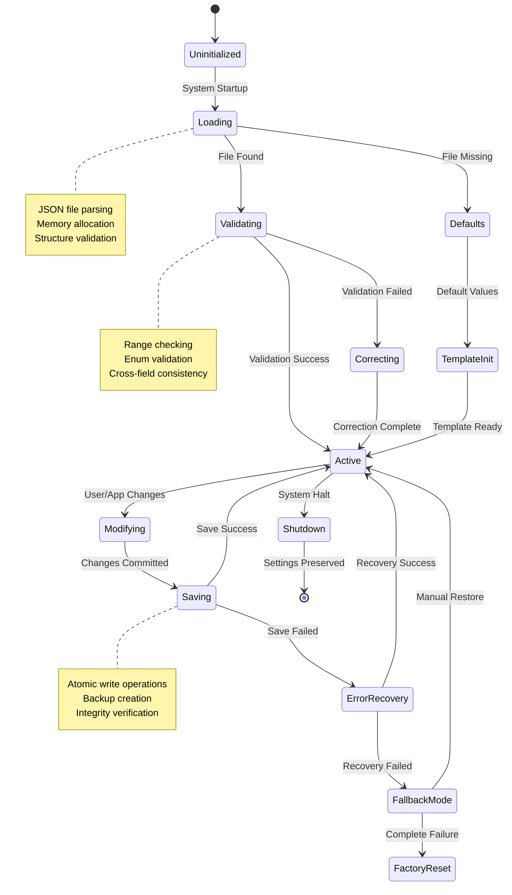
```mermaid
stateDiagram-v2
    [*] --> Uninitialized

    Uninitialized --> Loading: System Startup
    Loading --> Validating: File Found
    Loading --> Defaults: File Missing

    Validating --> Active: Validation Success
    Validating --> Correcting: Validation Failed
    Correcting --> Active: Correction Complete

    Defaults --> TemplateInit: Default Values
    TemplateInit --> Active: Template Ready

    Active --> Modifying: User/App Changes
    Modifying --> Saving: Changes Committed
    Saving --> Active: Save Success
    Saving --> ErrorRecovery: Save Failed

    ErrorRecovery --> Active: Recovery Success
    ErrorRecovery --> FallbackMode: Recovery Failed

    FallbackMode --> Active: Manual Restore
    FallbackMode --> FactoryReset: Complete Failure

    Active --> Shutdown: System Halt
    Shutdown --> [*]: Settings Preserved

    note right of Loading
        JSON file parsing
        Memory allocation
        Structure validation
    end note

    note right of Validating
        Range checking
        Enum validation
        Cross-field consistency
    end note

    note right of Saving
        Atomic write operations
        Backup creation
        Integrity verification
    end note
```

#### Settings Access Patterns and Concurrency

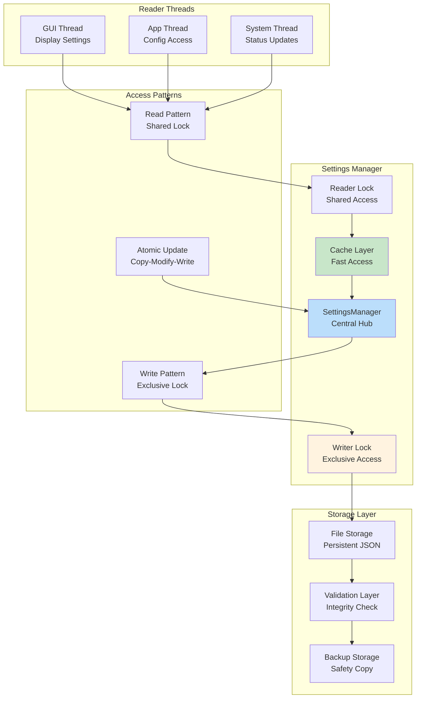
```mermaid
graph TD
    subgraph "Reader Threads"
        GUI_THREAD[GUI Thread<br/>Display Settings]
        APP_THREAD[App Thread<br/>Config Access]
        SYSTEM_THREAD[System Thread<br/>Status Updates]
    end

    subgraph "Settings Manager"
        SETTINGS_MGR[SettingsManager<br/>Central Hub]
        READER_LOCK[Reader Lock<br/>Shared Access]
        WRITER_LOCK[Writer Lock<br/>Exclusive Access]
        CACHE_LAYER[Cache Layer<br/>Fast Access]
    end

    subgraph "Storage Layer"
        FILE_STORAGE[File Storage<br/>Persistent JSON]
        BACKUP_STORAGE[Backup Storage<br/>Safety Copy]
        VALIDATION_LAYER[Validation Layer<br/>Integrity Check]
    end

    subgraph "Access Patterns"
        READ_PATTERN[Read Pattern<br/>Shared Lock]
        WRITE_PATTERN[Write Pattern<br/>Exclusive Lock]
        ATOMIC_UPDATE[Atomic Update<br/>Copy-Modify-Write]
    end

    GUI_THREAD --> READ_PATTERN
    APP_THREAD --> READ_PATTERN
    SYSTEM_THREAD --> READ_PATTERN

    READ_PATTERN --> READER_LOCK
    READER_LOCK --> CACHE_LAYER

    CACHE_LAYER --> SETTINGS_MGR

    SETTINGS_MGR --> WRITE_PATTERN
    WRITE_PATTERN --> WRITER_LOCK
    WRITER_LOCK --> FILE_STORAGE

    FILE_STORAGE --> VALIDATION_LAYER
    VALIDATION_LAYER --> BACKUP_STORAGE

    ATOMIC_UPDATE --> SETTINGS_MGR

    style SETTINGS_MGR fill:#bbdefb
    style CACHE_LAYER fill:#c8e6c9
    style WRITER_LOCK fill:#fff3e0
```

#### Settings Migration and Version Compatibility

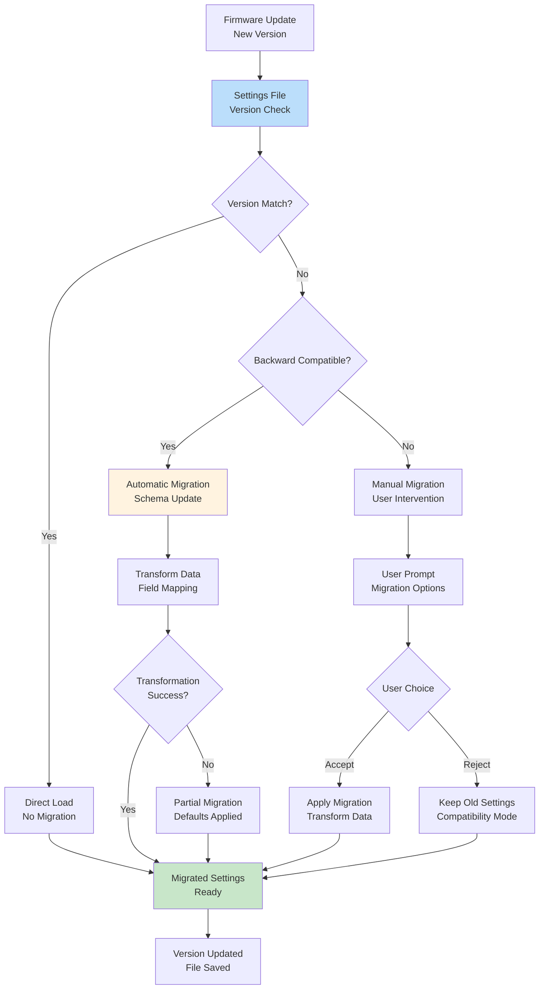
```mermaid
flowchart TD
    A[Firmware Update<br/>New Version] --> B[Settings File<br/>Version Check]

    B --> C{Version Match?}
    C -->|Yes| D[Direct Load<br/>No Migration]
    C -->|No| E{Backward Compatible?}

    E -->|Yes| F[Automatic Migration<br/>Schema Update]
    E -->|No| G[Manual Migration<br/>User Intervention]

    F --> H[Transform Data<br/>Field Mapping]
    H --> I{Transformation<br/>Success?}

    I -->|Yes| J[Migrated Settings<br/>Ready]
    I -->|No| K[Partial Migration<br/>Defaults Applied]

    G --> L[User Prompt<br/>Migration Options]
    L --> M{User Choice}
    M -->|Accept| N[Apply Migration<br/>Transform Data]
    M -->|Reject| O[Keep Old Settings<br/>Compatibility Mode]

    N --> J
    O --> J
    K --> J
    D --> J

    J --> P[Version Updated<br/>File Saved]

    style B fill:#bbdefb
    style J fill:#c8e6c9
    style F fill:#fff3e0
```

#### 6. File System Implementation (FileSystem.cpp)
**FatFs Wrapper (577 lines):**

**Multi-Volume Management:**
- **4 Logical Volumes**: Internal flash, external storage partitions
- **exFAT Formatting**: 4KB cluster size, partition table creation
- **Volume Labels**: Custom disk labels for identification

**Thread-Safe Operations:**
- **Mutex Array**: Separate locks for each volume + system operations
- **FF_FS_REENTRANT**: FatFs reentrancy support with OS mutexes

**Time Zone Handling:**
- **FAT ↔ UTC Conversion**: Proper timestamp management
- **exFAT Timezone Support**: 15-minute offset encoding
- **DST Awareness**: Local time calculations with timezone adjustments

**Advanced Features:**
- **Recursive Directory Creation**: `mkdir()` with path parsing
- **File Copy Operations**: Block-based copying with progress tracking
- **Factory Reset**: Complete volume reformatting capability

#### Multi-Volume File System Architecture

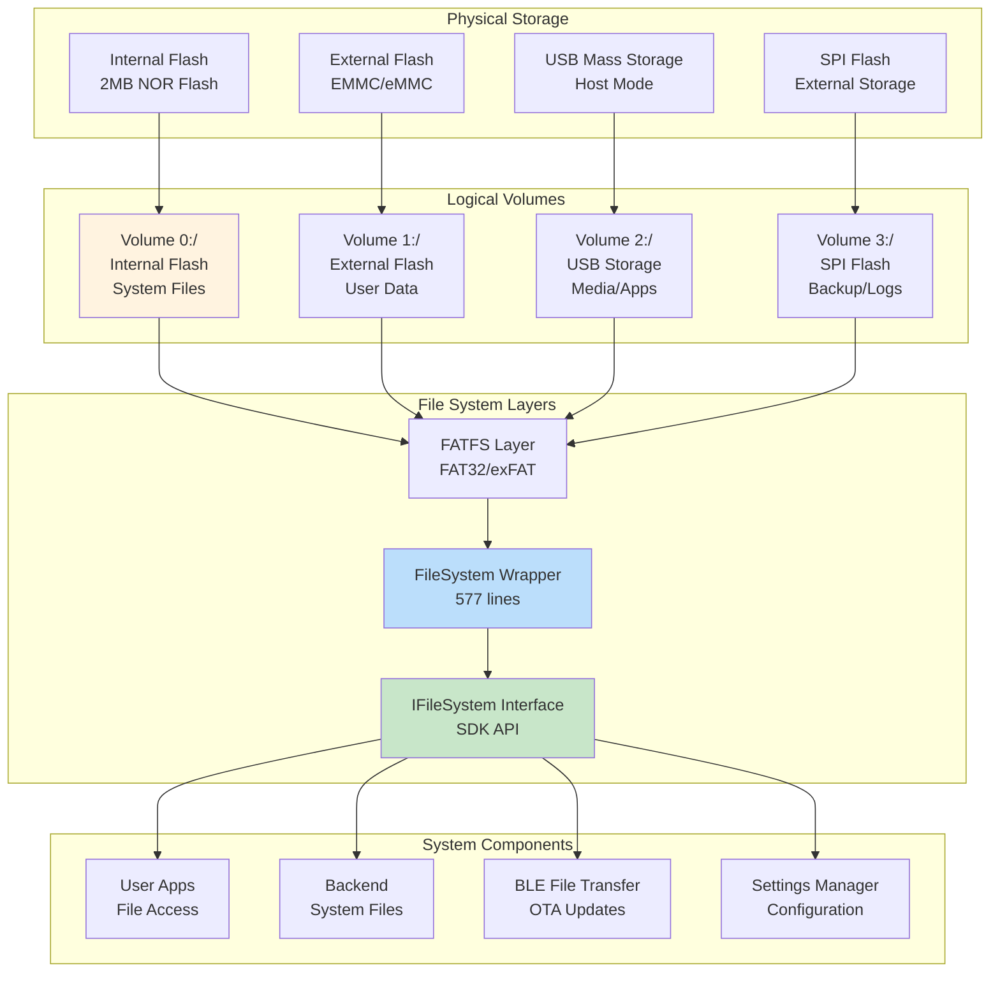
```mermaid
graph TD
    subgraph "Physical Storage"
        INTERNAL_FLASH[Internal Flash<br/>2MB NOR Flash]
        EXTERNAL_FLASH[External Flash<br/>EMMC/eMMC]
        SPI_FLASH[SPI Flash<br/>External Storage]
        USB_MSC[USB Mass Storage<br/>Host Mode]
    end

    subgraph "Logical Volumes"
        VOLUME_0[Volume 0:/<br/>Internal Flash<br/>System Files]
        VOLUME_1[Volume 1:/<br/>External Flash<br/>User Data]
        VOLUME_2[Volume 2:/<br/>USB Storage<br/>Media/Apps]
        VOLUME_3[Volume 3:/<br/>SPI Flash<br/>Backup/Logs]
    end

    subgraph "File System Layers"
        FATFS_LAYER[FATFS Layer<br/>FAT32/exFAT]
        FILESYSTEM_WRAPPER[FileSystem Wrapper<br/>577 lines]
        KERNEL_INTERFACE[IFileSystem Interface<br/>SDK API]
    end

    subgraph "System Components"
        APPS[User Apps<br/>File Access]
        BACKEND[Backend<br/>System Files]
        BLE_STACK[BLE File Transfer<br/>OTA Updates]
        SETTINGS[Settings Manager<br/>Configuration]
    end

    INTERNAL_FLASH --> VOLUME_0
    EXTERNAL_FLASH --> VOLUME_1
    USB_MSC --> VOLUME_2
    SPI_FLASH --> VOLUME_3

    VOLUME_0 --> FATFS_LAYER
    VOLUME_1 --> FATFS_LAYER
    VOLUME_2 --> FATFS_LAYER
    VOLUME_3 --> FATFS_LAYER

    FATFS_LAYER --> FILESYSTEM_WRAPPER
    FILESYSTEM_WRAPPER --> KERNEL_INTERFACE

    KERNEL_INTERFACE --> APPS
    KERNEL_INTERFACE --> BACKEND
    KERNEL_INTERFACE --> BLE_STACK
    KERNEL_INTERFACE --> SETTINGS

    style FILESYSTEM_WRAPPER fill:#bbdefb
    style KERNEL_INTERFACE fill:#c8e6c9
    style VOLUME_0 fill:#fff3e0
```

#### File System Operations Flow

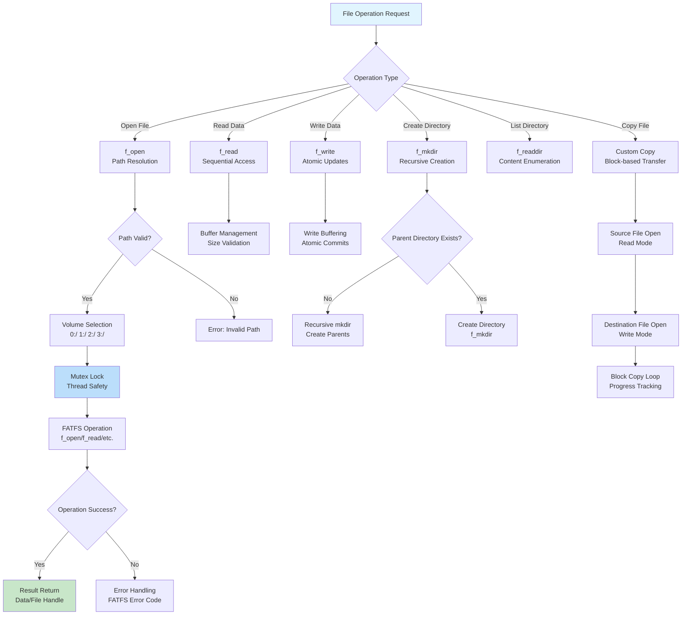
```mermaid
flowchart TD
    A[File Operation Request] --> B{Operation Type}

    B -->|Open File| C[f_open<br/>Path Resolution]
    B -->|Read Data| D[f_read<br/>Sequential Access]
    B -->|Write Data| E[f_write<br/>Atomic Updates]
    B -->|Create Directory| F[f_mkdir<br/>Recursive Creation]
    B -->|List Directory| G[f_readdir<br/>Content Enumeration]
    B -->|Copy File| H[Custom Copy<br/>Block-based Transfer]

    C --> I{Path Valid?}
    I -->|Yes| J[Volume Selection<br/>0:/ 1:/ 2:/ 3:/]
    I -->|No| K[Error: Invalid Path]

    J --> L[Mutex Lock<br/>Thread Safety]
    L --> M[FATFS Operation<br/>f_open/f_read/etc.]
    M --> N{Operation Success?}

    N -->|Yes| O[Result Return<br/>Data/File Handle]
    N -->|No| P[Error Handling<br/>FATFS Error Code]

    D --> Q[Buffer Management<br/>Size Validation]
    E --> R[Write Buffering<br/>Atomic Commits]

    F --> S{Parent Directory Exists?}
    S -->|No| T[Recursive mkdir<br/>Create Parents]
    S -->|Yes| U[Create Directory<br/>f_mkdir]

    H --> V[Source File Open<br/>Read Mode]
    V --> W[Destination File Open<br/>Write Mode]
    W --> X[Block Copy Loop<br/>Progress Tracking]

    style A fill:#e1f5fe
    style L fill:#bbdefb
    style O fill:#c8e6c9
```

#### Thread-Safe File Access State Machine

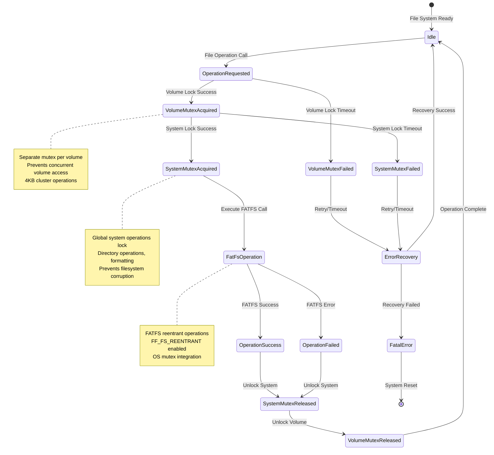
```mermaid
stateDiagram-v2
    [*] --> Idle: File System Ready

    Idle --> OperationRequested: File Operation Call
    OperationRequested --> VolumeMutexAcquired: Volume Lock Success
    OperationRequested --> VolumeMutexFailed: Volume Lock Timeout

    VolumeMutexAcquired --> SystemMutexAcquired: System Lock Success
    VolumeMutexAcquired --> SystemMutexFailed: System Lock Timeout

    SystemMutexAcquired --> FatFsOperation: Execute FATFS Call
    FatFsOperation --> OperationSuccess: FATFS Success
    FatFsOperation --> OperationFailed: FATFS Error

    OperationSuccess --> SystemMutexReleased: Unlock System
    OperationFailed --> SystemMutexReleased: Unlock System

    SystemMutexReleased --> VolumeMutexReleased: Unlock Volume
    VolumeMutexReleased --> Idle: Operation Complete

    VolumeMutexFailed --> ErrorRecovery: Retry/Timeout
    SystemMutexFailed --> ErrorRecovery: Retry/Timeout

    ErrorRecovery --> Idle: Recovery Success
    ErrorRecovery --> FatalError: Recovery Failed
    FatalError --> [*]: System Reset

    note right of VolumeMutexAcquired
        Separate mutex per volume
        Prevents concurrent volume access
        4KB cluster operations
    end note

    note right of SystemMutexAcquired
        Global system operations lock
        Directory operations, formatting
        Prevents filesystem corruption
    end note

    note right of FatFsOperation
        FATFS reentrant operations
        FF_FS_REENTRANT enabled
        OS mutex integration
    end note
```

#### File System Error Recovery and Factory Reset Flow

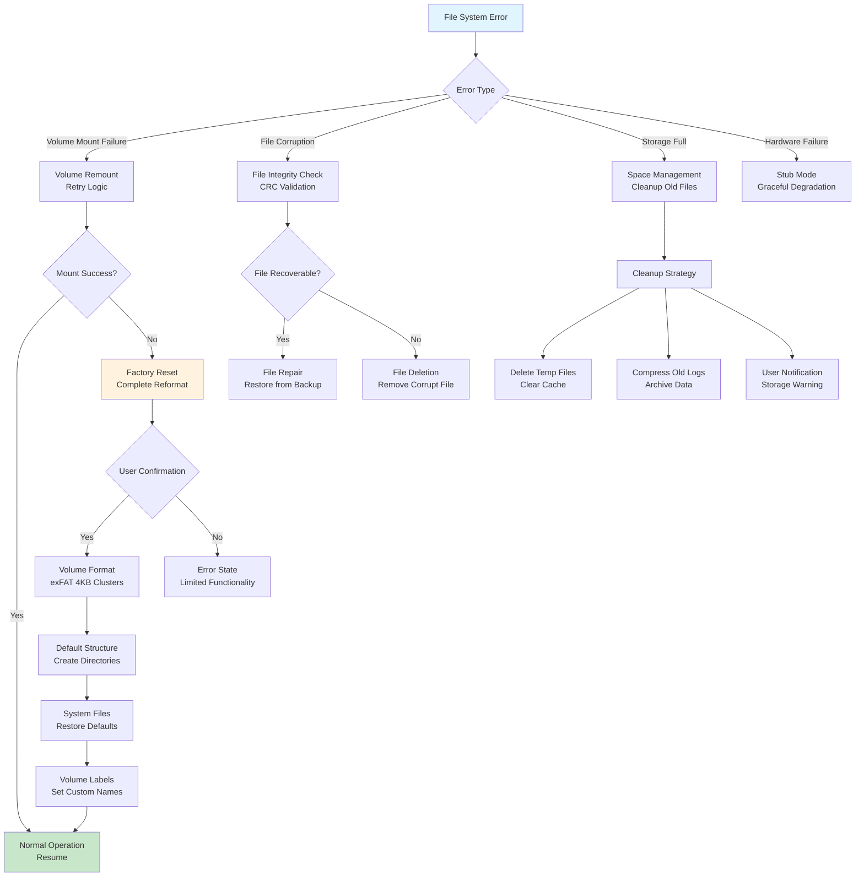
```mermaid
flowchart TD
    A[File System Error] --> B{Error Type}

    B -->|Volume Mount Failure| C[Volume Remount<br/>Retry Logic]
    B -->|File Corruption| D[File Integrity Check<br/>CRC Validation]
    B -->|Storage Full| E[Space Management<br/>Cleanup Old Files]
    B -->|Hardware Failure| F[Stub Mode<br/>Graceful Degradation]

    C --> G{Mount Success?}
    G -->|Yes| H[Normal Operation<br/>Resume]
    G -->|No| I[Factory Reset<br/>Complete Reformat]

    D --> J{File Recoverable?}
    J -->|Yes| K[File Repair<br/>Restore from Backup]
    J -->|No| L[File Deletion<br/>Remove Corrupt File]

    E --> M[Cleanup Strategy]
    M --> N[Delete Temp Files<br/>Clear Cache]
    M --> O[Compress Old Logs<br/>Archive Data]
    M --> P[User Notification<br/>Storage Warning]

    I --> Q{User Confirmation}
    Q -->|Yes| R[Volume Format<br/>exFAT 4KB Clusters]
    Q -->|No| S[Error State<br/>Limited Functionality]

    R --> T[Default Structure<br/>Create Directories]
    T --> U[System Files<br/>Restore Defaults]
    U --> V[Volume Labels<br/>Set Custom Names]

    V --> H

    style A fill:#e1f5fe
    style I fill:#fff3e0
    style H fill:#c8e6c9
```

#### Time Zone and DST Handling Architecture

```mermaid
graph TD
    subgraph "Time Sources"
        RTC[RTC Hardware<br/>Local Time]
        GPS[GPS Module<br/>UTC Time]
        BLE_STACK[BLE Time Service<br/>Phone Sync]
    end

    subgraph "Time Zone Processing"
        TZ_MANAGER[Time Zone Manager<br/>Offset Calculation]
        DST_HANDLER[DST Handler<br/>Daylight Saving]
        UTC_CONVERTER[UTC Converter<br/>Local ↔ UTC]
    end

    subgraph "File System Integration"
        FAT_TIME[FAT Timestamp<br/>32-bit DOS Format]
        EXFAT_TIME[exFAT Timestamp<br/>64-bit with TZ]
        FILE_METADATA[File Metadata<br/>Creation/Modified Times]
    end

    subgraph "System Components"
        BACKEND[Backend<br/>Time Updates]
        TOUCHGFX[TouchGFX<br/>Display Time]
        APPS[User Apps<br/>Time Access]
        LOGGING[Logging System<br/>Timestamped Events]
    end

    RTC --> TZ_MANAGER
    GPS --> TZ_MANAGER
    BLE_STACK --> TZ_MANAGER

    TZ_MANAGER --> DST_HANDLER
    DST_HANDLER --> UTC_CONVERTER

    UTC_CONVERTER --> FAT_TIME
    UTC_CONVERTER --> EXFAT_TIME

    FAT_TIME --> FILE_METADATA
    EXFAT_TIME --> FILE_METADATA

    FILE_METADATA --> BACKEND
    FILE_METADATA --> TOUCHGFX
    FILE_METADATA --> APPS
    FILE_METADATA --> LOGGING

    style TZ_MANAGER fill:#bbdefb
    style UTC_CONVERTER fill:#c8e6c9
    style FILE_METADATA fill:#fff3e0
```

### System Initialization Sequence

```
HAL_Init() → System Clock → Logging → Watchdog → RTC → Sleep Init →
Heap Monitor → Observer Dispatcher → StartupTask() → Hardware Init →
I2C Setup → PMIC → Flash → File System → USB/BLE → Buttons/Buzzer →
ComponentFactory.scanModules() → LCD/BLE/GPS Detection → SensorLayer.init() →
DailyHealth.init() → AppManager.scan() → Backend.run() → TouchGFX Init →
Event Loop Ready
```

#### Sequence Diagram: Detailed Backend Thread Initialization

```mermaid
sequenceDiagram
    participant Main as main()
    participant ST as StartupTask
    participant Backend as Backend::run()
    participant Thread as Backend::thread()
    participant Factory as ComponentFactory
    participant SL as SensorLayer
    participant AppMgr as App::Manager
    participant GPS as GPS
    participant GUI as GUI Queue

    Main->>ST: Backend::GetInstance().run()
    Backend->>Thread: mThread.init(thread)
    Thread->>Thread: HWButtons.attachCallback()
    Thread->>Factory: GetInstance()
    Thread->>Thread: minuteTimCallback() start timer
    Thread->>GUI: send DevInfo/Settings/Battery/BLE bond
    Note over Thread: BLE init if present (services, enable, advertise)
    Thread->>SL: init()
    Thread->>Thread: DH.init(), attach
    Thread->>AppMgr: scan(), autoRun if button
    Thread->>GPS: attachCallback(), sendEpoTime
    Thread->>GUI: send Booted
    Thread->>Thread: backlight.on()
    loop Event Loop
        Thread->>Thread: receiveBackendEvent()
        Thread->>Thread: evtHandler(std::visit)
    end
```

#### System Initialization Flow

```mermaid
flowchart TD
    A["Power On"] --> B["HAL_Init()"]
    B --> C["System Clock Setup"]
    C --> D["FreeRTOS Start"]
    D --> E["main() Entry"]
    E --> F["Hardware Init<br/>Cache/Irq/Power"]
    F --> G["PriorityMap_init()"]
    G --> H["Driver::System::Init()"]
    H --> I["Logging Setup"]
    I --> J["Watchdog Start"]
    J --> K["RTC Init"]
    K --> L["Sleep Manager Init"]
    L --> M["OS Kernel Start"]
    M --> N["StartupTask Create"]
    N --> O["StartupTask Run"]

    O --> P["I2C Bus Setup"]
    P --> Q["PMIC Init"]
    Q --> R["Flash Storage Init"]
    R --> S["File System Mount"]
    S --> T["USB Device Init"]
    T --> U["Battery Fuel Gauge"]
    U --> V["Settings Load"]
    V --> W["ComponentFactory.scanModules()"]
    W --> X["LCD/Backlight Detect"]
    X --> Y["BLE Module Detect"]
    Y --> Z["GPS Module Detect"]
    Z --> AA["Buzzer/Vibro Init"]
    AA --> BB["HW Buttons Init"]
    BB --> CC["Sensor Layer Init"]
    CC --> DD["Daily Health Init"]
    DD --> EE["App Manager Scan"]
    EE --> FF["Backend.run()"]
    FF --> GG["BLE Services Start"]
    GG --> HH["TouchGFX Init"]
    HH --> II["System Ready"]

    style A fill:#e1f5fe
    style II fill:#c8e6c9
```

### System Initialization from Multiple Perspectives

#### 1. Thread Perspective: RTOS Task Initialization

```mermaid
stateDiagram-v2
    [*] --> SystemReset: Power On / Reset

    SystemReset --> HAL_Init: Hardware Abstraction Layer
    HAL_Init --> FreeRTOS_Start: RTOS Kernel Boot
    FreeRTOS_Start --> main_Entry: main() Function

    main_Entry --> StartupTask_Created: StartupTask Thread
    StartupTask_Created --> StartupTask_Running: Hardware Init Loop

    StartupTask_Running --> Backend_Thread_Created: Backend Thread Spawn
    Backend_Thread_Created --> Backend_Thread_Running: Component Discovery

    Backend_Thread_Running --> TouchGFX_Init: GUI Framework Start
    TouchGFX_Init --> EventLoop_Active: System Ready

    EventLoop_Active --> Running: Normal Operation
    Running --> Sleep: Inactivity
    Running --> Shutdown: Power Off

    note right of StartupTask_Created
        Thread: StartupTask
        Priority: High
        Stack: 4KB
        Function: Hardware bringup
    end note

    note right of Backend_Thread_Created
        Thread: Backend
        Priority: Normal
        Stack: 8KB
        Function: System coordination
    end note

    note right of TouchGFX_Init
        Thread: TouchGFX
        Priority: Normal
        Stack: 16KB
        Function: UI rendering
    end note
```

#### 2. Component Dependency Perspective: Initialization Order

```mermaid
graph TD
    subgraph "Phase 1: Core Hardware"
        HAL[HAL_Init<br/>MCU Setup]
        CLOCK[System Clock<br/>PLL Config]
        RTOS[FreeRTOS<br/>Kernel Start]
    end

    subgraph "Phase 2: System Services"
        LOGGING[Logging System<br/>Debug Output]
        WATCHDOG[Watchdog Timer<br/>System Reset]
        RTC[RTC Module<br/>Time Keeping]
        SLEEP[Sleep Manager<br/>Power States]
    end

    subgraph "Phase 3: Storage & Communication"
        HEAP[Heap Monitor<br/>Memory Tracking]
        DISPATCHER[Observer Dispatcher<br/>Event System]
        I2C[I2C Bus Setup<br/>Multi-Drop Bus]
        PMIC[PMIC Init<br/>Power Management]
        FLASH[Flash Storage<br/>File System Base]
        FILESYSTEM[File System Mount<br/>FatFs Volumes]
    end

    subgraph "Phase 4: Peripherals"
        USB[USB Stack<br/>Host/Device Mode]
        BLE[BLE Services<br/>BlueNRG Stack]
        BUTTONS[HW Buttons<br/>Input System]
        BUZZER[Buzzer Control<br/>Audio Feedback]
        VIBRO[Haptic Motor<br/>DRV2605]
    end

    subgraph "Phase 5: Application Layer"
        COMPONENTS[ComponentFactory<br/>Hardware Discovery]
        SENSORS[Sensor Layer<br/>Data Acquisition]
        DAILYHEALTH[Daily Health<br/>Activity Tracking]
        APPS[App Manager<br/>Application Scan]
        BACKEND[Backend.run<br/>System Coordinator]
        TOUCHGFX[TouchGFX Init<br/>GUI Framework]
    end

    HAL --> CLOCK
    CLOCK --> RTOS
    RTOS --> LOGGING
    LOGGING --> WATCHDOG
    WATCHDOG --> RTC
    RTC --> SLEEP
    SLEEP --> HEAP
    HEAP --> DISPATCHER
    DISPATCHER --> I2C
    I2C --> PMIC
    PMIC --> FLASH
    FLASH --> FILESYSTEM
    FILESYSTEM --> USB
    USB --> BLE
    BLE --> BUTTONS
    BUTTONS --> BUZZER
    BUZZER --> VIBRO
    VIBRO --> COMPONENTS
    COMPONENTS --> SENSORS
    SENSORS --> DAILYHEALTH
    DAILYHEALTH --> APPS
    APPS --> BACKEND
    BACKEND --> TOUCHGFX

    style HAL fill:#e1f5fe
    style TOUCHGFX fill:#c8e6c9
```

#### 3. Timing Perspective: Initialization Timeline

```mermaid
gantt
    title System Initialization Timeline(To-Do)
    dateFormat HH:mm:ss
    axisFormat %H:%M:%S

    section Phase 1: MCU Core
    HAL_Init()         :done, t1, 00:00:00, 50ms
    System Clock Setup :done, t2, after t1, 10ms
    FreeRTOS Start     :done, t3, after t2, 20ms

    section Phase 2: System Services
    Logging Setup      :done, t4, after t3, 5ms
    Watchdog Start     :done, t5, after t4, 2ms
    RTC Init          :done, t6, after t5, 15ms
    Sleep Manager     :done, t7, after t6, 8ms

    section Phase 3: Storage & Comm
    Heap Monitor      :done, t8, after t7, 3ms
    Observer Dispatcher:done, t9, after t8, 5ms
    I2C Setup         :done, t10, after t9, 25ms
    PMIC Init         :done, t11, after t10, 30ms
    Flash Init        :done, t12, after t11, 100ms
    File System Mount :done, t13, after t12, 200ms

    section Phase 4: Peripherals
    USB Init          :done, t14, after t13, 50ms
    BLE Stack Init    :done, t15, after t14, 150ms
    Buttons Init      :done, t16, after t15, 10ms
    Buzzer Init       :done, t17, after t16, 5ms
    Vibro Init        :done, t18, after t17, 20ms

    section Phase 5: Application
    Component Scan    :done, t19, after t18, 100ms
    Sensor Layer      :done, t20, after t19, 75ms
    Daily Health      :done, t21, after t20, 25ms
    App Manager Scan  :done, t22, after t21, 150ms
    Backend Launch    :done, t23, after t22, 50ms
    TouchGFX Init     :done, t24, after t23, 200ms
```

#### 4. Memory Perspective: Allocation During Initialization

```mermaid
graph TD
    subgraph "Static Memory (Compile-time)"
        CODE[Code Segment<br/>Flash: 512KB<br/>Firmware Binary]
        RODATA[Read-Only Data<br/>Flash: 128KB<br/>Constants/Strings]
        ZIDATA[Zero-Init Data<br/>RAM: 64KB<br/>Global Variables]
    end

    subgraph "RTOS Memory (Boot-time)"
        RTOS_HEAP[RTOS Heap<br/>RAM: 32KB<br/>Task Stacks/Queues]
        TASK_STACKS[Task Stacks<br/>RAM: 16KB<br/>StartupTask/Backend]
        KERNEL_OBJECTS[Kernel Objects<br/>RAM: 8KB<br/>Mutexes/Semaphores]
    end

    subgraph "Dynamic Memory (Runtime)"
        HEAP_ALLOC[Heap Allocations<br/>RAM: Variable<br/>new Operators]
        MESSAGE_POOLS[Message Pools<br/>RAM: 4KB<br/>IPC Messages]
        APP_MEMORY[App Memory<br/>RAM: 256KB<br/>Loaded Applications]
    end

    subgraph "Component Memory (Init-time)"
        BACKEND_OBJ[Backend Object<br/>RAM: 2KB<br/>System Coordinator]
        COMPONENT_OBJS[Component Objects<br/>RAM: 1KB<br/>LCD/BLE/GPS Instances]
        SENSOR_OBJS[Sensor Objects<br/>RAM: 512B<br/>Driver Instances]
        SETTINGS_OBJ[Settings Object<br/>RAM: 4KB<br/>Configuration Data]
    end

    subgraph "File System Memory"
        FATFS_BUFFERS[FATFS Buffers<br/>RAM: 8KB<br/>File Operations]
        CACHE_BUFFERS[Cache Buffers<br/>RAM: 4KB<br/>Read/Write Cache]
        WORK_BUFFERS[Work Buffers<br/>RAM: 2KB<br/>Path Processing]
    end

    CODE --> RTOS_HEAP
    RODATA --> RTOS_HEAP
    ZIDATA --> RTOS_HEAP

    RTOS_HEAP --> HEAP_ALLOC
    HEAP_ALLOC --> MESSAGE_POOLS
    MESSAGE_POOLS --> APP_MEMORY

    APP_MEMORY --> BACKEND_OBJ
    BACKEND_OBJ --> COMPONENT_OBJS
    COMPONENT_OBJS --> SENSOR_OBJS
    SENSOR_OBJS --> SETTINGS_OBJ

    SETTINGS_OBJ --> FATFS_BUFFERS
    FATFS_BUFFERS --> CACHE_BUFFERS
    CACHE_BUFFERS --> WORK_BUFFERS

    style CODE fill:#e1f5fe
    style WORK_BUFFERS fill:#c8e6c9
```

#### 5. Error Handling Perspective: Fault Recovery During Init

```mermaid
flowchart TD
    A[Initialization Step] --> B{Step Success?}

    B -->|Yes| C[Next Step]
    B -->|No| D{Error Type}

    D -->|Hardware Missing| E[Create Stub<br/>Graceful Degradation]
    D -->|Timeout| F[Retry Logic<br/>Exponential Backoff]
    D -->|Resource Exhaustion| G[Memory Cleanup<br/>Reduce Allocations]
    D -->|Configuration Error| H[Load Defaults<br/>Safe Fallback]

    E --> I[Log Warning<br/>Continue Init]
    F --> J{Max Retries?}
    J -->|No| F
    J -->|Yes| K[Stub Fallback<br/>Degraded Mode]

    G --> L{Heap Available?}
    L -->|Yes| M[Compact Memory<br/>Defragment]
    L -->|No| N[Fatal Error<br/>System Reset]

    H --> O[Validation Check<br/>Bounds Checking]
    O --> P{Valid Defaults?}
    P -->|Yes| Q[Apply Defaults<br/>Continue]
    P -->|No| R[Factory Reset<br/>Clean Slate]

    I --> C
    K --> C
    M --> C
    Q --> C

    C --> S[Init Complete<br/>System Ready]
    N --> T[System Reset]
    R --> U[Factory Reset]

    style A fill:#e1f5fe
    style S fill:#c8e6c9
    style T fill:#fff3e0
    style U fill:#fff3e0
```

#### 6. Power Management Perspective: Energy During Initialization

```mermaid
graph TD
    subgraph "Power Sources"
        BATTERY[Battery<br/>3.7V LiPo<br/>400mAh]
        USB[USB Power<br/>5V<br/>500mA Max]
        PMIC[PMIC<br/>STPMIC1<br/>Power Controller]
    end

    subgraph "Power States During Init"
        BOOT[Boot Phase<br/>High Current<br/>200-300mA]
        DISCOVERY[Discovery Phase<br/>Moderate Current<br/>150-200mA]
        STANDBY[Standby Phase<br/>Low Current<br/>50-100mA]
        ACTIVE[Active Phase<br/>Variable Current<br/>100-250mA]
    end

    subgraph "Power-Conscious Components"
        LCD_BACKLIGHT[LCD Backlight<br/>PWM Controlled<br/>20-50mA]
        BLE_RADIO[BLE Radio<br/>TX/RX States<br/>10-20mA]
        FLASH_STORAGE[Flash Storage<br/>Read/Write<br/>15-30mA]
        SENSORS[Sensors<br/>Periodic Sampling<br/>5-15mA]
    end

    subgraph "Power Management Actions"
        VOLTAGE_MONITOR[Voltage Monitoring<br/>Battery Level Check]
        CURRENT_LIMIT[Current Limiting<br/>USB Charging]
        SLEEP_MODES[Sleep Mode Setup<br/>Deep Sleep Config]
        WAKE_SOURCES[Wake Sources<br/>Button/USB/Timer]
    end

    BATTERY --> PMIC
    USB --> PMIC

    PMIC --> BOOT
    BOOT --> DISCOVERY
    DISCOVERY --> STANDBY
    STANDBY --> ACTIVE

    ACTIVE --> LCD_BACKLIGHT
    ACTIVE --> BLE_RADIO
    ACTIVE --> FLASH_STORAGE
    ACTIVE --> SENSORS

    PMIC --> VOLTAGE_MONITOR
    VOLTAGE_MONITOR --> CURRENT_LIMIT
    CURRENT_LIMIT --> SLEEP_MODES
    SLEEP_MODES --> WAKE_SOURCES

    style BATTERY fill:#e1f5fe
    style WAKE_SOURCES fill:#c8e6c9
```

#### 7. Data Flow Perspective: Information Movement During Init

```mermaid
flowchart TD
    subgraph "Configuration Data"
        EEPROM_DATA[EEPROM Data<br/>Component IDs<br/>8-byte Unique IDs]
        SETTINGS_FILE[Settings File<br/>JSON Config<br/>Watch Settings]
        APP_PACKAGES[App Packages<br/>.uapp Files<br/>ELF + Metadata]
    end

    subgraph "Hardware Detection"
        I2C_PROBE[I2C Bus Probe<br/>Address 0x50<br/>EEPROM Detection]
        COMPONENT_ID[Component ID Read<br/>8-byte Unique ID<br/>Hardware Validation]
        INTERFACE_BIND[Interface Binding<br/>ILcd/IBle/IGps<br/>Polymorphic Access]
    end

    subgraph "System State Updates"
        DEVICE_INFO[Device Info<br/>Model/Serial/FW<br/>BLE Advertising]
        BATTERY_STATUS[Battery Status<br/>Level/Charging<br/>Power State]
        SETTINGS_LOAD[Settings Load<br/>Units/Timezone<br/>User Preferences]
    end

    subgraph "Application Loading"
        ELF_PARSE[ELF Parsing<br/>Service/GUI ELFs<br/>Symbol Resolution]
        MEMORY_MAP[Memory Mapping<br/>Protected Regions<br/>Address Space]
        THREAD_CREATE[Thread Creation<br/>PID Assignment<br/>Process Isolation]
    end

    EEPROM_DATA --> I2C_PROBE
    I2C_PROBE --> COMPONENT_ID
    COMPONENT_ID --> INTERFACE_BIND

    SETTINGS_FILE --> SETTINGS_LOAD
    APP_PACKAGES --> ELF_PARSE
    ELF_PARSE --> MEMORY_MAP
    MEMORY_MAP --> THREAD_CREATE

    INTERFACE_BIND --> DEVICE_INFO
    DEVICE_INFO --> BATTERY_STATUS
    BATTERY_STATUS --> SETTINGS_LOAD
    SETTINGS_LOAD --> THREAD_CREATE

    THREAD_CREATE --> SYSTEM_READY[System Ready<br/>Event Loop Active]

    style EEPROM_DATA fill:#e1f5fe
    style SYSTEM_READY fill:#c8e6c9
```

### Memory Management Patterns

- **Pool-Based Allocation**: Kernel message pools prevent heap fragmentation
- **Reference Counting**: Message lifecycle management with atomic counters
- **Placement New**: Direct memory construction for performance
- **RAII Pattern**: Automatic resource cleanup in destructors
- **Mutex Protection**: Thread-safe access to shared resources

### Error Handling & Robustness

- **CRC Validation**: .uapp file integrity checking
- **Exception Safety**: `new (std::nothrow)` for OOM protection
- **Graceful Degradation**: Stub implementations for missing hardware
- **Watchdog Integration**: Hardware reset on critical failures
- **Assert Handling**: Custom assert function with system reset

### Core System Architecture

#### Backend Class Inheritance Diagram

```mermaid
classDiagram
    class Backend {
        -OS::CircularBuffer~G2BEvent::Data,20~ mGuiRxQueue
        -OS::CircularBuffer~B2GEvent::Data,20~ mGuiTxQueue
        -OS::Timer~Backend~ mMinuteTimer
        -OS::Thread~Backend,40k~ mThread
        +static Backend& GetInstance()
        +void run()
        -void thread()
        -void evtHandler(G2BEvent::Data~)
    }
    class IGuiBackend {
        <<interface>>
        +bool receiveGuiEvent(B2GEvent::Data~&)
        +bool sendEventToBackend(G2BEvent::Data)
    }
    class PowerStatusCallback {
        <<interface>>
        +void onCharging(bool)
        +void onUsbDetected(bool)
        +void onBatteryLevelChanged(float)
    }
    class IButtonsCallback {
        <<interface>>
        +void onPress(Id)
    }
    class IBleStatusCallback {
        <<interface>>
        +void onPinRequest(uint32_t)
        +void onPair(bool)
        +void onConnect(Address~)
        +void onDisconnect(uint8_t)
    }
    Backend ..|> IGuiBackend : implements
    Backend ..|> PowerStatusCallback
    Backend ..|> IButtonsCallback
    Backend ..|> IBleStatusCallback
    Note right of Backend: Central orchestrator~n~Implements 13 interfaces~n~1045 LOC
```

#### 8. BLE Service Stack

**Standard Services:**
- **Device Information Service**: Manufacturer, model, serial, firmware info
- **Current Time Service**: Time synchronization with timezone/DST support
- **Battery Service**: Level reporting and charging status
- **File Transfer Service**: Firmware updates and data exchange
- **Notification Service**: iOS ANCS (Apple Notification Center Service) integration
- **Custom Command Service**: Proprietary watch control commands

#### BLE Service Architecture

```mermaid
graph TD
    subgraph "BLE Hardware"
        BLUENRG[BlueNRG-2<br/>BLE Controller]
        SPI[SPI Interface<br/>4-wire]
        INTERRUPTS[Interrupt Lines<br/>TX_INT/RST]
    end

    subgraph "BLE Stack"
        PERIPHERAL[Ble::PeripheralBlueNRG<br/>Main Controller]
        CORE[Ble::CoreBlueNRG<br/>SPI Driver]
    end

    subgraph "BLE Services"
        DIS[Device Info Service<br/>Manufacturer/Model/Serial]
        CTS[Current Time Service<br/>Time Sync/TZ/DST]
        BAS[Battery Service<br/>Level/Charging Status]
        FTS[File Transfer Service<br/>OTA Updates]
        NTS[Notification Service<br/>iOS ANCS]
        CCS[Custom Command Service<br/>Proprietary Commands]
    end

    subgraph "BLE Integration"
        BACKEND[Backend<br/>Service Manager]
        FILESYSTEM[FileSystem<br/>BLE Root Dir]
        SETTINGS[SettingsManager<br/>Notification Config]
        POWER[Power Manager<br/>Battery Data]
    end

    BLUENRG --> CORE
    SPI --> CORE
    INTERRUPTS --> CORE

    CORE --> PERIPHERAL

    PERIPHERAL --> DIS
    PERIPHERAL --> CTS
    PERIPHERAL --> BAS
    PERIPHERAL --> FTS
    PERIPHERAL --> NTS
    PERIPHERAL --> CCS

    DIS --> BACKEND
    CTS --> BACKEND
    BAS --> BACKEND
    FTS --> BACKEND
    NTS --> BACKEND
    CCS --> BACKEND

    FTS --> FILESYSTEM
    NTS --> SETTINGS
    BAS --> POWER

    BACKEND -.->|Advertising| PERIPHERAL
    BACKEND -.->|Connections| PERIPHERAL
    BACKEND -.->|Pairing| PERIPHERAL

    style PERIPHERAL fill:#bbdefb
    style BACKEND fill:#c8e6c9
```

#### 9. Settings Management (SettingsManagerBase.hpp)

**Persistent Configuration:**
- **Template-Based**: Type-safe settings storage and retrieval
- **JSON Serialization**: Human-readable configuration files
- **Thread-Safe**: Mutex-protected read/write operations
- **Default Fallback**: Automatic default value restoration

#### 10. Power Management System

**Advanced Power States:**
- **Sleep Modes**: Configurable low-power states with wake sources
- **Battery Monitoring**: Real-time voltage, level, and charging status
- **USB Detection**: Automatic power source switching
- **Component Control**: Selective peripheral power management

#### Power Management State Machine

```mermaid
stateDiagram-v2
    [*] --> PowerOff: System Reset
    PowerOff --> Bootloader: Power Button Long Press
    Bootloader --> KernelInit: Firmware Valid
    KernelInit --> Running: System Ready

    Running --> Sleep: Inactivity Timer
    Running --> Charging: USB Connected
    Charging --> Running: USB Disconnected

    Sleep --> Wake: Button Press/Touch
    Wake --> Running: Activity Detected

    Running --> LowPower: Battery Critical
    LowPower --> PowerOff: Battery Depleted

    Running --> Shutdown: Power Button Long Press
    Shutdown --> PowerOff: Clean Shutdown

    note right of Running
        Full functionality
        All peripherals active
        TouchGFX running
        Apps active
    end note

    note right of Sleep
        CPU sleep mode
        RAM retention
        Wake on interrupt
        Low power display
    end note

    note right of Charging
        USB power detected
        Battery charging
        Display charging screen
        Mass storage mode available
    end note

    note right of LowPower
        Minimal functionality
        Critical notifications only
        Extended battery life
    end note
```

### System Initialization Sequence

```
HAL Init → RTOS Start → StartupTask → Hardware Init →
File System → USB/BLE Setup → Sensor Layer → LCD/GUI →
Backend Launch → TouchGFX Start → App Management Ready
```

### Key Design Patterns

- **Observer Pattern**: Event dispatching and callback systems
- **Singleton Pattern**: Core system components (Backend, managers, factories)
- **Factory Pattern**: ComponentFactory for hardware module discovery
- **Strategy Pattern**: Interface-based sensor and communication abstractions
- **Command Pattern**: Message-based inter-process communication
- **Template Method**: Settings management with type-safe serialization

This architecture enables a **professional-grade modular smartwatch platform** supporting:
- Independent app development and deployment
- Hardware abstraction with runtime component detection
- Advanced power management and battery optimization
- Rich BLE services with iOS integration
- Comprehensive sensor data processing
- Persistent settings with JSON configuration
- Thread-safe inter-process communication
- TouchGFX-based user interface framework

### Static Component Architecture

```mermaid
graph TB
    subgraph "Hardware Layer"
        MCU[STM32U595<br/>Microcontroller]
        FLASH[(Internal Flash<br/>2MB)]
        EXTERNAL[(External Flash<br/>EMMC)]
        LCD[LCD Display<br/>320x300 RGB]
        TOUCH[Touch Controller<br/>GT911]
        BLE[BLE Module<br/>BlueNRG-2]
        GPS[GPS Module<br/>Airoha AG3335M]
        SENSORS[Sensors<br/>PPG/IMU/Barometer]
        PMIC[Power Management<br/>IC]
        BUTTONS[Physical Buttons<br/>×4]
        BUZZER[Buzzer<br/>PWM]
        VIBRO[Haptic Motor<br/>DRV2605]
    end

    subgraph "RTOS Layer"
        FREERTOS[FreeRTOS<br/>Kernel]
        TASKS[Tasks<br/>Startup/Backend/App]
        QUEUES[Message Queues<br/>IPC]
        TIMERS[Software Timers<br/>Periodic Tasks]
        MUTEXES[Mutexes<br/>Synchronization]
        SEMAPHORES[Semaphores<br/>Thread Control]
    end

    subgraph "Core System Components"
        MAIN[main.cpp<br/>System Entry]
        BACKEND[Backend<br/>Central Hub]
        COMPONENT_FACTORY[ComponentFactory<br/>Hardware Discovery]
        APP_MANAGER[App::Manager<br/>Application Control]
        SENSOR_MANAGER[Sensor::Manager<br/>Sensor Coordination]
        FILESYSTEM[FileSystem<br/>Storage Management]
        SETTINGS[SettingsManager<br/>Configuration]
        POWER[Power Manager<br/>Battery/Charging]
    end

    subgraph "Communication Layer"
        MESSAGE_SYSTEM[Message System<br/>IPC Framework]
        BLE_SERVICES[BLE Services<br/>DIS/CTS/BAS/FTS/NTS/CCS]
        USB_STACK[USB Stack<br/>MSC/VCP]
    end

    subgraph "Application Layer"
        KERNEL[Kernel SDK<br/>App Interfaces]
        APPS[User Apps<br/>Service + GUI]
        GLANCES[Glance System<br/>Notifications]
        TOUCHGFX[TouchGFX<br/>GUI Framework]
    end

    MCU --> FREERTOS
    FREERTOS --> TASKS
    FREERTOS --> QUEUES
    FREERTOS --> TIMERS
    FREERTOS --> MUTEXES
    FREERTOS --> SEMAPHORES

    MAIN --> BACKEND
    BACKEND --> COMPONENT_FACTORY
    BACKEND --> APP_MANAGER
    BACKEND --> SENSOR_MANAGER
    BACKEND --> FILESYSTEM
    BACKEND --> SETTINGS
    BACKEND --> POWER

    COMPONENT_FACTORY --> LCD
    COMPONENT_FACTORY --> BLE
    COMPONENT_FACTORY --> GPS
    COMPONENT_FACTORY --> SENSORS

    MESSAGE_SYSTEM --> BLE_SERVICES
    MESSAGE_SYSTEM --> USB_STACK

    KERNEL --> APPS
    KERNEL --> GLANCES
    TOUCHGFX --> APPS

    APP_MANAGER --> APPS
    SENSOR_MANAGER --> APPS
    FILESYSTEM --> APPS
    SETTINGS --> APPS
```

#### Data Flow: User Input to App Response

```mermaid
flowchart TD
    A[User Interaction] --> B{Hardware Type}

    B -->|Button Press| C[HW Buttons Driver]
    B -->|Touch Gesture| D[Touch Controller]
    B -->|BLE Command| E[BLE Services]

    C --> F[Button Event]
    D --> G[Touch Event]
    E --> H[BLE Event]

    F --> I[Observer Dispatcher]
    G --> I
    H --> I

    I --> J[Backend.onPress<br/>Backend.onTouch<br/>Backend.onBleCommand]

    J --> K{Event Type}

    K -->|System| L[Backend Handler<br/>Power/BLE/Settings]
    K -->|App| M[App Manager<br/>Route to Active App]

    L --> N[Direct Action<br/>Backlight/Buzzer/Vibro]
    M --> O[Message Queue<br/>to App Process]

    O --> P[App Service<br/>Event Processing]
    P --> Q[App GUI<br/>UI Update]

    Q --> R[TouchGFX<br/>Display Update]
    R --> S[LCD Controller<br/>Hardware Update]

    N --> T[System Response]
    S --> T

    style A fill:#e1f5fe
    style T fill:#c8e6c9
    style J fill:#fff3e0