# How to Deploy

## Directly onto the Watch

### Copy Your App into the Watch Memory via USB

1. Connect the watch via USB cable. Wait for Mass Storage to be attached. Note: It may take some time as running apps may need to flush their data before mass storage becomes active.
2. Go to the `Apps/` directory and create a new one with a name equal to the app name.
3. Paste the `*.uapp` into this folder.
4. Eject the attached watch drive **safely**.
5. Disconnect the USB cable.
6. Perform a watch power cycle: power off the watch and turn it on again.
7. Press the top right button and check the app.

### Troubleshooting

- If you do not see the app, check the hash sum of the copied file.
- If the error still persists, use a **debug** adapter to monitor the watch debug UART Tx line to see the logs.
- If you still encounter any platform issues, please create an issue at the [GitHub project issue page](https://github.com/UNAWatch/una-sdk/issues).
- To discuss any issues, use [Discussions](https://github.com/UNAWatch/una-sdk/discussions).

## Sharing the Apps

### Via https://apps.unawatch.com for Closed Source Apps

**Disclaimer:** In these instructional steps, we use the __Files__ Tutorial **as an example**. Please apply the steps below to your own app!

- Enter the [portal page](https://apps.unawatch.com) and sign up.

  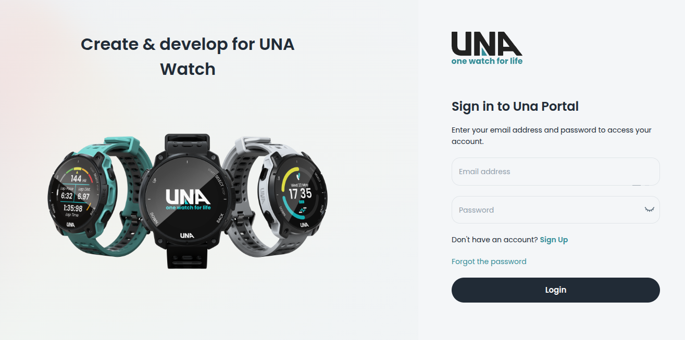

- After signing in, click **Add New**.

  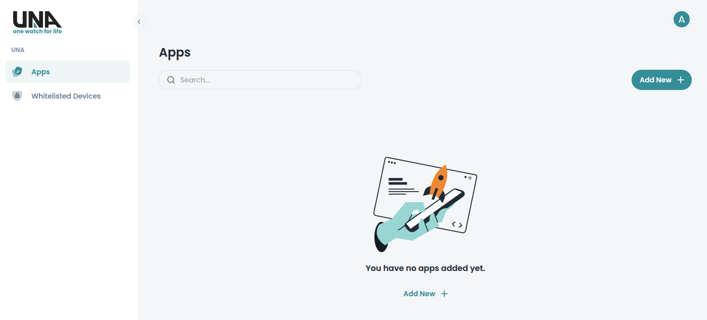

- Enter **App Name** and a brief description. Click the Generate button.

  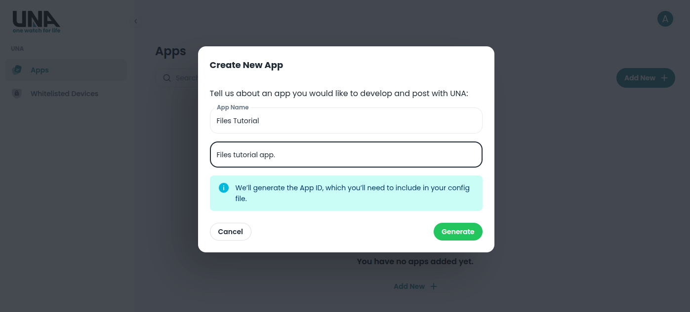

- Copy **App ID** from app Page:

  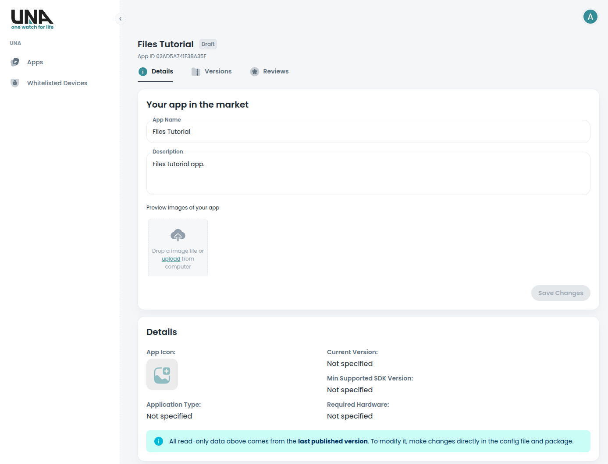

- Paste it into your `CMakeLists.txt` into the `APP_ID` variable. **Note:** APP_ID is required to track the apps in the apps store and for the mobile app to match new `*.uapp` file versions in case the file name itself has been changed.

  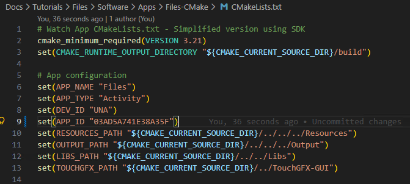

- Compile the app with the generated **APP_ID** (see [sdk-setup](sdk-setup.md#building-apps-manually) for detailed instructions). Note: Run `cmake` to apply the new APP_ID. Verify in the build output that the ID matches in the `app_merging.py` log: `INFO:root:ID             : 03AD5A741E38A35F`

  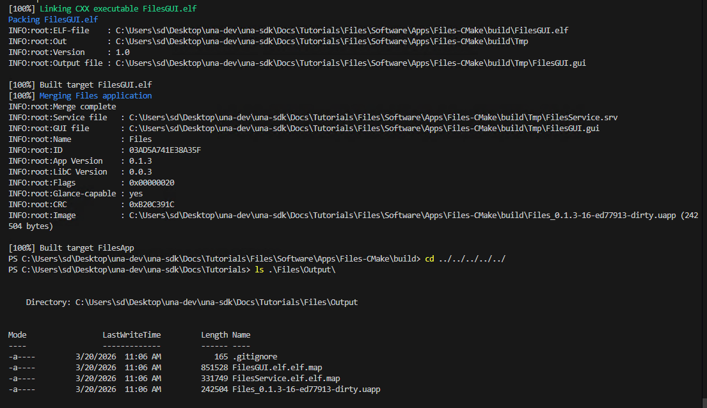

- Create the `app-manifest.json` file — see [App Manifest JSON](app-config-json.md) for every key it may carry

  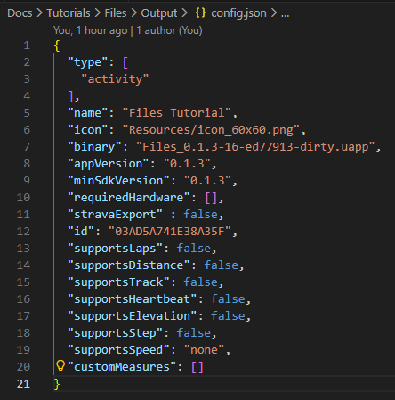

- Set its `minKernelVersion` with the SDK resolver rather than by hand — `--stamp` raises it to the ABI-derived floor, keeping any deliberately-higher value you set (see [App Manifest JSON](app-config-json.md)):

  ```bash
  python3 Utilities/Scripts/app_packer/min_kernel_version.py --stamp app-manifest.json
  ```

- Pack the resulting `*.uapp`, `icon.png`, and `app-manifest.json` into a `*.zip` archive.

  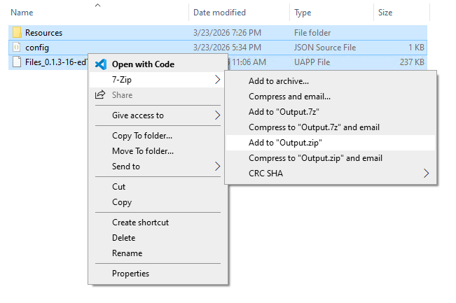

- At the app page, click the **Version** tab.

  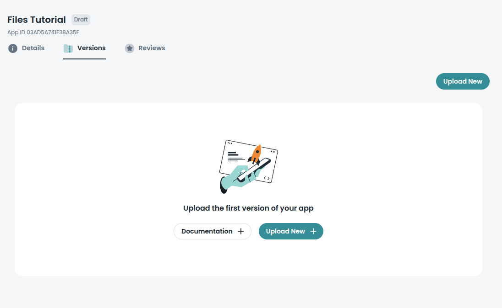

- Click **Upload New**.

  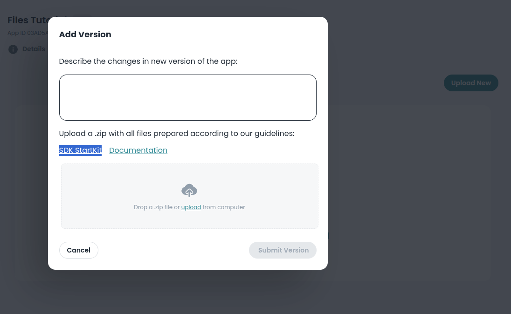

- Upload the resulting `*.zip` file.

  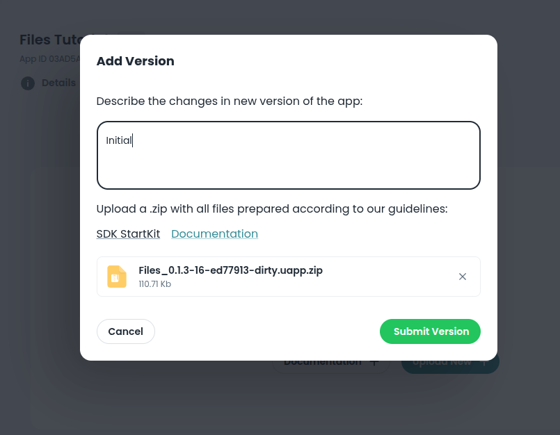

- After the upload succeeds, click **Release** to publish the app.

  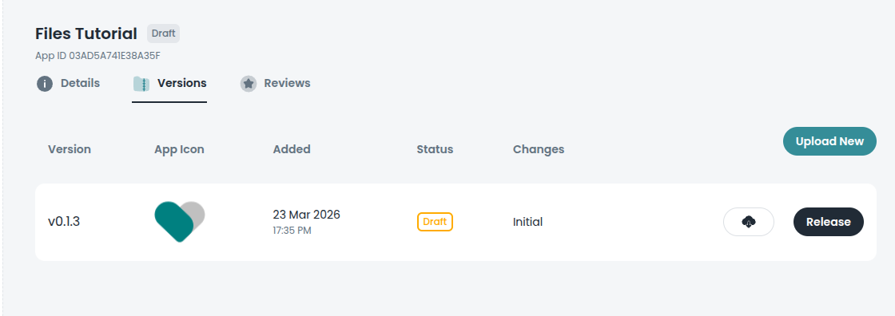

- Confirm by clicking **Confirm and Publish**

  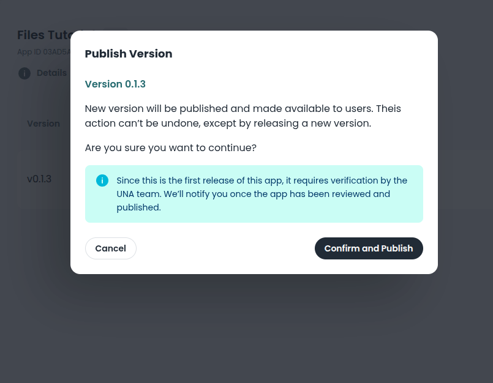

### Via PR to https://github.com/UNAWatch/una-sdk for Open Source Apps

- Apply a PR to https://github.com/UNAWatch/una-sdk with changes under `Examples/Apps/`.
  