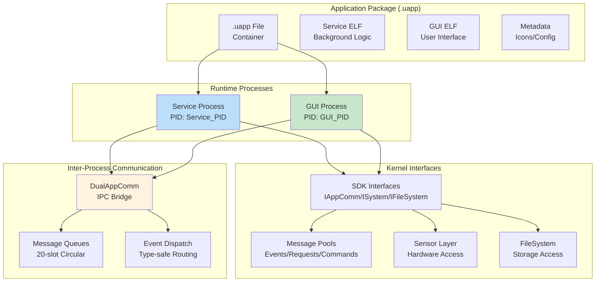
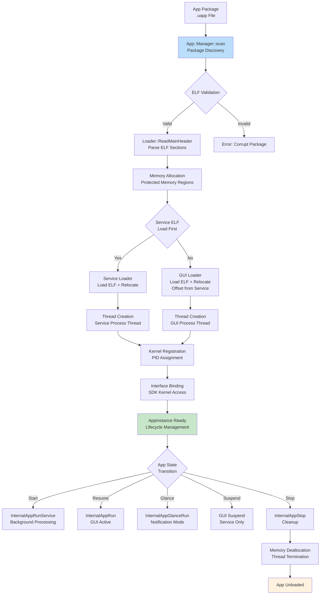
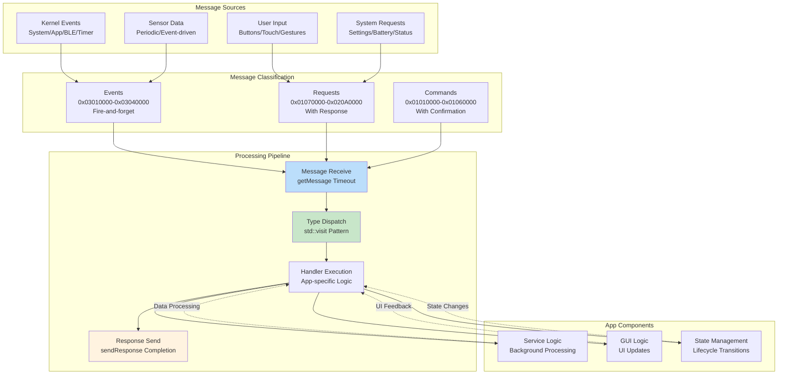
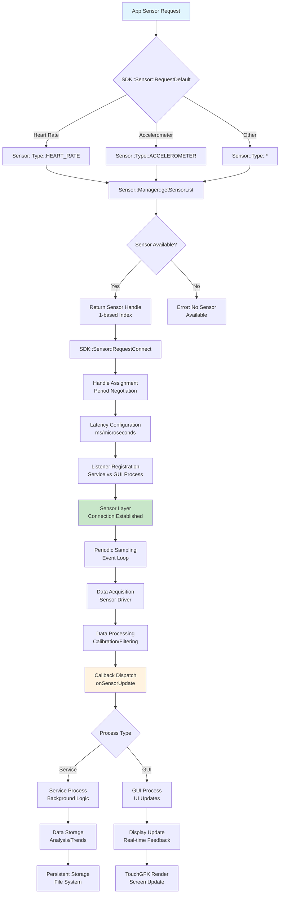
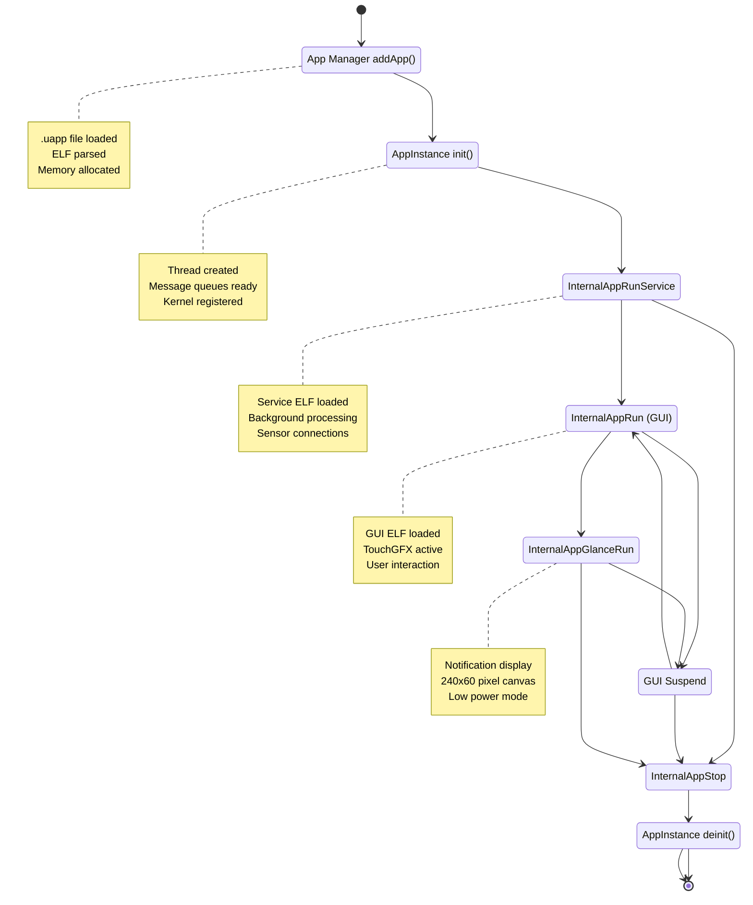
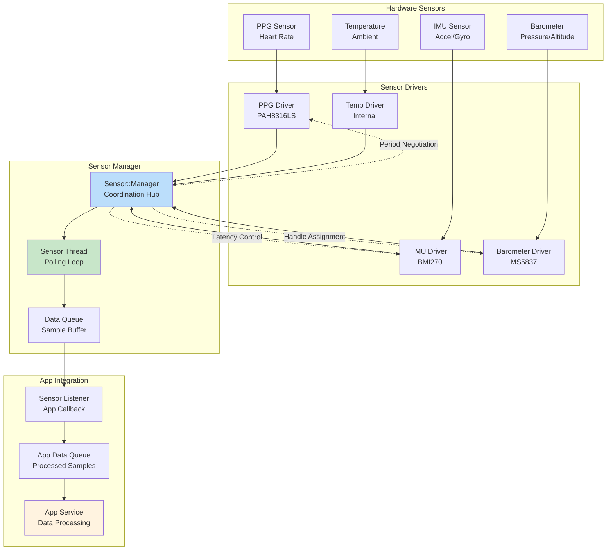
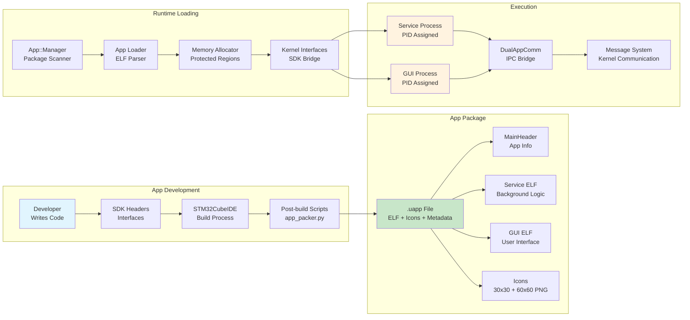

# Development Workflow

This document outlines the complete development lifecycle for Una-Watch applications.

## Workflow Stages

### 1. Planning
Before writing code, decide on your app type:
- **Activity**: For long-running, interactive apps.
- **Utility**: For tools like calculators or settings.
- **Glance**: For notification-based widgets.
- **Clockface**: For time-keeping displays.

### 2. Development
Use the SDK interfaces to build your app logic.
- Implement the **Service process** for background tasks.
- Implement the **GUI process** for user interaction.
- Use **IPC messages** to communicate between them.

### 3. Building
Compile your app into an ELF binary using the provided toolchain.
```bash
make release
```
Ensure you are using the correct optimization flags for PIC execution.

### 4. Testing
- **Simulator**: Test UI and basic logic on your development machine.
- **Unit Tests**: Write tests for individual components.
- **Integration Tests**: Verify IPC and sensor data flow.

### 5. Debugging
- Use `ILogger` for real-time logging.
- Set breakpoints in the simulator.
- Use performance profiling to monitor CPU and memory usage.

### 6. Packaging
Package your ELF binary and assets into a `.uapp` container using `app_packer.py`.
- Inject version metadata.
- Embed app icons.

### 7. Deployment
Deploy your app to the watch via:
- **USB**: For direct development flashing.
- **BLE OTA**: For wireless updates.

### 8. Maintenance
- Monitor crash reports.
- Release version updates.
- Respond to user feedback.

## Technical Architecture Details

### Application Framework Implementation

**AppInstance Architecture:**

**Dual-Process Model:**
- **Service Component**: Background logic, sensor access, data processing
- **GUI Component**: User interface, TouchGFX integration, screen rendering

**Lifecycle State Machine:**
```cpp
enum AppPartState {
    NONE,       // Not loaded
    RUN,        // Running normally
    RESUMED,    // GUI active and visible
    GLANCE,     // Glance mode (notification display)
    SUSPENDED   // Backgrounded
};
```

**Message Processing Thread:**
- Dedicated OS thread with cancellable event loop
- Handler dispatch: lifecycle, app-specific, sensor layer messages
- Automatic queue clearing on termination to prevent memory leaks

**Dynamic Loading Mechanism:**
- ELF parsing with `Loader::ReadMainHeader()` for .uapp files
- Memory-mapped execution with `mSrvLoader.load()` and `mGuiLoader.load()`
- Offset-based loading: GUI loads after service + icons in .uapp structure

**Sensor Integration:**
- **SDK::Sensor::RequestDefault** for default sensor discovery
- **SDK::Sensor::RequestConnect** with period/latency negotiation
- Listener registration for service vs GUI process isolation

#### Application Framework Dual-Process Architecture



#### Dynamic Loading and Memory Management Flow



#### Application Message Processing Architecture



#### Sensor Integration and Data Flow



## App Development Framework

### App Architecture & Lifecycle

**Dual-Process Model:**
- **Service Process**: Background logic, sensor access, data processing, glance notifications
- **GUI Process**: User interface, TouchGFX integration, screen rendering, user interaction

**App Types:**
- **Activity**: Full-screen GUI app with service background processing
- **Utility**: Specialized function app (calculator, settings, etc.)
- **Glance**: Notification-only app without GUI (240x60 pixel display)
- **Clockface**: Watch face app with time display

**Lifecycle States:**
```cpp
enum AppPartState {
    NONE,       // Not loaded
    RUN,        // Running normally
    RESUMED,    // GUI active and visible
    GLANCE,     // Glance mode (notification display)
    SUSPENDED   // Backgrounded
};
```

#### App Lifecycle & Management



### SDK Interfaces for App Development

**Core Interfaces Available to Apps:**

**1. IAppComm (Communication)**
- Message passing between app and kernel
- Type-safe message allocation from pools
- Process identity with unique PIDs

**2. ISystem (System Services)**
- Timing functions and delays
- Battery status and power management
- Device identification

**3. IFileSystem (Storage)**
- File operations on multiple volumes (0:/, 1:/, 2:/)
- Directory navigation and content listing

**4. ILogger (Debugging)**
- Formatted logging with multiple levels
- System timestamp integration

### Message System Architecture

**Message Type Ranges:**
- **Custom/App-specific** (0x00000000-0x0000FFFF): Application-specific internal communication
- **Commands** (0x01010000-0x01060000): Kernel-to-app directives (response expected)
- **Requests** (0x01070000-0x020A0000): App-to-kernel lifecycle and hardware requests
- **Events** (0x03010000-0x03040000): System-level notifications (fire-and-forget)
- **Sensors** (0x03100000-0x03180000): Sensor discovery and data events

**Key System Messages:**
```cpp
REQUEST_BATTERY_STATUS       // Get battery level
REQUEST_SYSTEM_SETTINGS      // Get watch settings
REQUEST_DISPLAY_CONFIG       // Get screen dimensions (GUI only)
REQUEST_BACKLIGHT_SET        // Set screen brightness
REQUEST_SENSOR_LAYER_CONNECT // Start sensor sampling
```

### Sensor Layer Integration

**Sensor Access Pattern:**
```cpp
// Modern way using SDK::Sensor::Connection wrapper
SDK::Sensor::Connection hrSensor(SDK::Sensor::Type::HEART_RATE, 1000.0f);
hrSensor.connect();

// Manual way using messages
auto msg = SDK::make_msg<SDK::Message::Sensor::RequestDefault>(kernel);
msg->id = SDK::Sensor::Type::HEART_RATE;
if (msg.send(100) && msg.ok()) {
    uint32_t handle = msg->handle;
    // ... use handle to connect
}
```

#### Sensor Data Flow Architecture



### App Development Workflow

**1. Project Structure Setup:**
```
AppName/
├── Software/
│   ├── App/
│   │   └── AppName-CubeIDE/          # STM32CubeIDE project
│   │       ├── Core/
│   │       │   ├── Inc/main.h
│   │       │   └── Src/main.cpp      # App entry point
│   │       └── SDK/                  # SDK headers
│   └── Libs/
│       ├── Header/Service.hpp        # Service class
│       └── Source/Service.cpp        # Service implementation
├── Resources/
│   ├── icon_30x30.png               # Small app icon
│   └── icon_60x60.png               # Large app icon
└── Output/Release/                  # Built .uapp files
```

**2. Service Implementation:**
```cpp
class Service : public SDK::Interface::IApp::Callback,
                public SDK::Interface::IGlance {
private:
    SDK::Kernel& mKernel;
    bool mTerminate = false;

public:
    Service(SDK::Kernel& kernel) : mKernel(kernel) {
        // Register this instance as a lifecycle callback
        // Note: IApp interface must be queried via IKIP if not passed directly
    }

    void run() {
        while (!mTerminate) {
            // Main service loop
            mKernel.sys.delay(1000);

            // Handle messages
            SDK::MessageBase* msg = nullptr;
            if (mKernel.comm.getMessage(msg, 0)) {
                // ... handle message
                mKernel.comm.releaseMessage(msg);
            }
        }
    }

    // Lifecycle callbacks
    void onCreate() override { /* Initialize */ }
    void onStart() override { /* Start processing */ }
    void onStop() override { mTerminate = true; }
};
```

**3. Message Handling:**
```cpp
bool getMessage(MessageBase*& msg, uint32_t timeout) {
    return mKernel.comm.getMessage(msg, timeout);
}

void sendResponse(MessageBase* msg) {
    mKernel.comm.sendResponse(msg);
}
```

### App Capabilities System

**Permission-Based Features:**
- **Phone Notifications**: iOS ANCS integration
- **USB Charging Screen**: Custom charging UI
- **Music Control**: Media playback integration

### App Deployment

**OTA Update Process:**
1. File transfer via BLE to `2:/Update/` directory
2. CRC and signature verification
3. Atomic replacement with rollback capability
4. System reboot to activate new version

#### App Development Data Flow



This framework enables **independent app development** with clean SDK interfaces, resource management, and comprehensive tooling support.

### Building Individual Apps

1. Open STM32CubeIDE
2. Import the CubeIDE project: `File > Import > Existing Projects into Workspace`
3. Select the `.cproject` file in `Apps/<AppName>/Software/App/<AppName>-CubeIDE/`
4. Build the project (Project > Build All)
5. The post-build script will automatically generate a `.uapp` file in `Output/Release/`

### App Installation

- Apps are installed as `.uapp` files
- Deploy via the watch's companion app or development interface
- Apps can be updated independently of the main firmware