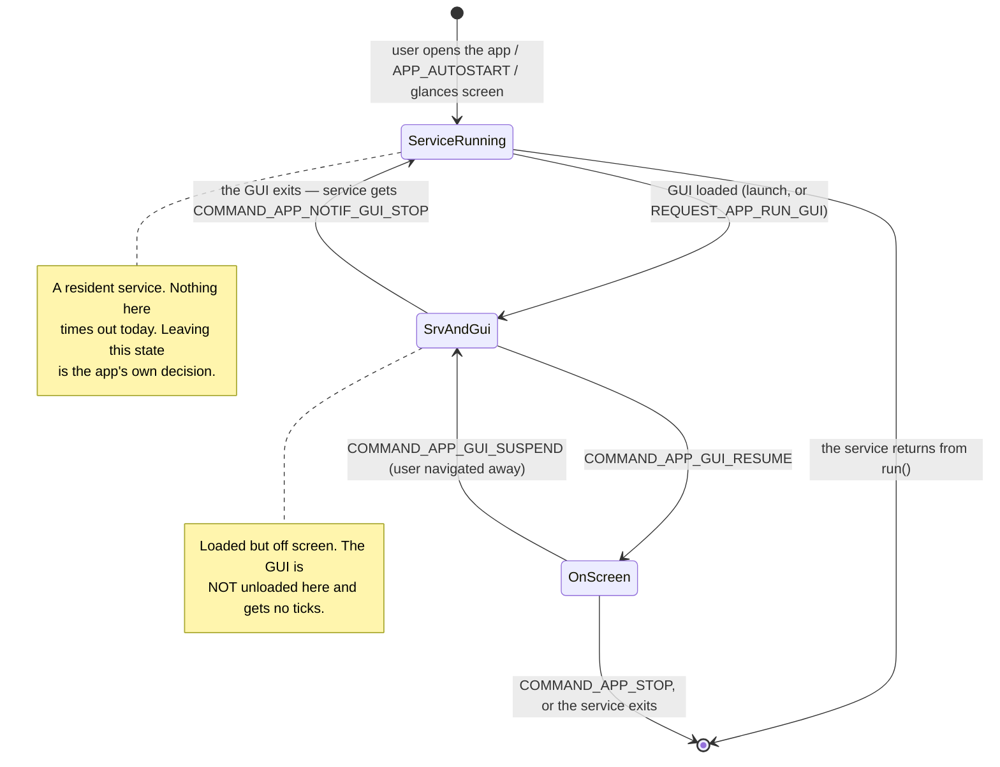

# Service Lifecycle

## Revision History

| Revision | Date of Changes | Matter of Change | Note | Editor |
|----------|-----------------|------------------|------|--------|
| 1.00     | 09.09.2026      | Creating: the two-process model, how a service is started, what a resident service receives, how a service must end itself, GUI focus versus the display, and the conditions that stop an app | | Ross Ryles |
| 1.01     | 24.09.2026      | Glance selection: `APP_GLANCE_INTF` withdrawn; the glances-screen caveat applies only to images from an earlier SDK | | Denys Saienko |
| 1.02     | 24.09.2026      | Self-exit: Stopwatch and the clockfaces leave after a startup grace when no GUI comes up; Stopwatch's resident branch is rarely taken, since its GUI offers exit only with the clock stopped | | Denys Saienko |

## 1. Overview

Every `.uapp` is **two processes**: a *service* that holds the app's logic and state, and a
*GUI* that draws it. They have **independent lifetimes**, and that makes a **resident
service** — one that keeps state moving while nothing is on screen — a supported design.

The two things to take from this document:

> **A service is not stopped because its GUI closed, and it is not stopped for being idle.**
> **Nothing wakes a service because time has passed.**

The first is why a resident service works. The second is why it is your job to pace it, and
why **ending the service is your responsibility**.

### 1.1 Promised, and not promised

An app that relies only on the left column keeps working. The right column is how the
current kernel happens to behave; it is not a promise, and a later release may change it.

| Promised | Not promised |
|---|---|
| Your service is not stopped when its GUI closes; it receives `COMMAND_APP_NOTIF_GUI_STOP` | That an idle service is never reclaimed. Do not rely on being allowed to stay resident with nothing to do |
| Your service's sensor subscriptions survive its GUI closing | That a service exceeding its resource budget is left alone |
| Your service keeps receiving what it subscribed to, and messages from its own GUI | That any particular message arrives periodically — including any not listed in section 4.1 |
| `COMMAND_APP_STOP` is delivered before an orderly teardown, and you get a grace period to act on it | That every teardown is orderly. A reboot or power loss gives no notice at all |
| `APP_AUTOSTART` starts your service, and only your service, without a GUI | Any particular ordering, timing or count of autostarted services |

### 1.2 Who needs this

Read it if your app is any of these:

- state must keep moving with nobody looking — an alarm, a timer, a long-running count;
- something must *happen* at a time, not merely be *known* about at a time;
- the app is started with `APP_AUTOSTART On`;
- the app is a `Glance`, whose service runs with no GUI at all;
- the service holds a sensor subscription that should outlive a screen.

If your app only needs to show the right answer whenever the user opens it, you very likely
do **not** need a resident service. See section 9.

## 2. The two processes

| | Service | GUI |
|---|---|---|
| Purpose | logic, state, sensors, files | drawing, buttons |
| Started by | the user opening the app; `APP_AUTOSTART`; the glances screen | the user opening the app; the service's own `REQUEST_APP_RUN_GUI` |
| Started when the other is not | yes — routinely | no — the service is always started first |
| Paced by | **nothing** (see section 4.2) | `EVENT_GUI_TICK`, while it is on screen |
| Ended by | returning from `run()`; `COMMAND_APP_STOP`; the whole app being torn down | returning from `run()` / `sys.exit()`; the service exiting; the whole app being torn down |
| Ended by the user navigating away | no | **no — it is suspended, not ended.** See section 6 |

The service is started first, always: no path starts a GUI without its service.



## 3. Starting a service

### 3.1 On demand

The ordinary case. The user picks the app; the service is loaded and started, then the GUI.
Once the GUI process has been **loaded** — before it has drawn anything or come on screen —
the service receives `COMMAND_APP_NOTIF_GUI_RUN`. That is your cue to send it the current
state, because a freshly loaded GUI knows nothing.

Note the order: **there is a window on every single launch during which the service is
running and the GUI is not.** Any "no GUI, so nobody wants me" exit test must be guarded
against that window — see section 5.2.

### 3.2 Autostart

`APP_AUTOSTART On` in `CMakeLists.txt` (see [sdk-setup.md](sdk-setup.md)) sets a bit in the
packed header. The watch reads it and **starts the app's service — and only the service —**
at boot, after it has scanned the installed apps, and again on leaving USB mass-storage mode.
No user action, no GUI, nothing on screen.

This is the sanctioned form of a resident service. The service runs from boot until it
returns or one of the conditions in section 7 occurs.

When such a service needs the user, it asks for its own GUI:

```cpp
auto *msg = mKernel.comm.allocateMessage<SDK::Message::RequestAppRunGui>();
if (msg) {
    mKernel.comm.sendMessage(msg);      // fire-and-forget: the default timeout is 0
    mKernel.comm.releaseMessage(msg);
}
// Do NOT assume the GUI is usable here. Wait for COMMAND_APP_NOTIF_GUI_RUN, which is the
// authoritative signal, and send the GUI its state from that branch.
```

The watch both loads the GUI **and brings it to the screen**, so this is how a background
service takes the display. Whichever app was on screen is suspended.
[Alarm](Examples/Alarm-Architecture.md) is the worked example.

Note the timeout: `sendMessage(msg)` defaults to `timeoutMs = 0`, which sends without waiting
and leaves `getResult()` unfilled. Passing a non-zero timeout makes the call block until the
watch has answered, after which `getResult()` is `SUCCESS`, `FAIL` or `TIMEOUT`. Either is
valid, but even `SUCCESS` only means the GUI process was loaded — treat
`COMMAND_APP_NOTIF_GUI_RUN` as the point from which you may talk to it.

Two limits worth knowing:

- A **variant alias** cannot autostart. The autostart bit is cleared when an alias is
  resolved, so a code-less alias of an autostart app is not itself autostarted.
- Autostart is not *required* for residency. Any app started normally may stay resident after
  its GUI closes; [Stopwatch](Examples/Stopwatch-Architecture.md) does exactly that. Autostart
  is specifically about running **before and without** any GUI.

### 3.3 The glances screen

For an app whose `APP_TYPE` is `Glance`, opening the glances screen starts the **service**
and never the GUI. The service then receives:

| Message | Meaning |
|---|---|
| `EVENT_GLANCE_START` | your glance is on screen — configure it and subscribe |
| `EVENT_GLANCE_TICK` | periodic, while your glance is on screen |
| `EVENT_GLANCE_STOP` | your glance is off screen |

`EVENT_GLANCE_STOP` **does not unload you.** It is a notification, and what it means for
your app is your decision. Exiting is the usual and expected answer — see
[GlanceHR](Examples/GlanceHR-Architecture.md), which disconnects its sensors and returns. A
glance that deliberately keeps a subscription running is a legitimate choice, but then
nothing else will ask it to stop.

Set `APP_TYPE Glance` for an app whose service should be started for the glances screen.
An app of another type is left alone there, unless its image was packed by an earlier SDK
and runs on kernel 1.4.0 or earlier — see section 10.

## 4. What a resident service gets

"Resident" here means the service is running and no GUI of its own is loaded — after
`COMMAND_APP_NOTIF_GUI_STOP`, or from boot under `APP_AUTOSTART`.

### 4.1 What still arrives

| Source | Still delivered while resident? |
|---|---|
| Sensor data you subscribed to (`EVENT_SENSOR_LAYER_DATA`) | **Yes — at the rate you asked for, ungated** |
| Accessory / external-sensor events | Yes |
| Your own custom messages from your GUI | Yes, when a GUI exists |
| Lifecycle commands (`COMMAND_APP_NOTIF_GUI_RUN` / `_GUI_STOP`, `COMMAND_APP_STOP`) | Yes |
| `EVENT_GUI_TICK` | Never — that goes to the GUI process, and only while it is on screen |
| A periodic wake-up of your own | **No. Nothing paces a service** |

Sensor subscriptions belong to the *process*, not to the screen. A service subscription is
untouched when the GUI closes, and samples keep arriving at the rate you asked for.

> **Read that as a responsibility, not a licence.** A resident service holding a GPS or
> heart-rate subscription keeps that sensor powered and duty-cycled with nothing on screen.
> Disconnect what you no longer need — a resident service should hold the *cheapest*
> subscription that still does its job, or none at all.

**Handle only the message types you asked for, and ignore the rest.** Your service may be
handed messages this table does not list, and which types those are is not part of the
contract. A `default:` branch that ignores unknown types — and still releases them — is the
only forward-compatible shape. Never treat an unrequested message as a clock.

### 4.2 What paces a resident service — nothing

There is no periodic message you can rely on, and **time passing is not an event**. Never
build on an unbounded wait for work that is due at a time:

```cpp
// Correct only for a service that genuinely has nothing to do between messages.
mKernel.comm.getMessage(msg, 0xFFFFFFFF);   // may block for the life of the app
```

Blocking like that is what lets the chip reach its low-power state with your service still
resident, so it is the right choice for a service driven purely by events. It is the wrong
choice the moment something must happen on the clock.

Use a **bounded wait** and do time-driven work in the timeout branch:

```cpp
static constexpr uint32_t kTickMs = 1000;   // your pacing choice — see the note below

void Service::run()
{
    SDK::Timer guiInitTimeout(TIMER_SECONDS(5));    // the startup grace, see section 5.2
    guiInitTimeout.start();

    while (true) {
        SDK::MessageBase *msg;

        if (mKernel.comm.getMessage(msg, kTickMs)) {
            switch (msg->getType()) {
                case SDK::MessageType::COMMAND_APP_STOP:
                    mKernel.comm.releaseMessage(msg);
                    return;                                  // release, then leave

                case SDK::MessageType::COMMAND_APP_NOTIF_GUI_RUN:
                    mGuiStarted = true;
                    publish();                               // a new GUI knows nothing
                    break;

                case SDK::MessageType::COMMAND_APP_NOTIF_GUI_STOP:
                    mGuiStarted = false;
                    break;

                default:
                    handle(msg);                             // must ignore unknown types
                    break;
            }
            mKernel.comm.releaseMessage(msg);
        } else {
            // Timed out: no message arrived. Time-driven work goes here.
            advance(mKernel.sys.getTimeMs());

            if (!mGuiStarted && guiInitTimeout.expired() && !hasWorkOutstanding()) {
                LOG_INFO("Nothing to do and no GUI, exiting service\n");
                return;
            }
        }
    }
}
```

Two rules for the time-driven part:

- **Derive elapsed time from `sys.getTimeMs()`; never accumulate it.** `getTimeMs()` is
  milliseconds since boot and moves monotonically whether or not your loop woke up on
  schedule. Counting your own wake-ups drifts, and drifts worst exactly when the system is
  busy.
- **`kTickMs` is a power decision.** It is a wake-up every `kTickMs` for as long as your
  service is resident. Pick the longest period that meets your requirement, and prefer having
  a period at all only if something must *happen*; if the answer merely has to be correct
  when read, compute it on demand instead.

## 5. Ending a service

### 5.1 The two ways out

1. **Return from `run()`** (or call `sys.exit()`). This is the app deciding it is done.
2. **`COMMAND_APP_STOP`** — the watch tearing the app down. Release the message, free what
   you hold, and return.

Act on `COMMAND_APP_STOP` promptly. The watch waits a grace period for your service to
acknowledge it by exiting, and **force-terminates the thread if you do not** — which can
strand resources you were holding. Note also that pending messages are discarded before
`COMMAND_APP_STOP` is delivered, so do not expect to drain a backlog first.

> **Write the exit condition before anything else.** Nothing in the current kernel ends an
> idle service — there is no idle timeout — so a service with no reachable path out of
> `run()` stays until the watch reboots. Do not read that as permission: an app that can
> always exit on its own is the only shape guaranteed to keep working, and a later kernel may
> reclaim a service that never exits or outstays its resource budget.

### 5.2 Guard every exit against startup

The service starts *before* the GUI on every normal launch, so "no GUI has started" is
briefly true every single time. An unguarded `if (!mGuiStarted) return;` exits during launch
and the app appears to fail to open. Every example that exits on its own therefore uses a
startup grace — the activity examples with
[`SDK::Timer`](../Libs/Header/SDK/Timer/Timer.hpp) as shown in section 4.2, Alarm, Timer,
Stopwatch and the clockfaces with plain `getTimeMs()` arithmetic. Either is fine.

Three conditions, all load-bearing: the GUI is not up, the launch window has passed, and your
own work is finished. Drop any one and you get either a service that exits mid-launch or one
that never exits at all.

### 5.3 The asymmetry that catches people

Which process exits determines what happens to the other:

| The process that exits | Effect |
|---|---|
| The **GUI** returns from `run()` | The GUI is unloaded. The **service keeps running** and receives `COMMAND_APP_NOTIF_GUI_STOP`. |
| The **service** returns from `run()` | The **whole app goes**, GUI included. |

So a service must not return from `run()` as a way of going quiet while its GUI is loaded: it
takes the GUI with it. Worse, the GUI is unloaded **without notice** on this path — it does
not receive `COMMAND_APP_STOP` and its `onStop()` does not run, so anything it would do on
the way out is simply lost. Every example checks that the GUI is gone before releasing
itself.

That is why a service's exit test belongs where the GUI is known to be gone: the
`COMMAND_APP_NOTIF_GUI_STOP` branch, or a check guarded on no GUI having started, as the
startup-grace exits in section 5.4 are.

### 5.4 The patterns in the examples

| Example | Wait | Exits when |
|---|---|---|
| [Alarm](Examples/Alarm-Architecture.md) | bounded | after a 5 s grace, no GUI started and no active alarms |
| [Timer](Examples/Timer-Architecture.md) | bounded | after a startup grace, idle and the GUI closed |
| Activity apps ([Running](Examples/Running-Architecture.md), [Cycling](Examples/Cycling-Architecture.md), …) | bounded | after a 5 s grace, no GUI started |
| [GlanceHR](Examples/GlanceHR-Architecture.md) | unbounded | `EVENT_GLANCE_STOP` |
| [Stopwatch](Examples/Stopwatch-Architecture.md) | bounded until the GUI runs, then unbounded | after a 5 s grace, no GUI started; or `COMMAND_APP_NOTIF_GUI_STOP` **and** the clock is not running |
| Clockfaces ([Analogue](Examples/ClockfaceAnalogue-Architecture.md), [Peak](Examples/ClockfacePeak-Architecture.md), …) | bounded (next minute or sooner) | after a 5 s grace, no GUI started; or `COMMAND_APP_NOTIF_GUI_STOP` |

Read the activity apps' condition precisely: the exit is guarded on the GUI never having
started, **not** on whether an activity is in progress. A recording activity is safe only
because its GUI does not exit mid-activity. If you copy that pattern into an app whose GUI
can close while work is outstanding, add the `hasWorkOutstanding()` term yourself.

Stopwatch shows the shape for *state that must outlive the screen*: a running clock keeps the
service resident through `COMMAND_APP_NOTIF_GUI_STOP`, and a returning GUI is handed the state
on `COMMAND_APP_NOTIF_GUI_RUN`. In Stopwatch that branch is rarely taken, since its GUI offers
the exit control only once the clock has stopped; copy it when your GUI can close while work
is outstanding. Its normal exit is `COMMAND_APP_NOTIF_GUI_STOP`, a message that never arrives
if no GUI ever ran, so until the first GUI it waits with a bounded timeout and leaves once a
startup grace has run out. Copy both halves: an unbounded wait is safe only after a GUI has
come up to send the message it is waiting for.

## 6. GUI focus: suspend and resume

`COMMAND_APP_GUI_SUSPEND` and `COMMAND_APP_GUI_RESUME` mean **"your GUI is / is no longer the
thing on screen"**. They are navigation, delivered when the user moves off your app's screen
and back onto it.

They are **not** the display going dark. The backlight is a timed pulse, independent of app
lifecycle: while the screen is dark with your app still in front, your GUI is still the app on
screen. The SDK exposes no screen-off signal to an app.

| | Suspended | On screen |
|---|---|---|
| Loaded in memory | yes | yes |
| `EVENT_GUI_TICK` / `onFrame()` | **do not rely on receiving them** — see section 10 | yes |
| Button events | no | yes |
| Draws to the display | no | yes |

**A suspended GUI is not unloaded.** Navigating away from your app suspends its GUI and
nothing more: the GUI keeps its RAM, and your service does **not** receive
`COMMAND_APP_NOTIF_GUI_STOP`. A GUI is unloaded only when it ends itself (`sys.exit()`, which
is what an app's own exit control does), when the service exits, or on a teardown from
section 7. If your app should release itself when the user walks away from it, the GUI has to
take that decision and exit; no one else will.

**The service is told nothing about focus.** Suspend and resume go to the GUI process only. A
service cannot distinguish "the user navigated away" from "the user is still looking" — it
learns only about `COMMAND_APP_NOTIF_GUI_RUN` and `COMMAND_APP_NOTIF_GUI_STOP`. If your
service needs to know, your GUI must tell it with a custom message.

Should a GUI handle these? Usually not directly — the SDK's TouchGFX port consumes both and
calls [`SDK::Interface::IGuiLifeCycleCallback`](../Libs/Header/SDK/Interfaces/IGuiLifeCycleCallback.hpp)
`onSuspend()` / `onResume()`. Override those when you want the hooks. The one that reliably
earns its keep is `onResume()`: recompute from the service's state on the way back in rather
than trusting anything cached, the GUI-side counterpart of publishing on
`COMMAND_APP_NOTIF_GUI_RUN`.

The practical consequence of suspend is that **anything paced by GUI ticks may stop until
resume.** Never put app logic that must keep running in the GUI's frame handler; that is the
service's job.

## 7. What ends an app whatever it wants

Two kinds, and the difference matters.

**Orderly teardown — your service receives `COMMAND_APP_STOP` and a grace period:**

| Condition |
|---|
| Watch shutdown |
| Low-battery shutdown |
| Factory reset |
| Entering USB mass-storage mode (autostart services are restarted on the way out) |

**No notice at all — the app simply stops running:**

| Condition |
|---|
| Reboot, including a reboot commanded over BLE and one taken to apply a firmware update |
| Watchdog reset, or any unexpected reset |
| Power loss and battery removal |

> **Persist as you go.** Because the second list gives you nothing, any state a resident
> service must not lose has to be written when it changes, not on the way out. There is no
> "last chance to save" callback that covers every case.

Notably **not** on either list: launching another app, opening the launcher, opening or
leaving the glances screen, and the screen timing out. None of them stop a resident service.

One more, and it applies to GUIs only: a GUI that has never produced a frame is unloaded a
few seconds after it was loaded or last brought on screen. The service survives it and
receives `COMMAND_APP_NOTIF_GUI_STOP`. Note "never" — a GUI that drew once and then wedged is
not covered.

## 8. Memory, and what happens when it runs out

RAM is charged in two places, and both can fail:

- **At load.** Each process's code, data, bss and stack are allocated when it is loaded. The
  stack is yours to size with `UNA_APP_SERVICE_STACK_SIZE` (default 10 KB); the rest follows
  from what you built. If there is not enough room, **the launch fails** — an already-running
  service is not evicted to make space for a new app.
- **At runtime.** Each process has its own cap on outstanding allocations. Past it,
  `malloc` and `new` return `nullptr` **for that process alone**. Check for it; on a watch
  this is a condition to handle, not an abstract possibility. This cap is distinct from
  `UNA_APP_SERVICE_RAM_LENGTH`, which is the linker's address-space budget rather than an
  allocation.

There is no reclaim of a resident service under memory pressure today, so the practical
consequence is that a service which stays resident when it did not need to makes **later**
launches fail rather than being cleaned up itself. Treat your resource footprint while
resident as something you are accountable for, and see the "not promised" column in section
1.1 before designing around the absence of enforcement.

## 9. Choosing a design

Both designs below are correct. Pick on this question: **must something happen at a time, or
must something merely be correct when read?**

| | Resident service | Recompute on open |
|---|---|---|
| Shape | `APP_AUTOSTART`, or stay past `_GUI_STOP`; bounded wait | exit once the GUI has closed; on reopen, derive from `getTimeMs()` and persisted state |
| Costs | a wake-up per period; RAM held; sensors held if subscribed | nothing while closed |
| Needed for | notifications, alerts, writing a file at a moment, a transition the wearer must not miss | elapsed time, totals, anything derivable from a stored timestamp |
| Survives a reboot | only what you persisted | naturally, since it was already persisted |
| Risk | leaks if the exit condition is wrong | none |

If your app's state is a function of a start timestamp and the current time, **recompute on
open**. Persist the timestamp, derive the rest, and let the service exit. That is Stopwatch's
own approach to its reading — derived from a shared monotonic clock, never accumulated — and
it is why a stopped stopwatch costs nothing. It also survives the reboot that would take a
resident service down without warning. A resident service earns its thread only when
something must *occur* while nobody is looking.

## 10. Behaviour not to rely on

Two behaviours have changed since kernel 1.4.0, or are close enough to the edge of the
contract that you should not build on them. Neither affects service lifecycle itself.

**GUI ticks while suspended.** On 1.4.0 a GUI that is loaded but off screen still receives
`EVENT_GUI_TICK`. That is incidental, not promised, and it has already changed: treat ticks as
something you receive **only while on screen**. If your GUI does work in its tick handler that
must continue while the app is off screen, move that work to the service now — see section 6.

**Which apps the glances screen starts.** Target `APP_TYPE Glance` for a glance and give the
glances screen nothing to do with your app otherwise. On 1.4.0 an app of another type could
have its service started on a visit to the glances screen depending on the flags its `.uapp`
carried. An image packed by this SDK does not carry that flag, so only images packed by an
earlier SDK are affected. Either way, give every service a self-exit that does not depend
on a GUI arriving.

## 11. Checklist

Before shipping a service that outlives its GUI:

- [ ] There is a reachable path out of `run()` in **every** state the service can be in —
      including "started with no GUI, and none ever arrives".
- [ ] That path does not depend on a message that might never be sent.
- [ ] The exit test is guarded by a startup grace, so a normal launch cannot trip it.
- [ ] `COMMAND_APP_STOP` releases the message and returns without blocking.
- [ ] Unknown message types are ignored and released, not treated as a clock.
- [ ] Time-driven work reads `sys.getTimeMs()` rather than counting wake-ups.
- [ ] The wait period is the longest that meets the requirement.
- [ ] Sensor subscriptions held while resident are the cheapest that do the job, and are
      dropped when they are not needed.
- [ ] State that must not be lost is persisted when it changes — a reboot gives no notice.
- [ ] Allocation failure (`nullptr`) is handled.
- [ ] The service does not return from `run()` while its own GUI is loaded.
- [ ] State is published to a returning GUI on `COMMAND_APP_NOTIF_GUI_RUN`.
- [ ] If the app should release itself when the user walks away, the **GUI** exits — being
      navigated away from does not close it.

## 12. See also

- [Alarm](Examples/Alarm-Architecture.md) — autostart service, autonomous GUI launch
- [Timer](Examples/Timer-Architecture.md) — bounded wait, self-release, background fire
- [Stopwatch](Examples/Stopwatch-Architecture.md) — residency tied to state, extrapolated reading
- [GlanceHR](Examples/GlanceHR-Architecture.md) — a service with no GUI at all
- [sdk-setup.md](sdk-setup.md) — `APP_AUTOSTART`, `APP_TYPE`, stack and RAM settings
- [SensorsLayer](SensorsLayer.md) — subscribing, and what a subscription costs
- [`CommandMessages.hpp`](../Libs/Header/SDK/Messages/CommandMessages.hpp) — the lifecycle messages
- [`IAppComm.hpp`](../Libs/Header/SDK/Interfaces/IAppComm.hpp) — `getMessage()` and its timeout
- [`Timer.hpp`](../Libs/Header/SDK/Timer/Timer.hpp) — `SDK::Timer`, for grace periods and deadlines
- [`IGuiLifeCycleCallback.hpp`](../Libs/Header/SDK/Interfaces/IGuiLifeCycleCallback.hpp) — GUI hooks
