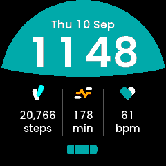

# Writing a Watch Face

A **clockface** is a `.uapp` like any other, with one difference: the kernel
hands it the display in place of its own built-in home screen. So a clockface
is what the user sees whenever nothing else is running, and that shapes every
decision in it.

This page is the guide to building one. Five faces ship as worked examples --
[Analogue](Examples/ClockfaceAnalogue-Architecture.md),
[Peak](Examples/ClockfacePeak-Architecture.md),
[Smile](Examples/ClockfaceSmile-Architecture.md),
[Console](Examples/ClockfaceConsole-Architecture.md) and
[Retro](Examples/ClockfaceRetro-Architecture.md) -- and each of those pages
covers only what is particular to it. Everything general is here.

## What a clockface is, and is not

- **The user does not drive it.** The kernel owns the buttons while a face is
  on screen: pressing one opens the top menu or the glance list, it does not
  reach your app. A face receives no `EVENT_BUTTON`, has no navigation, and has
  exactly one screen.
- **It is chosen, not launched.** The user picks a face in
  Settings -> Watch Face. The kernel finds every installed app of
  `APP_TYPE "Clockface"` at boot and lists them, so installing your `.uapp` is
  all it takes to appear. The list holds nine entries including the built-in
  face.
- **It is on screen for hours at a time.** Which makes power the first design
  constraint, not the last: see [Do not subscribe to what you do not
  draw](#do-not-subscribe-to-what-you-do-not-draw).
- **It serves no glance data.** Leave the glance-capable bit clear, which
  `APP_TYPE "Clockface"` does by default.
- **It is suspended, not stopped, when something else takes the screen.** This
  has consequences that are easy to miss -- see [The GUI stops draining its
  queue while suspended](#the-gui-stops-draining-its-queue-while-suspended).

## Architecture overview

A face is the standard two-process app: a **service** that owns the clock and
the sensors, and a **GUI** process running TouchGFX, talking over app-private
`CustomMessage`s.

```text
   [sensor layer] ──EVENT_SENSOR_LAYER_DATA──► Service ◄── clock, once a minute
                                                  │  ▲
                       CustomMessage::Time        │  │ CustomMessage::Refresh
                       ...your values...          │  │ (sent on resume)
                                                  ▼  │
   [kernel] ──EVENT_GUI_TICK──► frame ──► FrontendApplication::handleTickEvent
                                                                 │
                                                          callCustomMessageHandler
                                                                 │
                                                                 ▼
                                                  Model ──► MainPresenter ──► MainView
```

The service pushes; the GUI draws what arrives. Nothing the face shows is
sampled per frame, which is what makes a face cost almost nothing when the time
is not changing.

## Implementation steps

### Step 1: The app skeleton

Copy an existing face. The quickest start is `Examples/Apps/ClockfaceAnalogue`
(the simplest) or `ClockfaceRetro` (the closest to a typical data face).

In `Software/Apps/<Face>-CMake/CMakeLists.txt`:

```cmake
set(APP_NAME "MyFace")
set(APP_USER_NAME "MyFace")     # what Settings and the store show, max 16 chars
set(APP_TYPE "Clockface")       # this is what makes it a face
set(DEV_ID "UNA")
set(APP_ID "....16 hex....")    # must be unique; see Docs/deploy.md
```

Two things catch people out:

- `Software/Apps/TouchGFX-GUI/una/Makefile` repeats the app id in a hard-coded
  `-DAPP_ID=` for the simulator build. Change it too, or your simulator and
  your device build disagree.
- The packer requires `Resources/icon_60x60.png` and `icon_30x30.png`. They are
  not optional unless you set `APP_USE_ICONS Off`.

**What is hand-written and what is not.** Everything under
`Software/Apps/TouchGFX-GUI/generated/` is tool output from `tgfx generate`,
and it **is committed** -- do not edit it, do not delete it from the repo. You
write the `.touchgfx` project, the assets, `gui/**`, and the service under
`Software/Libs/`.

### Step 2: Define your messages

`Software/Libs/Header/Commands.hpp`. Ids live in the app-private range
`0x00000000`-`0x0000FFFF`; the kernel never interprets them. (The header
itself writes these with digit separators, `0x0000_0000`, which reads more
easily but is not a C++17 literal -- so they are spelled out here, where
the surrounding text is meant to be copied.)

```cpp
constexpr SDK::MessageType::Type TIME  = 0x00000003;
constexpr SDK::MessageType::Type STEPS = 0x00000004;
```

Keep each struct **under 256 bytes** and assert it:

```cpp
static_assert(sizeof(Steps) <= 256, "must fit the largest kernel message pool");
```

See [Messages over 256 bytes vanish](#messages-over-256-bytes-vanish).

### Step 3: The service - the clock

A face draws nothing finer than a minute, so read the clock once a turn round
the loop and let that same reading size the wait:

```cpp
while (true) {
    std::tm local {};
    readLocalTime(local);       // time() + localtime_r
    publishTime(local);         // drops a reading equal to the last

    SDK::MessageBase *msg;
    if (!mKernel.comm.getMessage(msg, msToNextMinute(local))) {
        continue;
    }
    ...
}
```

Publishing *before* the wait rather than when it expires is what stops a
message arriving just before a minute boundary from swallowing that minute.
Sizing each wait from a fresh reading is what stops a late wake-up
accumulating into drift.

There is no SDK time interface: the clock is `time()` and `localtime_r()`.

**Give every value one publisher that drops an unchanged value**, so a source
may call as often as it likes and only a real change costs an IPC round trip:

```cpp
void Service::publishSteps()
{
    if (mSentOnce && (mSteps == mSent)) { return; }
    mSent = mSteps; mSentOnce = true;
    SDK::send_msg<CustomMessage::Steps>(mKernel, mSent);
}
```

### Step 4: The service - sensors

Subscribe with `SDK::Sensor::Connection`, connect once at startup and hold it:
a face is on screen whenever nothing else is, so there is no moment worth
deferring to, and an event-driven subscription that only speaks on a change
costs nothing to keep open.

| Value | `SDK::Sensor::Type` | Parser under `SDK/SensorLayer/DataParsers/` | Getter |
|---|---|---|---|
| Charge % | `BATTERY_LEVEL` | `SensorDataParserBatteryLevel` | `getCharge()` |
| Steps today | `STEP_COUNTER_DAILY` | `SensorDataParserStepCounter` | `getStepCount()` |
| Active minutes today | `ACTIVITY_TIME_DAILY` | `SensorDataParserActivity` | `getDuration()` |
| Heart rate | `HEART_RATE` | `SensorDataParserHeartRate` | `getBpm()`, `getTrustLevel()` |
| Floors today | `FLOOR_COUNTER_DAILY` | `SensorDataParserFloorCounter` | see header |

Read the **newest** sample, and check the size rather than assuming it -- a
batch holds its samples oldest first, and `DataBatch` guards its index with an
assert that a release build drops:

```cpp
if (data.size() == 0) { return; }
const SDK::Sensor::DataView newest = data[data.size() - 1];
```

### Step 5: The two presentation settings

Two settings under Settings -> Clock record how the user wants the time and the
date written: a 12- or 24-hour clock, and day-first or month-first dates.
Reading them is what lets one face cover every form instead of one face per
combination. `SDK::Message::RequestSystemSettings` carries both, along with the
daily goals, the unit system and the user's height and weight:

```cpp
if (auto msg = SDK::make_msg<SDK::Message::RequestSystemSettings>(mKernel)) {
    if (msg.send(100) && msg.ok()) {
        mIs12h      = msg->timeFormat;      // true means 12-hour
        mMonthFirst = msg->dateMonthFirst;  // true means "MAY 22", not "22 MAY"
    }
}
```

The date order is the easier of the two to overlook, because ignoring it fails
silently: the face still reads correctly, just not in the order the user chose,
so there is no symptom to catch it in testing.

The kernel's own face keeps the weekday leading in both orders and swaps only
the day and the month (`gui/src/containers/ClockHome.cpp`), which is the
reference if you want a date line that matches the rest of the watch. Build the
part that moves first, then the line:

```cpp
touchgfx::Unicode::UnicodeChar dayMonth[DATETEXT_SIZE];
if (mMonthFirst) {
    Unicode::snprintf(dayMonth, DATETEXT_SIZE, "%s %u", month, mday);
} else {
    Unicode::snprintf(dayMonth, DATETEXT_SIZE, "%u %s", mday, month);
}
```

Size that temporary from the destination buffer, not from the English labels:
the day and month names come out of the text database, and a translation is
free to be longer than `SEP`.

A date that is not a line has no sequence to reverse, so the flag alone does not
tell you what to draw. Console stacks its date around a 112 px day of the month
and reads the setting as a swap of the two rows either side of that number,
leaving the number itself alone: `WEDNESDAY / 03 / AUG` against
`AUG / 03 / WEDNESDAY`. One answer among several a stacked layout could take.

Call it from the **service**, not the GUI, and not from a constructor -- it is a
blocking round trip that needs the app's message loop running.

**It is pull-only. Nothing tells you it changed.** There is no
settings-changed event, so re-read it on all three occasions that can follow a
change:

1. `COMMAND_APP_NOTIF_GUI_RUN` -- your GUI has come up.
2. An app-private `Refresh` your GUI sends when it resumes.
3. A poll from the service loop, bounded to once a minute.

The second is the one people miss, and without it a setting the user changes
never takes effect: the kernel **suspends** a face rather than stopping it, so
returning from Settings brings no lifecycle message -- and Settings is exactly
where the user just changed the format.

The third covers what neither edge can see: a change that lands while your
face is on screen. The kernel re-reads `settings.json` -- the daily goals, the
units, the heart-rate zones -- when the phone finishes writing it over BLE, and
`local_settings.json`, which is where these two presentation settings live,
when a USB session ends. Bound it against the monotonic tick rather than
hanging it off the loop's wait expiring --

```cpp
// In the service loop:
if ((mKernel.sys.getTimeMs() - mSettingsAt) >= kSettingsPollMs) {
    refreshSystemSettings();
}

void Service::refreshSystemSettings()
{
    // Before the request -- not after it, and not only when it succeeds.
    mSettingsAt = mKernel.sys.getTimeMs();

    if (auto msg = SDK::make_msg<SDK::Message::RequestSystemSettings>(mKernel)) {
        if (msg.send(kSettingsTimeoutMs) && msg.ok()) {
            mIs12h      = msg->timeFormat;
            mMonthFirst = msg->dateMonthFirst;
        }
    }
    publishClockFormat();
}
```

-- because the loop is message driven: on a face showing a heart rate, samples
arrive about once a second and the wait almost never expires, while on a face
with only a pedometer it expires constantly. Neither gives you once a minute.

**Stamp the clock before the request.** Stamp it after a successful reply
instead and a request that times out leaves the condition still true on the
next turn, so the service issues a fresh blocking request every time round the
loop for as long as the kernel stays quiet -- the exact opposite of polling once
a minute, and at the worst possible moment. Stamping first means a failed read
is retried at the next interval like any other.

The request itself is cheap. Its 100 ms figure is a *timeout*; the kernel
answers on a completion semaphore and normally returns at once, and the
publishers drop the result when nothing moved.

### Step 6: The GUI

`Model` / `ModelListener` / `MainPresenter` / `MainView`, as in any app. Two
rules specific to a face:

```cpp
void Model::onResume()
{
    mResumed = true;        // a flag, and nothing else
}

void Model::tick()
{
    if (!mResumed) { return; }
    mResumed = false;

    adopt(now());                                    // re-read the clock
    SDK::send_msg<CustomMessage::Refresh>(mKernel);  // ask for everything again
    application().invalidate();                      // repaint the whole screen
}
```

- **`onResume()` is not on the drawing thread** -- it is dispatched from
  `waitForFrameTick()`. Touch a widget there and you race the render loop. Set
  a flag; act in `tick()`.
- **Repaint everything on resume.** Whatever the kernel drew over your face is
  still in the framebuffer.
- **Re-read the clock on resume.** The face may have been off screen across a
  minute boundary, and the next push is not due until the one after it.

## Constraints that will bite you

### Messages over 256 bytes vanish

The kernel's message pools top out at 256 bytes. A larger request returns
nullptr and **the send is dropped silently**. The simulator allocates with a
plain `new[]`, so it will never show you this -- your face will work in the
simulator and render default-constructed values forever on the watch. Guard it
with a `static_assert`, not a test. See
[architecture-deep-dive](architecture-deep-dive.md) for the pool layout.

### The GUI stops draining its queue while suspended

Custom messages waiting for the GUI sit in a **ten-deep** queue that is drained
once per `EVENT_GUI_TICK`. A suspended face gets no ticks, so nothing drains,
and once the queue is full **the newest message is rejected outright**.

If your service publishes anything at even ~1 Hz -- a heart rate will -- the
queue fills within about ten seconds of the face leaving the screen. Anything
that changes after that is lost. And if your publishers dedup on the last value
sent (they should), they will never offer it again.

So make `Refresh` mean what it says: clear the sent flags and re-send
everything, rather than only the settings.

```cpp
void Service::republishAll()
{
    mLevelSent = mStepsSent = mFormatSent = false;
    publishBatteryLevel(mLevel);
    publishSteps();
    refreshSystemSettings();
}
```

### Do not subscribe to what you do not draw

A `HEART_RATE` subscription keeps the **optical sensor powered**, and a face is
on screen for hours. Subscribing "for symmetry" with another face, or leaving a
subscription behind after dropping a row from the design, is one of the more
expensive mistakes available here. `ClockfaceConsole` shows a face trimmed to a
single sensor for exactly this reason.

### The trust gate is a recording gate

`isDataValid()` on the parser is only a field-count check -- it tells you
nothing about signal quality. That leads people to reach for the gate the
activity apps use:

```cpp
bpm > 20 && trust >= 1 && trust <= 3     // trust runs 0-3; 0 means no signal
```

That gate is not a display filter. It is a *recording* one: in
`Running`, `Cycling`, `Hiking`, `Treadmill` and `Workout` it decides whether a
sample is written to the FIT file, and their live readouts are fed
unconditionally. `HRMonitor` forwards trust to its GUI as an indicator and
gates nothing; `GlanceHR` has no trust gate at all.

Trust dips transiently whenever the wrist moves, so applied per sample to a
display the gate blanks the row about once a second.

If you do want to filter what you show, treat a failed sample as *no new
information* rather than *no reading*: hold the last trusted value and only
give up after a sustained loss.

```cpp
// On each sample. A trusted one refreshes the hold; an untrusted one does
// nothing at all -- it is not evidence of anything.
if (isTrusted(bpm, trust)) {
    mBpm   = static_cast<uint16_t>(bpm);
    mBpmAt = mKernel.sys.getTimeMs();
}
expireHeartRate();
publishHealth();

// Every turn round the loop, sample or no sample.
void Service::expireHeartRate()
{
    if ((mBpm != 0u) && ((mKernel.sys.getTimeMs() - mBpmAt) >= kHoldMs)) {
        mBpm = 0;                      // and now show ---
        publishHealth();
    }
}
```

Two traps in that, both of which cost the four faces here a round of fixes.

**Expire on the loop, not on the sample.** Putting the test in an `else` on the
sample handler looks natural and cannot work: it only runs when a sample
arrives, and the case the hold exists for -- the watch taken off -- is exactly
the one where samples *stop*. The rate would sit on screen indefinitely. Also
shorten the loop's wait to the pending expiry, or it fires whenever the minute
next turns rather than when it is due:

```cpp
uint32_t wait = msToNextMinute(local);
const uint32_t hold = msToHeartRateExpiry(mBpm, mBpmAt, mKernel.sys.getTimeMs());
if ((hold != 0u) && (hold < wait)) {
    wait = hold;
}
```

While the watch is worn, samples arrive far more often than the hold and keep
resetting it, so that costs no extra wake-ups in the common case.

**Time it with `mKernel.sys.getTimeMs()`, not `time()`.** The wall clock is set
from the phone over BLE and can move either way. A backward jump makes the age
negative, so the hold never expires and the reading is stranded; a forward one
retires a good reading early. `getTimeMs()` is the OS tick, monotonic since
boot, and unsigned arithmetic on it stays correct across its wrap at about 49
days.

Holding is the right way round to be wrong: a rate a few seconds old still
reads true, whereas a row that blinks reads broken.

### The display has four levels per channel

`LCD8bpp_ABGR2222` -- two bits each. So the palette is 0, 85, 170, 255 per
channel, and **you cannot render a smooth gradient or a blended edge.** Between
a mid teal and black there is exactly one representable tone, which means an
antialiased boundary does not ramp: every partially covered pixel lands on that
one value. On a near-horizontal curve that reads as a dark dashed line.

Draw hard-edged shapes, and let the steps be steps. `dither_algorithm` is `0`
in `application.config` and turning it on affects every image in the app.

### Invalidation does not follow from changing something

- `setPosition()` invalidates **nothing**. A widget you move must be
  invalidated before *and* after, or it leaves a hole where it was.
- `invalidateContent()` is a **no-op on an already-hidden widget**, which is
  exactly when the area it used to cover needs repainting. Use `invalidate()`
  when hiding.
- Canvas widgets (`Circle`, `Line`) invalidate their *minimal rect*, so a
  240x240 arc container invalidating both its track and its fill repaints the
  whole face. `Circle::updateArc()` invalidates only the delta.

### Arcs sweep clockwise from twelve o'clock

`Circle::setArc(start, end)` goes clockwise from 12. So a ring on the left of
the face has its *start* at the bottom and its *end* at the top, and a ring on
the right is the other way round -- a mirrored pair of progress rings is two
different fill operations, not one. `Peak` and the kernel's own
`ActivityBarTop` / `ActivityBarBottom` both split them for this reason.

Two more:

- **There is no zero-span case.** With round caps, an arc whose start and end
  coincide still draws both caps -- a full disc of the stroke's width. Hide the
  widget when it has nothing to show.
- **Read your angle range off the track, never off the fill.** The fill is what
  you are about to narrow; read the range from it and it shrinks on every call.

### Size the canvas buffer, then measure it

`CanvasBufferSize` in the `.touchgfx` sizes the buffer every canvas widget
rasterises through. Too small and a draw silently splits or fails. Two rim
rings of radius ~108 fit in 3600, which is what the kernel's home screen
declares; a face with no canvas widgets can declare `0`. Re-measure with
TouchGFX's own memory report after retuning a stroke.

### Glyphs written into a wildcard need declaring twice

A `<Typography>`'s `WildcardCharacters` lists what gets rasterised for wildcard
substitution. Static translations contribute their own glyphs automatically --
wildcards do not.

So if you read a name back out of the text database and write it into a
wildcard buffer, which is the natural way to keep day and month names
translatable:

```cpp
Unicode::snprintf(buf, SIZE, "%s %u %s",
                  touchgfx::TypedText(T_TEXT_WED).getText(), 22,
                  touchgfx::TypedText(T_TEXT_MAY).getText());
```

then every letter those names can contain must also be in that typography's
`WildcardCharacters`, or it renders as the fallback character. This is a
silent, data-dependent failure: it will look fine in January and wrong in
August.

Also: `--` is illegal inside an XML comment, and TouchGFX reports a malformed
`texts.xml` only as `Object reference not set to an instance of an object`.

### Use tabular figures for a clock

A proportional font gives `1` a narrower advance than `8`, so a clock drawn in
one shifts as the digits change. This repo's `Poppins-*.ttf` are tabular builds
(every digit 661 units) and the `Poppins-Non-Tabular-*.ttf` files are the stock
metrics -- the Figma library calls the tabular ones "UNA_Poppins". IBM Plex Mono
and Doto are monospaced throughout.

Tabular figures also make text measurement exact, which matters if you lay out
a group by measuring it (below).

## Techniques worth copying

### Centre a group by measuring it

If a design centres a clock rather than pinning digits either side of a fixed
midpoint, the group moves as its parts change width -- between clock formats,
and between a one- and two-digit hour. Measure and centre, and every case falls
out of one rule:

```cpp
const int16_t hourW = hourText.getTextWidth();      // accounts for the wildcard
const int16_t minW  = minuteText.getTextWidth();
const int16_t sepW  = mIs12h ? kSeparator12 : kSeparator24;

int16_t x = (240 - (hourW + sepW + minW)) / 2;
place(hourText, x, hourW);   x += hourW;
place(colonText, x, sepW);   x += sepW;
place(minuteText, x, minW);
```

Keep the separator a constant per format rather than the colon's own advance:
designs usually leave more room around a colon than the glyph occupies, and the
24-hour form needs a plain gap where no colon is drawn.

### A two-colour line is two widgets

One `TextArea` has one colour. A date line with the day name in an accent
colour is two widgets laid out end to end and centred as a pair -- the same
measure-and-centre technique. `Peak` does this.

### Columns need no layout at all

If each value is centred in a fixed box on its column's centre, a value that
changes width re-centres itself and there is nothing to lay out. Prefer this to
measuring whenever the design allows it. `Smile` does this for three columns.

### A goal ring is a track and a fill

Two `Circle`s with identical geometry: `background` never changes, `progress`
gets `setArc`. Clamp past the goal to full, and treat a goal of zero as an
empty ring rather than a full one. `Peak`'s two containers are the worked
example.

### Format numbers yourself when you must

`Unicode::snprintf` has no thousands-grouping flag. If your design groups a
step count, write the handful of lines -- see `formatGrouped()` in any of the
new faces' `gui/include/gui/common/*Labels.hpp`.

## What the simulator cannot show you

The app simulator runs your real service against a mock kernel, so it exercises
far more than rendering. But for a face specifically:

| | |
|---|---|
| `STEP_COUNTER_DAILY` | not served -- the simulated pedometer serves `STEP_COUNTER` (since boot) |
| `ACTIVITY_TIME_DAILY` | no simulated sensor at all |
| `timeFormat`, `dateMonthFirst` | neither is populated by the simulated settings handler, so a face always sees a 24-hour clock and a day-first date |
| Message pools | not simulated: an oversized message succeeds here and fails on the watch |
| Heart rate | served, and it does return trust 0 for ~5 % of samples -- but at the default period that is roughly one event per 200 s, so a short session will not show you a trust-loss bug |

None of these is hard to work around temporarily while you develop a face --
point a subscription at the non-daily sensor, or bias the simulated trust -- but
none of them will fail for you on its own. Test a face on the watch.

## The shipped faces

| | | | |
|---|---|---|---|
|  |  |  |  |
| **[Peak](Examples/ClockfacePeak-Architecture.md)** | **[Smile](Examples/ClockfaceSmile-Architecture.md)** | **[Console](Examples/ClockfaceConsole-Architecture.md)** | **[Retro](Examples/ClockfaceRetro-Architecture.md)** |
| two goal rings, a two-colour date line, targets from system settings | a bitmap background from a clipped shape, three fixed columns | trimmed to one sensor, and a deliberately off-centre group | four sensors, a battery as an image swap, one font throughout |

[Analogue](Examples/ClockfaceAnalogue-Architecture.md) is the fifth and the
simplest: rotating canvas hands, and a measured argument for why not a rotated
bitmap.

All four screenshots are the app simulator. Their step counts, active minutes
and goals are the designs' sample values fed in by hand, because the simulator
cannot serve the daily sensors -- see [what the simulator cannot show
you](#what-the-simulator-cannot-show-you). The heart rates are the simulated
sensor's own.
